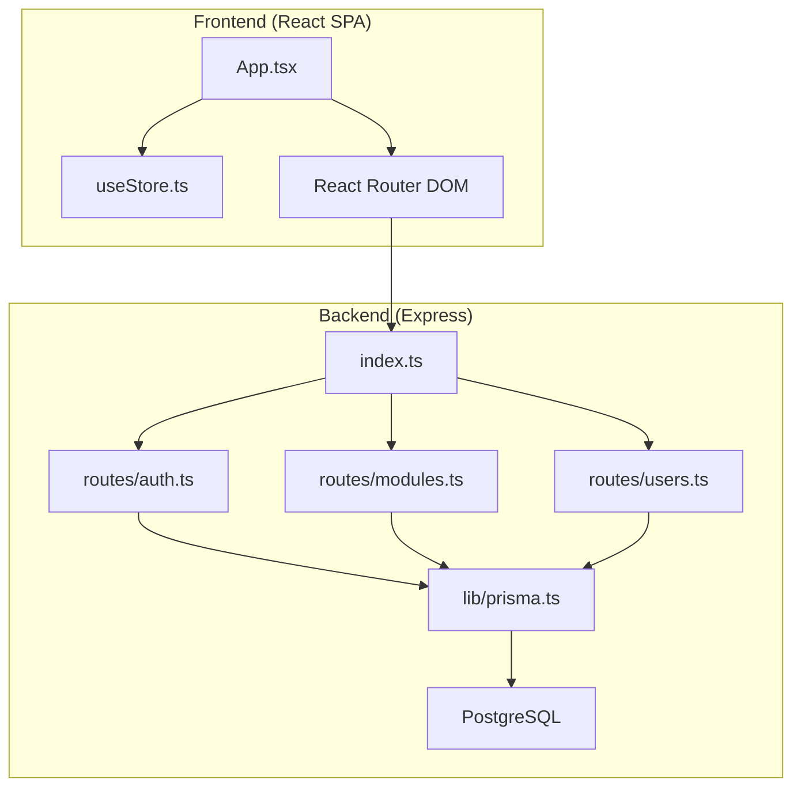
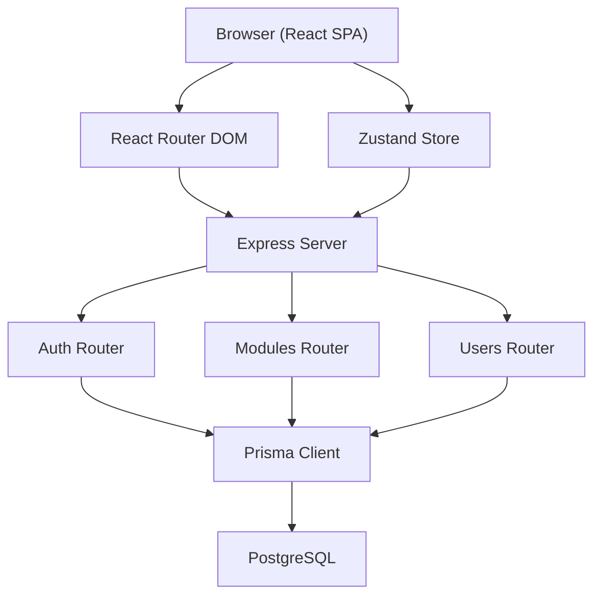
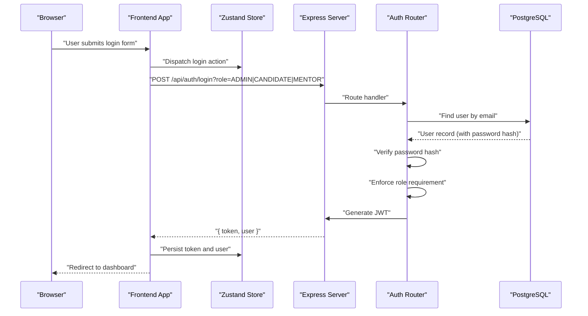
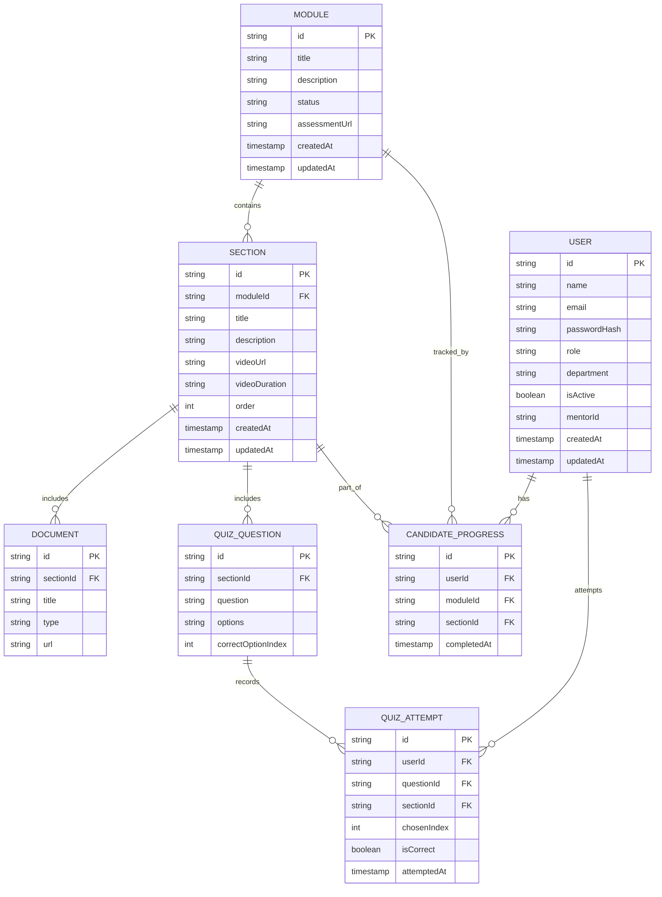
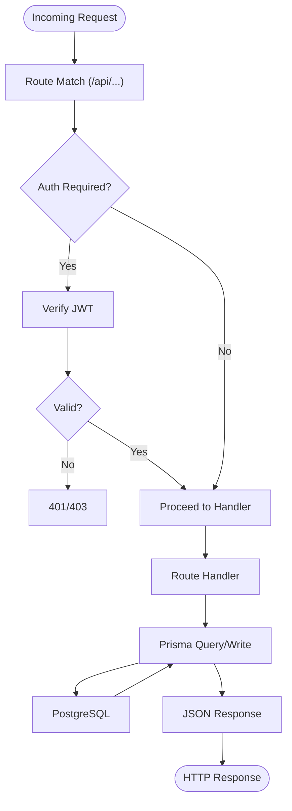
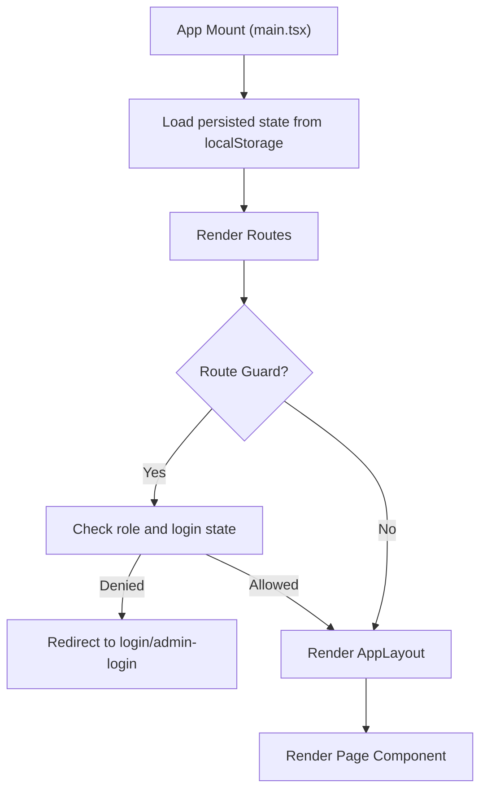
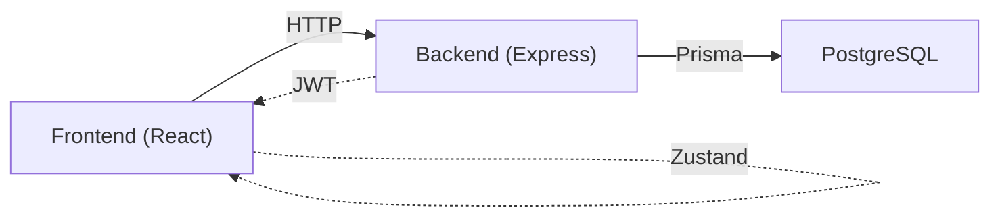
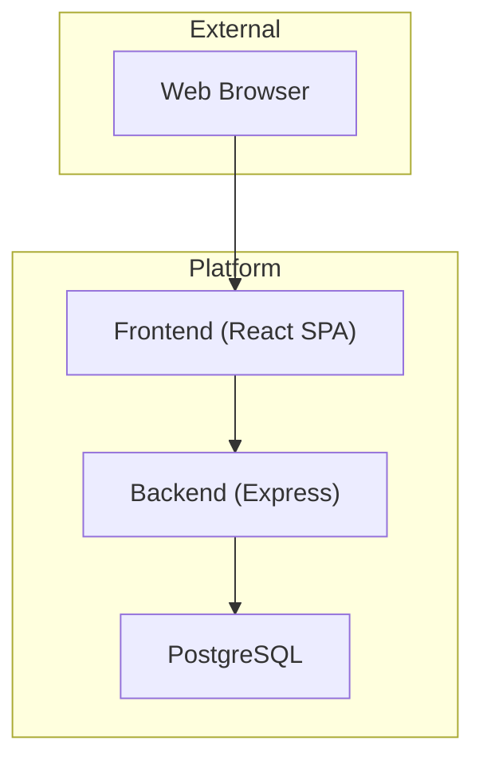

# Architecture Overview

<cite>
**Referenced Files in This Document**
- [README.md](file://README.md)
- [ONBOARDING_PLATFORM_ARCHITECTURE_PLAN.md](file://ONBOARDING_PLATFORM_ARCHITECTURE_PLAN.md)
- [TECH_STACK_DECISION_MATRIX.md](file://TECH_STACK_DECISION_MATRIX.md)
- [backend/package.json](file://backend/package.json)
- [frontend/package.json](file://frontend/package.json)
- [backend/src/index.ts](file://backend/src/index.ts)
- [backend/src/lib/prisma.ts](file://backend/src/lib/prisma.ts)
- [backend/prisma/schema.prisma](file://backend/prisma/schema.prisma)
- [backend/src/routes/auth.ts](file://backend/src/routes/auth.ts)
- [backend/src/routes/modules.ts](file://backend/src/routes/modules.ts)
- [backend/src/routes/users.ts](file://backend/src/routes/users.ts)
- [frontend/src/App.tsx](file://frontend/src/App.tsx)
- [frontend/src/store/useStore.ts](file://frontend/src/store/useStore.ts)
- [frontend/src/main.tsx](file://frontend/src/main.tsx)
</cite>

## Table of Contents
1. [Introduction](#introduction)
2. [Project Structure](#project-structure)
3. [Core Components](#core-components)
4. [Architecture Overview](#architecture-overview)
5. [Detailed Component Analysis](#detailed-component-analysis)
6. [Dependency Analysis](#dependency-analysis)
7. [Performance Considerations](#performance-considerations)
8. [Troubleshooting Guide](#troubleshooting-guide)
9. [Conclusion](#conclusion)
10. [Appendices](#appendices)

## Introduction
This document presents the architecture of the Onboarding AntiGravity platform, a production-grade employee onboarding solution. The platform follows a modular monolith design with clear separation between the React frontend and the Express backend, backed by PostgreSQL. It emphasizes role-based access control, JWT-based authentication, and a pragmatic technology stack optimized for developer velocity and operational simplicity.

## Project Structure
The repository is organized into two primary directories:
- frontend: React 18 application with Vite, Tailwind CSS, Zustand, and React Router DOM.
- backend: Node.js/Express application with TypeScript, Prisma ORM, and PostgreSQL.

**Diagram sources**
- [frontend/src/App.tsx:1-79](file://frontend/src/App.tsx#L1-L79)
- [frontend/src/store/useStore.ts:1-77](file://frontend/src/store/useStore.ts#L1-L77)
- [backend/src/index.ts:1-45](file://backend/src/index.ts#L1-L45)
- [backend/src/routes/auth.ts:1-69](file://backend/src/routes/auth.ts#L1-L69)
- [backend/src/routes/modules.ts:1-209](file://backend/src/routes/modules.ts#L1-L209)
- [backend/src/routes/users.ts:1-180](file://backend/src/routes/users.ts#L1-L180)
- [backend/src/lib/prisma.ts:1-19](file://backend/src/lib/prisma.ts#L1-L19)
- [backend/prisma/schema.prisma:1-112](file://backend/prisma/schema.prisma#L1-L112)

**Section sources**
- [README.md:1-28](file://README.md#L1-L28)
- [backend/package.json:1-34](file://backend/package.json#L1-L34)
- [frontend/package.json:1-43](file://frontend/package.json#L1-L43)

## Core Components
- Frontend (React SPA)
  - Routing and guards: Candidate, Mentor, and Admin route protection using React Router DOM and a Zustand store.
  - State management: Global state persisted in localStorage via Zustand.
  - UI framework: Tailwind CSS for styling and component composition.
- Backend (Express)
  - Modular routing: Feature-based route groups under /api/v1 endpoints.
  - Persistence: Prisma ORM with a singleton client for efficient database connections.
  - Authentication: JWT-based login with role enforcement and bcrypt password hashing.
- Database (PostgreSQL)
  - Domain models for identity, learning modules, assessments, progress tracking, and mentorship.
  - UUID primary keys, soft-delete-friendly design, and relational integrity enforced by Prisma.

**Section sources**
- [frontend/src/App.tsx:1-79](file://frontend/src/App.tsx#L1-L79)
- [frontend/src/store/useStore.ts:1-77](file://frontend/src/store/useStore.ts#L1-L77)
- [backend/src/index.ts:1-45](file://backend/src/index.ts#L1-L45)
- [backend/src/lib/prisma.ts:1-19](file://backend/src/lib/prisma.ts#L1-L19)
- [backend/prisma/schema.prisma:1-112](file://backend/prisma/schema.prisma#L1-L112)

## Architecture Overview
The platform employs a modular monolith architecture:
- Separation of concerns across frontend and backend.
- RESTful API surface exposed by Express with JWT bearer tokens.
- Role-based access control enforced at the route level.
- Data persistence through Prisma and PostgreSQL.

**Diagram sources**
- [frontend/src/App.tsx:1-79](file://frontend/src/App.tsx#L1-L79)
- [frontend/src/store/useStore.ts:1-77](file://frontend/src/store/useStore.ts#L1-L77)
- [backend/src/index.ts:1-45](file://backend/src/index.ts#L1-L45)
- [backend/src/routes/auth.ts:1-69](file://backend/src/routes/auth.ts#L1-L69)
- [backend/src/routes/modules.ts:1-209](file://backend/src/routes/modules.ts#L1-L209)
- [backend/src/routes/users.ts:1-180](file://backend/src/routes/users.ts#L1-L180)
- [backend/src/lib/prisma.ts:1-19](file://backend/src/lib/prisma.ts#L1-L19)
- [backend/prisma/schema.prisma:1-112](file://backend/prisma/schema.prisma#L1-L112)

## Detailed Component Analysis

### Authentication Flow (JWT + RBAC)
The authentication flow integrates frontend state management with backend endpoints and database-backed user records.

Key implementation highlights:
- Role enforcement via query parameter to gate admin, candidate/mentor portals.
- JWT issued with a fixed TTL and returned alongside sanitized user data.
- Frontend persists token and user profile in localStorage via Zustand.

**Diagram sources**
- [backend/src/routes/auth.ts:1-69](file://backend/src/routes/auth.ts#L1-L69)
- [frontend/src/store/useStore.ts:1-77](file://frontend/src/store/useStore.ts#L1-L77)
- [frontend/src/App.tsx:1-79](file://frontend/src/App.tsx#L1-L79)

**Section sources**
- [backend/src/routes/auth.ts:1-69](file://backend/src/routes/auth.ts#L1-L69)
- [frontend/src/store/useStore.ts:1-77](file://frontend/src/store/useStore.ts#L1-L77)
- [frontend/src/App.tsx:1-79](file://frontend/src/App.tsx#L1-L79)

### Data Model and Relationships
The domain model centers around users, modules, sections, documents, quiz questions, and candidate progress.

**Diagram sources**
- [backend/prisma/schema.prisma:1-112](file://backend/prisma/schema.prisma#L1-L112)

**Section sources**
- [backend/prisma/schema.prisma:1-112](file://backend/prisma/schema.prisma#L1-L112)

### API Endpoints and Data Flow
The backend exposes RESTful endpoints grouped by feature. Requests flow through Express routes to Prisma queries against PostgreSQL.

Representative endpoints:
- Authentication: POST /api/auth/login with role gating.
- Modules: GET /api/modules, GET /api/modules/:id, POST /api/modules, PUT /api/modules/:id, DELETE /api/modules/:id, POST /api/modules/:moduleId/sections/:sectionId/import-questions.
- Users: GET /api/users, GET /api/users/mentors, POST /api/users/bulk-import, POST /api/users, PUT /api/users/:id/assign-mentor, PUT /api/users/:id/toggle-active, DELETE /api/users/:id.

**Diagram sources**
- [backend/src/index.ts:1-45](file://backend/src/index.ts#L1-L45)
- [backend/src/routes/auth.ts:1-69](file://backend/src/routes/auth.ts#L1-L69)
- [backend/src/routes/modules.ts:1-209](file://backend/src/routes/modules.ts#L1-L209)
- [backend/src/routes/users.ts:1-180](file://backend/src/routes/users.ts#L1-L180)
- [backend/src/lib/prisma.ts:1-19](file://backend/src/lib/prisma.ts#L1-L19)
- [backend/prisma/schema.prisma:1-112](file://backend/prisma/schema.prisma#L1-L112)

**Section sources**
- [backend/src/index.ts:1-45](file://backend/src/index.ts#L1-L45)
- [backend/src/routes/auth.ts:1-69](file://backend/src/routes/auth.ts#L1-L69)
- [backend/src/routes/modules.ts:1-209](file://backend/src/routes/modules.ts#L1-L209)
- [backend/src/routes/users.ts:1-180](file://backend/src/routes/users.ts#L1-L180)
- [backend/src/lib/prisma.ts:1-19](file://backend/src/lib/prisma.ts#L1-L19)
- [backend/prisma/schema.prisma:1-112](file://backend/prisma/schema.prisma#L1-L112)

### State Management Approach
The frontend uses Zustand for global state management:
- Stores user identity, role, and login status.
- Persists token and user profile to localStorage for session continuity.
- Guards routes based on role and login state.

**Diagram sources**
- [frontend/src/main.tsx:1-11](file://frontend/src/main.tsx#L1-L11)
- [frontend/src/App.tsx:1-79](file://frontend/src/App.tsx#L1-L79)
- [frontend/src/store/useStore.ts:1-77](file://frontend/src/store/useStore.ts#L1-L77)

**Section sources**
- [frontend/src/main.tsx:1-11](file://frontend/src/main.tsx#L1-L11)
- [frontend/src/App.tsx:1-79](file://frontend/src/App.tsx#L1-L79)
- [frontend/src/store/useStore.ts:1-77](file://frontend/src/store/useStore.ts#L1-L77)

## Dependency Analysis
Technology stack and architectural trade-offs:
- Frontend: React 18 + Vite + Zustand + React Router DOM + Tailwind CSS. Chosen for developer productivity, fast HMR, and minimal boilerplate state management.
- Backend: Node.js + Express + Prisma + PostgreSQL. Selected for high concurrency and robust ORM support.
- Database: PostgreSQL for relational integrity and complex joins across users, modules, and assessments.
- Security: JWT bearer tokens, bcrypt password hashing, and role-based access control at the route level.

**Diagram sources**
- [frontend/package.json:1-43](file://frontend/package.json#L1-L43)
- [backend/package.json:1-34](file://backend/package.json#L1-L34)
- [backend/src/lib/prisma.ts:1-19](file://backend/src/lib/prisma.ts#L1-L19)
- [backend/prisma/schema.prisma:1-112](file://backend/prisma/schema.prisma#L1-L112)

**Section sources**
- [TECH_STACK_DECISION_MATRIX.md:1-52](file://TECH_STACK_DECISION_MATRIX.md#L1-L52)
- [README.md:5-8](file://README.md#L5-L8)

## Performance Considerations
- Database efficiency: Prisma singleton client prevents connection pool exhaustion and reduces latency.
- Endpoint optimization: Dedicated single-module retrieval endpoint minimizes payload size for candidate views.
- Caching strategy: Master plan indicates Redis caching for module trees and user-specific progress bypasses caching for real-time accuracy.
- Background jobs: Heavy analytics exports offloaded to background processing with S3 pre-signed URLs.

[No sources needed since this section provides general guidance]

## Troubleshooting Guide
Common areas to inspect:
- Health check: GET /api/health verifies backend availability.
- CORS configuration: Wildcard CORS enabled for development; adjust for production environments.
- Authentication failures: Validate JWT secret, user existence, password hash verification, and role gating.
- Database connectivity: Confirm Prisma client initialization and DATABASE_URL environment variable.

**Section sources**
- [backend/src/index.ts:1-45](file://backend/src/index.ts#L1-L45)
- [backend/src/lib/prisma.ts:1-19](file://backend/src/lib/prisma.ts#L1-L19)
- [backend/src/routes/auth.ts:1-69](file://backend/src/routes/auth.ts#L1-L69)

## Conclusion
The Onboarding AntiGravity platform demonstrates a pragmatic modular monolith architecture. The React frontend and Express backend collaborate through RESTful APIs, with JWT and role-based access control securing feature boundaries. The PostgreSQL schema supports the platform’s learning, assessment, and mentorship domains. The technology stack balances developer velocity, operational simplicity, and scalability readiness.

[No sources needed since this section summarizes without analyzing specific files]

## Appendices

### System Context Diagram

[No sources needed since this diagram shows conceptual workflow, not actual code structure]