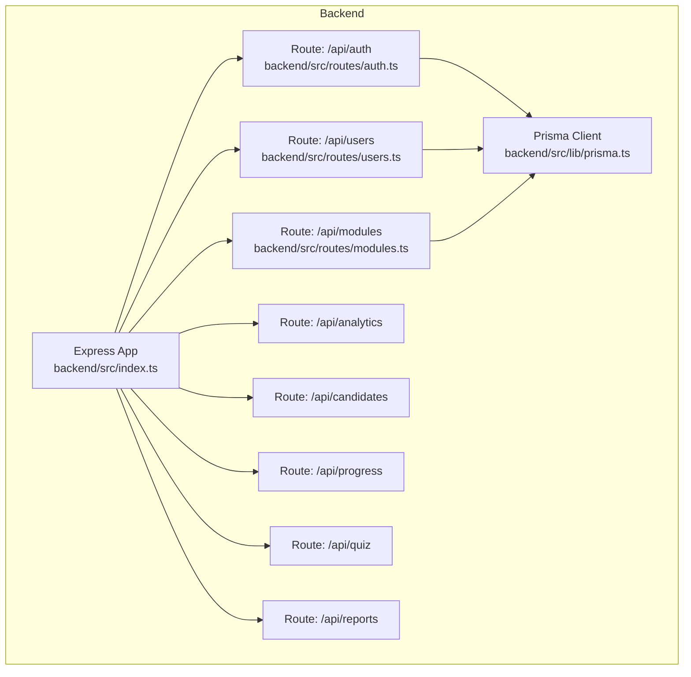
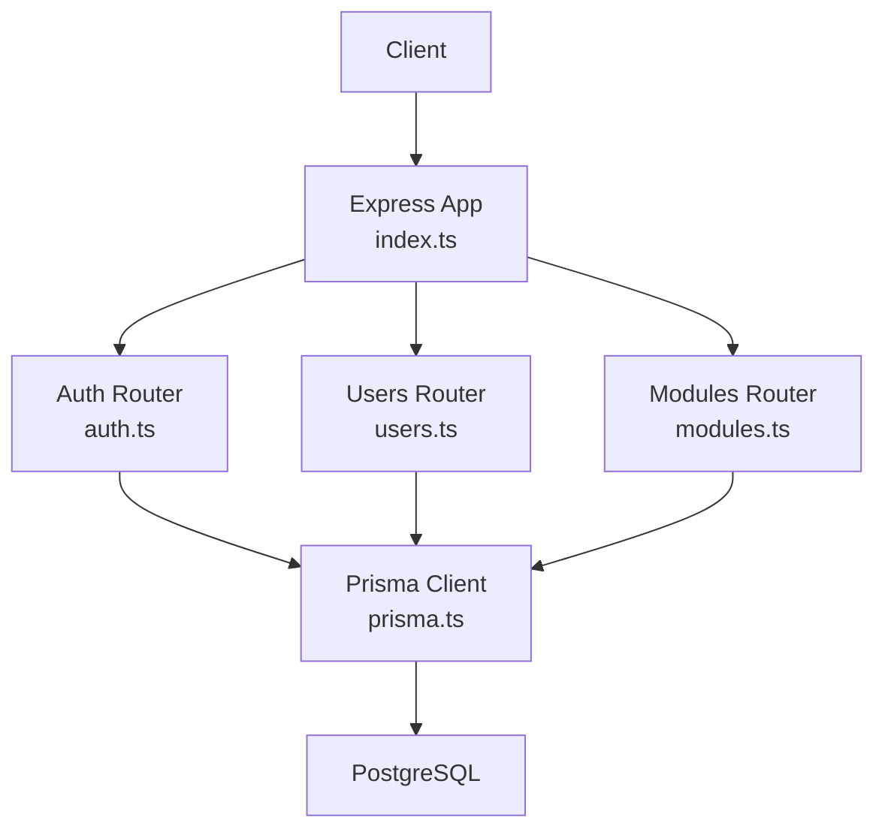
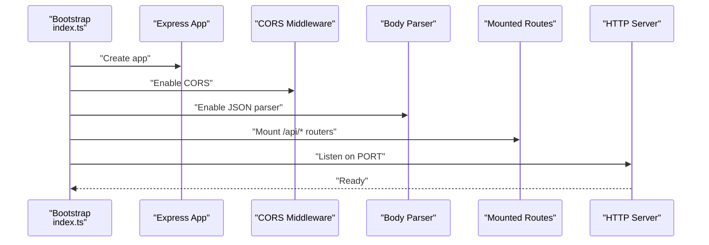
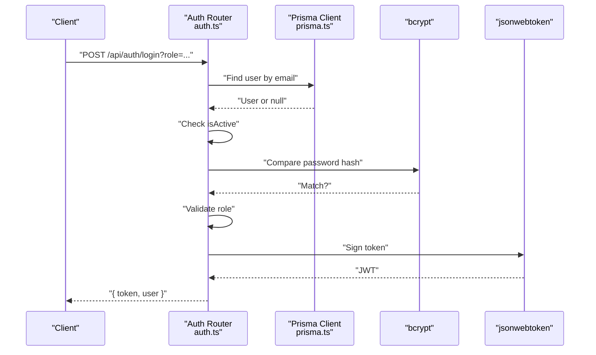
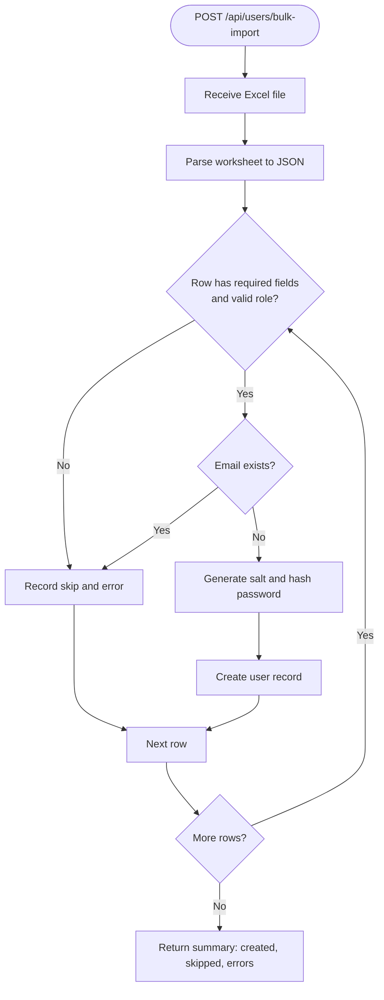
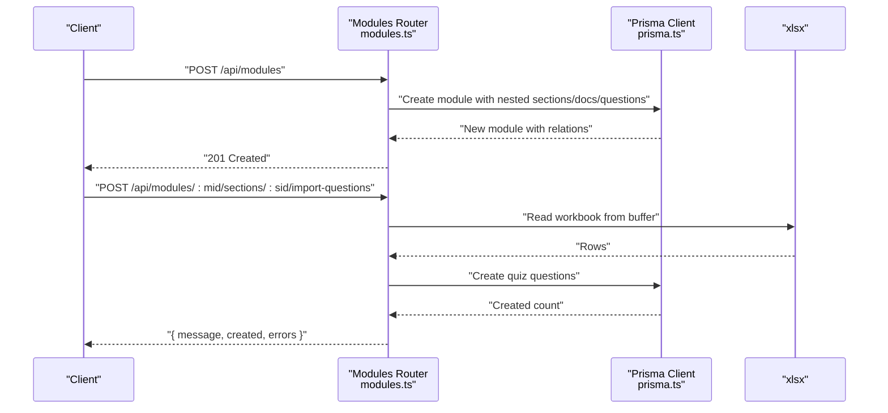
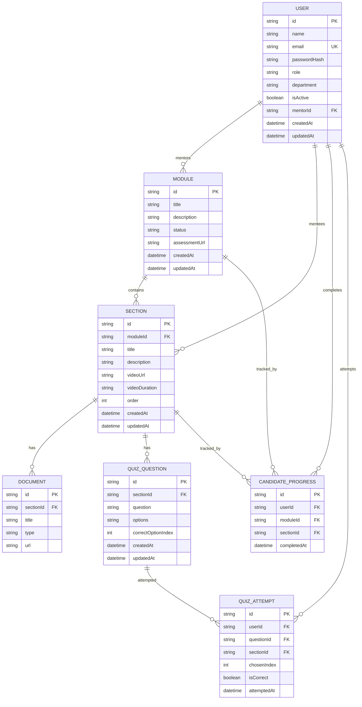
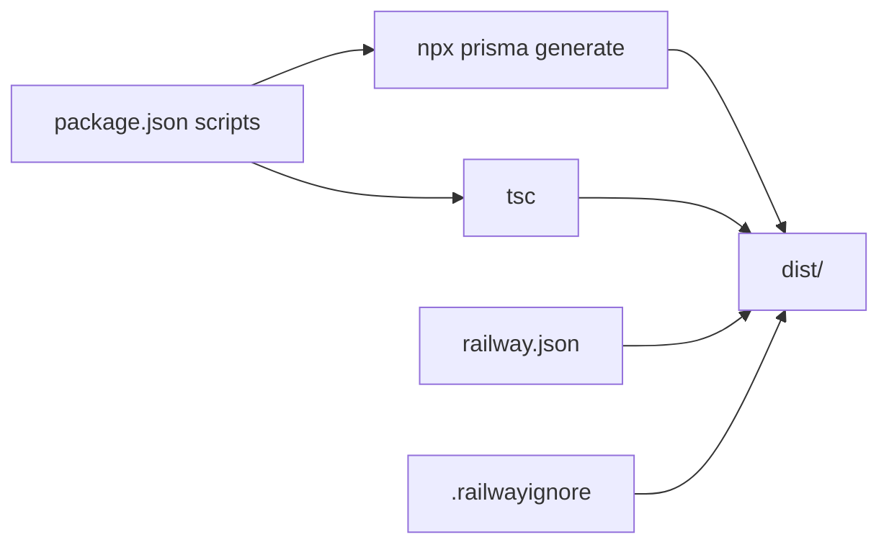

# Backend Architecture

<cite>
**Referenced Files in This Document**
- [backend/src/index.ts](file://backend/src/index.ts)
- [backend/src/lib/prisma.ts](file://backend/src/lib/prisma.ts)
- [backend/src/routes/auth.ts](file://backend/src/routes/auth.ts)
- [backend/src/routes/users.ts](file://backend/src/routes/users.ts)
- [backend/src/routes/modules.ts](file://backend/src/routes/modules.ts)
- [backend/tsconfig.json](file://backend/tsconfig.json)
- [backend/package.json](file://backend/package.json)
- [backend/railway.json](file://backend/railway.json)
- [backend/.railwayignore](file://backend/.railwayignore)
- [backend/prisma/schema.prisma](file://backend/prisma/schema.prisma)
</cite>

## Table of Contents
1. [Introduction](#introduction)
2. [Project Structure](#project-structure)
3. [Core Components](#core-components)
4. [Architecture Overview](#architecture-overview)
5. [Detailed Component Analysis](#detailed-component-analysis)
6. [Dependency Analysis](#dependency-analysis)
7. [Performance Considerations](#performance-considerations)
8. [Troubleshooting Guide](#troubleshooting-guide)
9. [Conclusion](#conclusion)
10. [Appendices](#appendices)

## Introduction
This document describes the backend architecture of the Onboarding AntiGravity platform. It focuses on the Express server configuration, middleware stack, routing, authentication, database integration via Prisma, error handling strategy, logging mechanisms, environment variable management, project structure, TypeScript configuration, and the build/deployment pipeline. It also outlines scalability considerations, performance optimization opportunities, and deployment architecture.

## Project Structure
The backend is organized around a classic Express modular architecture:
- Application entry initializes Express, loads environment variables, configures middleware, mounts route handlers, and starts the HTTP server.
- Route modules encapsulate API endpoints grouped by domain (authentication, users, modules, analytics, candidates, progress, quiz, reports).
- A shared Prisma client singleton manages database connections and queries.
- TypeScript compiles the source into a distributable JavaScript build.
- Railway configuration defines the build and runtime commands, including a health check.

**Diagram sources**
- [backend/src/index.ts:1-45](file://backend/src/index.ts#L1-L45)
- [backend/src/lib/prisma.ts:1-19](file://backend/src/lib/prisma.ts#L1-L19)
- [backend/src/routes/auth.ts:1-69](file://backend/src/routes/auth.ts#L1-L69)
- [backend/src/routes/users.ts:1-180](file://backend/src/routes/users.ts#L1-L180)
- [backend/src/routes/modules.ts:1-247](file://backend/src/routes/modules.ts#L1-L247)

**Section sources**
- [backend/src/index.ts:1-45](file://backend/src/index.ts#L1-L45)
- [backend/src/lib/prisma.ts:1-19](file://backend/src/lib/prisma.ts#L1-L19)
- [backend/tsconfig.json:1-15](file://backend/tsconfig.json#L1-L15)
- [backend/package.json:1-34](file://backend/package.json#L1-L34)

## Core Components
- Express application bootstrap and middleware:
  - Loads environment variables.
  - Enables CORS for all origins with explicit allowed methods and headers.
  - Handles preflight OPTIONS for all routes.
  - Parses JSON request bodies.
  - Mounts route handlers under /api/* paths.
  - Provides a health endpoint returning service status and timestamp.
  - Starts the HTTP server on configured port.
- Prisma client singleton:
  - Ensures a single database client instance across the app lifecycle.
  - Configures logging level based on NODE_ENV.
  - Stores the client in a global object during development to prevent hot reload issues.
- Route modules:
  - Authentication: login endpoint with role enforcement and JWT issuance.
  - Users: CRUD, mentor assignment, activation toggle, bulk import from Excel, and sample templates.
  - Modules: CRUD with nested sections, documents, and quiz questions; dedicated single-module retrieval; quiz import from Excel.
  - Analytics, Candidates, Progress, Quiz, Reports: route placeholders present in server mount but not analyzed here.

Key implementation references:
- Server initialization and middleware chain: [backend/src/index.ts:13-44](file://backend/src/index.ts#L13-L44)
- Prisma singleton pattern: [backend/src/lib/prisma.ts:3-16](file://backend/src/lib/prisma.ts#L3-L16)
- Health endpoint: [backend/src/index.ts:32-39](file://backend/src/index.ts#L32-L39)
- Authentication flow: [backend/src/routes/auth.ts:9-66](file://backend/src/routes/auth.ts#L9-L66)
- Users bulk import and sample template: [backend/src/routes/users.ts:62-112](file://backend/src/routes/users.ts#L62-L112)
- Modules nested creation and quiz import: [backend/src/routes/modules.ts:28-77](file://backend/src/routes/modules.ts#L28-L77), [backend/src/routes/modules.ts:193-243](file://backend/src/routes/modules.ts#L193-L243)

**Section sources**
- [backend/src/index.ts:13-44](file://backend/src/index.ts#L13-L44)
- [backend/src/lib/prisma.ts:3-16](file://backend/src/lib/prisma.ts#L3-L16)
- [backend/src/routes/auth.ts:9-66](file://backend/src/routes/auth.ts#L9-L66)
- [backend/src/routes/users.ts:62-112](file://backend/src/routes/users.ts#L62-L112)
- [backend/src/routes/modules.ts:28-77](file://backend/src/routes/modules.ts#L28-L77)

## Architecture Overview
The backend follows a layered architecture:
- Presentation layer: Express routes.
- Domain logic: Route handlers orchestrate Prisma queries and external libraries (bcrypt, jsonwebtoken, xlsx).
- Data access layer: Prisma client singleton.
- Persistence: PostgreSQL via Prisma schema.

**Diagram sources**
- [backend/src/index.ts:1-45](file://backend/src/index.ts#L1-L45)
- [backend/src/lib/prisma.ts:1-19](file://backend/src/lib/prisma.ts#L1-L19)
- [backend/prisma/schema.prisma:1-112](file://backend/prisma/schema.prisma#L1-L112)

## Detailed Component Analysis

### Express Server Initialization and Middleware Chain
The server initializes with:
- Environment loading.
- CORS configuration allowing all origins and essential methods/headers.
- Preflight handling for all routes.
- JSON body parsing.
- Route mounting under /api/*.
- Health endpoint.
- HTTP server start with console logs.

**Diagram sources**
- [backend/src/index.ts:13-44](file://backend/src/index.ts#L13-L44)

**Section sources**
- [backend/src/index.ts:13-44](file://backend/src/index.ts#L13-L44)

### Authentication Flow
The authentication route enforces role-specific access and issues JWT tokens:
- Validates presence of user by email.
- Checks account activity.
- Compares password hash.
- Enforces portal-specific role via query parameter.
- Signs JWT with secret and expiration.
- Returns token and sanitized user payload.

**Diagram sources**
- [backend/src/routes/auth.ts:9-66](file://backend/src/routes/auth.ts#L9-L66)
- [backend/src/lib/prisma.ts:1-19](file://backend/src/lib/prisma.ts#L1-L19)

**Section sources**
- [backend/src/routes/auth.ts:9-66](file://backend/src/routes/auth.ts#L9-L66)

### Users Management and Bulk Import
The users route supports:
- Listing users with mentor info.
- Retrieving mentors for dropdowns.
- Downloading a sample Excel template.
- Bulk importing users from Excel with validation and deduplication.
- Creating users with hashed passwords.
- Assigning mentors and toggling activation.
- Deleting users.

**Diagram sources**
- [backend/src/routes/users.ts:62-112](file://backend/src/routes/users.ts#L62-L112)

**Section sources**
- [backend/src/routes/users.ts:10-180](file://backend/src/routes/users.ts#L10-L180)

### Modules Management and Quiz Import
The modules route supports:
- Fetching all modules with nested sections, documents, and questions.
- Creating modules with nested sections, documents, and questions.
- Updating modules by replacing sections.
- Fetching a single module optimized for candidate views.
- Downloading a quiz import template.
- Importing quiz questions from Excel into a specific section.

**Diagram sources**
- [backend/src/routes/modules.ts:28-77](file://backend/src/routes/modules.ts#L28-L77)
- [backend/src/routes/modules.ts:193-243](file://backend/src/routes/modules.ts#L193-L243)
- [backend/src/lib/prisma.ts:1-19](file://backend/src/lib/prisma.ts#L1-L19)

**Section sources**
- [backend/src/routes/modules.ts:6-26](file://backend/src/routes/modules.ts#L6-L26)
- [backend/src/routes/modules.ts:28-143](file://backend/src/routes/modules.ts#L28-L143)
- [backend/src/routes/modules.ts:165-191](file://backend/src/routes/modules.ts#L165-L191)
- [backend/src/routes/modules.ts:193-243](file://backend/src/routes/modules.ts#L193-L243)

### Database Schema and Prisma Client
The Prisma schema defines the data model for users, modules, sections, documents, quiz questions, candidate progress, and quiz attempts. The Prisma client singleton ensures a single connection pool and appropriate logging levels per environment.

**Diagram sources**
- [backend/prisma/schema.prisma:10-112](file://backend/prisma/schema.prisma#L10-L112)

**Section sources**
- [backend/src/lib/prisma.ts:1-19](file://backend/src/lib/prisma.ts#L1-L19)
- [backend/prisma/schema.prisma:10-112](file://backend/prisma/schema.prisma#L10-L112)

## Dependency Analysis
- Runtime dependencies include Express, CORS, dotenv, bcrypt, jsonwebtoken, multer, xlsx, and @prisma/client.
- Development dependencies include TypeScript, ts-node, prisma, and related type packages.
- Build script runs Prisma generation followed by TypeScript compilation.
- Post-install hook runs Prisma generation.
- Railway build command installs dependencies, generates Prisma client, and builds the project.
- Railway deploy command starts the built server and sets a health check path.

**Diagram sources**
- [backend/package.json:6-11](file://backend/package.json#L6-L11)
- [backend/railway.json:3-12](file://backend/railway.json#L3-L12)
- [backend/.railwayignore:1-4](file://backend/.railwayignore#L1-L4)

**Section sources**
- [backend/package.json:6-11](file://backend/package.json#L6-L11)
- [backend/railway.json:3-12](file://backend/railway.json#L3-L12)
- [backend/.railwayignore:1-4](file://backend/.railwayignore#L1-L4)

## Performance Considerations
- Database connection pooling:
  - The Prisma singleton prevents multiple clients and redundant pools, reducing connection overhead and latency.
- Request body limits:
  - Consider configuring a reasonable limit for JSON payloads to mitigate memory pressure from large requests.
- File uploads:
  - Bulk imports use multer with memory storage; for very large files, consider streaming or disk-based storage to reduce memory usage.
- Query optimization:
  - The modules route includes nested relations; ensure indexes exist on foreign keys and consider pagination for large datasets.
- Logging:
  - Current logging uses console.error in routes; consider structured logging (e.g., Winston/Pino) for production observability and cost control.
- Caching:
  - Add response caching for read-heavy endpoints (e.g., modules listing) to reduce database load.
- Concurrency:
  - Scale horizontally behind a load balancer; ensure stateless design and shared database.

[No sources needed since this section provides general guidance]

## Troubleshooting Guide
- Health endpoint:
  - Verify the health route responds with success and current timestamp.
- CORS issues:
  - Confirm that the allowed origin and methods match client requests; preflight OPTIONS is handled globally.
- Authentication failures:
  - Check JWT secret configuration and ensure the role query parameter aligns with user roles.
- Database connectivity:
  - Ensure DATABASE_URL is set and reachable; review Prisma client logging level.
- Bulk import errors:
  - Validate Excel format and required columns; inspect returned errors array for skipped rows.
- Build and deployment:
  - Confirm Railway build steps run Prisma generation and TypeScript compilation; verify start command targets dist/index.js.

**Section sources**
- [backend/src/index.ts:32-39](file://backend/src/index.ts#L32-L39)
- [backend/src/routes/auth.ts:7](file://backend/src/routes/auth.ts#L7)
- [backend/src/lib/prisma.ts:10-12](file://backend/src/lib/prisma.ts#L10-L12)
- [backend/src/routes/users.ts:62-112](file://backend/src/routes/users.ts#L62-L112)
- [backend/railway.json:3-12](file://backend/railway.json#L3-L12)

## Conclusion
The Onboarding AntiGravity backend employs a clean, modular Express architecture with a centralized Prisma client singleton and straightforward middleware stack. Authentication relies on JWT with role enforcement, while users and modules support robust CRUD and bulk operations. The build and deployment pipeline integrates Prisma generation and TypeScript compilation, and Railway configuration automates health checks and restart policies. To enhance production readiness, adopt structured logging, implement caching, optimize database queries, and scale horizontally.

[No sources needed since this section summarizes without analyzing specific files]

## Appendices

### Environment Variables
- JWT_SECRET: Used to sign authentication tokens.
- DATABASE_URL: Points to the PostgreSQL database.
- PORT: HTTP server port (defaults to 3000).
- NODE_ENV: Controls Prisma logging verbosity.

**Section sources**
- [backend/src/routes/auth.ts:7](file://backend/src/routes/auth.ts#L7)
- [backend/src/lib/prisma.ts:10-12](file://backend/src/lib/prisma.ts#L10-L12)
- [backend/src/index.ts:16](file://backend/src/index.ts#L16)

### TypeScript and Build Configuration
- Target and module settings compile to CommonJS.
- Strict mode enabled for type safety.
- OutDir and rootDir define source and distribution locations.
- Scripts:
  - dev: Run TypeScript directly with ts-node.
  - build: Generate Prisma client and compile TypeScript.
  - start: Run the compiled server.

**Section sources**
- [backend/tsconfig.json:1-15](file://backend/tsconfig.json#L1-L15)
- [backend/package.json:6-11](file://backend/package.json#L6-L11)