# Backend Development

<cite>
**Referenced Files in This Document**
- [index.ts](file://backend/src/index.ts)
- [package.json](file://backend/package.json)
- [schema.prisma](file://backend/prisma/schema.prisma)
- [prisma.ts](file://backend/src/lib/prisma.ts)
- [auth.ts](file://backend/src/routes/auth.ts)
- [modules.ts](file://backend/src/routes/modules.ts)
- [users.ts](file://backend/src/routes/users.ts)
- [progress.ts](file://backend/src/routes/progress.ts)
- [quiz.ts](file://backend/src/routes/quiz.ts)
- [analytics.ts](file://backend/src/routes/analytics.ts)
- [candidates.ts](file://backend/src/routes/candidates.ts)
- [tsconfig.json](file://backend/tsconfig.json)
</cite>

## Table of Contents
1. [Introduction](#introduction)
2. [Project Structure](#project-structure)
3. [Core Components](#core-components)
4. [Architecture Overview](#architecture-overview)
5. [Detailed Component Analysis](#detailed-component-analysis)
6. [Dependency Analysis](#dependency-analysis)
7. [Performance Considerations](#performance-considerations)
8. [Security Considerations](#security-considerations)
9. [Troubleshooting Guide](#troubleshooting-guide)
10. [Conclusion](#conclusion)
11. [Appendices](#appendices)

## Introduction
This document provides comprehensive backend development documentation for the Onboarding AntiGravity platform. It covers the Express server configuration, middleware setup, error handling strategies, the complete API endpoint structure, Prisma ORM implementation, database schema design, authentication system using JWT tokens and bcrypt password hashing, and operational best practices for performance, security, and database management.

## Project Structure
The backend is organized around an Express server that mounts modular route handlers grouped by domain capability. Prisma is configured as the ORM with a PostgreSQL data source. TypeScript compiles the application to JavaScript for production.

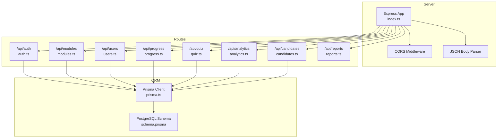

**Diagram sources**
- [index.ts:15-30](file://backend/src/index.ts#L15-L30)
- [auth.ts:1-69](file://backend/src/routes/auth.ts#L1-L69)
- [modules.ts:1-209](file://backend/src/routes/modules.ts#L1-L209)
- [users.ts:1-180](file://backend/src/routes/users.ts#L1-L180)
- [progress.ts:1-63](file://backend/src/routes/progress.ts#L1-L63)
- [quiz.ts:1-76](file://backend/src/routes/quiz.ts#L1-L76)
- [analytics.ts:1-55](file://backend/src/routes/analytics.ts#L1-L55)
- [candidates.ts:1-117](file://backend/src/routes/candidates.ts#L1-L117)
- [prisma.ts:1-19](file://backend/src/lib/prisma.ts#L1-L19)
- [schema.prisma:1-112](file://backend/prisma/schema.prisma#L1-L112)

**Section sources**
- [index.ts:1-45](file://backend/src/index.ts#L1-L45)
- [package.json:1-34](file://backend/package.json#L1-L34)
- [tsconfig.json:1-15](file://backend/tsconfig.json#L1-L15)

## Core Components
- Express server initialization and port configuration
- Global CORS policy allowing all origins with explicit methods and headers
- JSON body parsing middleware
- Health check endpoint returning service status
- Modular routing mounted under /api with dedicated route files for each domain

Key behaviors:
- CORS is configured broadly to support cross-origin requests and automatically handles preflight OPTIONS
- JSON body parsing is enabled globally
- Routes are mounted for authentication, modules, users, analytics, candidates, progress tracking, quiz system, and reports

**Section sources**
- [index.ts:15-44](file://backend/src/index.ts#L15-L44)

## Architecture Overview
The backend follows a layered architecture:
- HTTP Layer: Express server and middleware
- Routing Layer: Route handlers for each functional area
- Persistence Layer: Prisma ORM connecting to PostgreSQL
- Data Models: Strongly typed models defined in Prisma schema

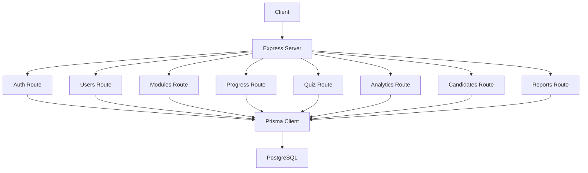

**Diagram sources**
- [index.ts:23-30](file://backend/src/index.ts#L23-L30)
- [prisma.ts:8-12](file://backend/src/lib/prisma.ts#L8-L12)
- [schema.prisma:5-8](file://backend/prisma/schema.prisma#L5-L8)

## Detailed Component Analysis

### Authentication System
The authentication route implements:
- Role-enforced login via query parameter
- Password verification using bcrypt
- JWT token generation with expiration
- Account activation checks
- Safe response payload excluding sensitive fields

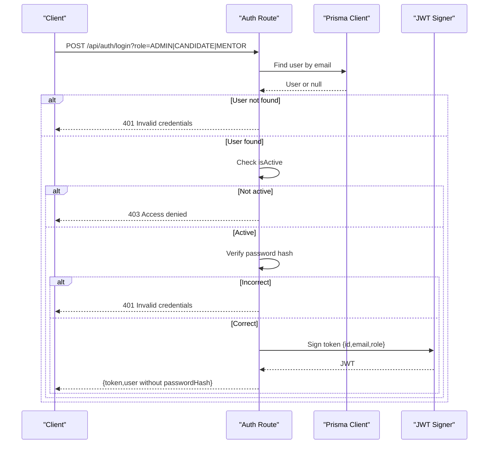

**Diagram sources**
- [auth.ts:9-66](file://backend/src/routes/auth.ts#L9-L66)

**Section sources**
- [auth.ts:1-69](file://backend/src/routes/auth.ts#L1-L69)

### Modules Management
Endpoints:
- List modules with nested sections, documents, and questions
- Create modules with nested sections, documents, and questions
- Delete modules
- Update module status
- Download a sample quiz Excel template
- Retrieve a single module with nested data
- Bulk import quiz questions from Excel into a specific section

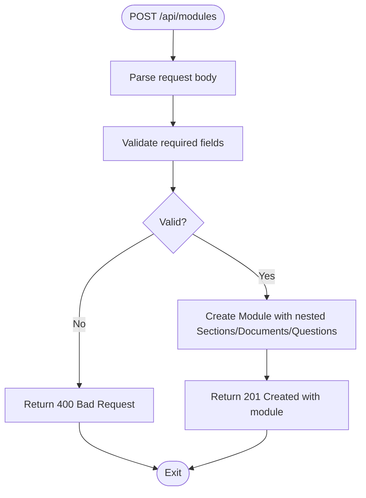

**Diagram sources**
- [modules.ts:28-77](file://backend/src/routes/modules.ts#L28-L77)

**Section sources**
- [modules.ts:1-209](file://backend/src/routes/modules.ts#L1-L209)

### Users Administration
Endpoints:
- List all users with mentor info
- List mentors only
- Download sample Excel template for bulk import
- Bulk import users from Excel with deduplication and hashing
- Create a single user with hashed password
- Assign a mentor to a user
- Toggle user active status
- Delete a user

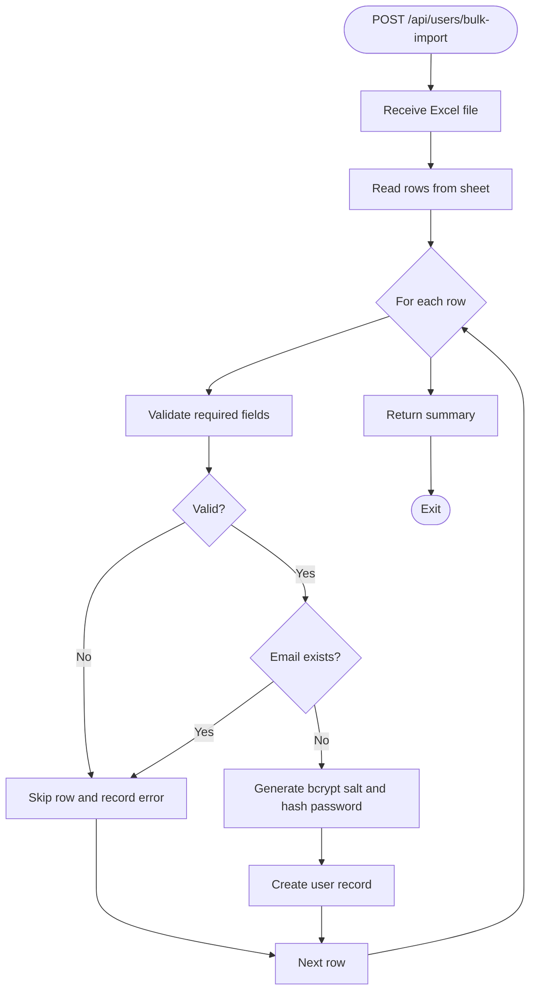

**Diagram sources**
- [users.ts:62-112](file://backend/src/routes/users.ts#L62-L112)

**Section sources**
- [users.ts:1-180](file://backend/src/routes/users.ts#L1-L180)

### Progress Tracking
Endpoints:
- Record completion of a section for a user (UPSERT)
- Retrieve all completed sections for a user

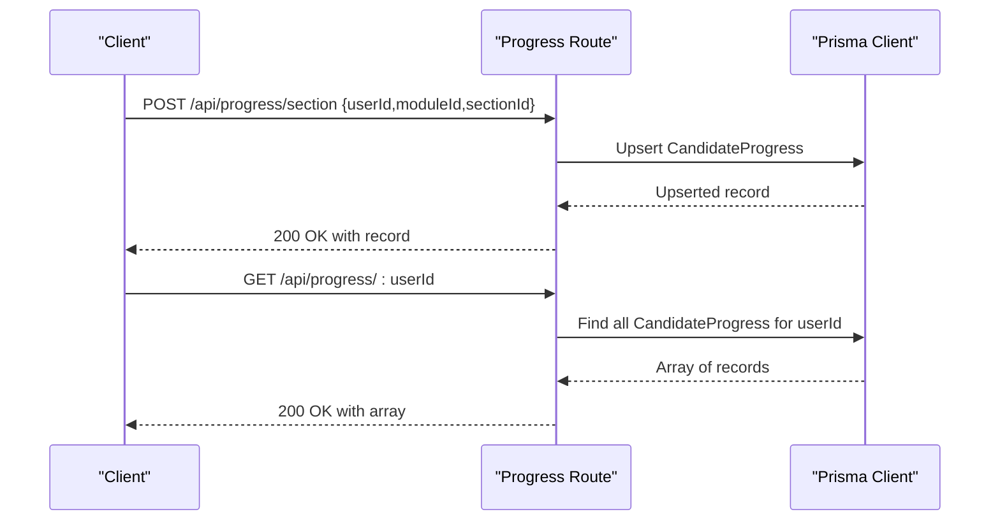

**Diagram sources**
- [progress.ts:6-60](file://backend/src/routes/progress.ts#L6-L60)

**Section sources**
- [progress.ts:1-63](file://backend/src/routes/progress.ts#L1-L63)

### Quiz System
Endpoints:
- Submit quiz answers for a section with batch scoring and transactional upserts

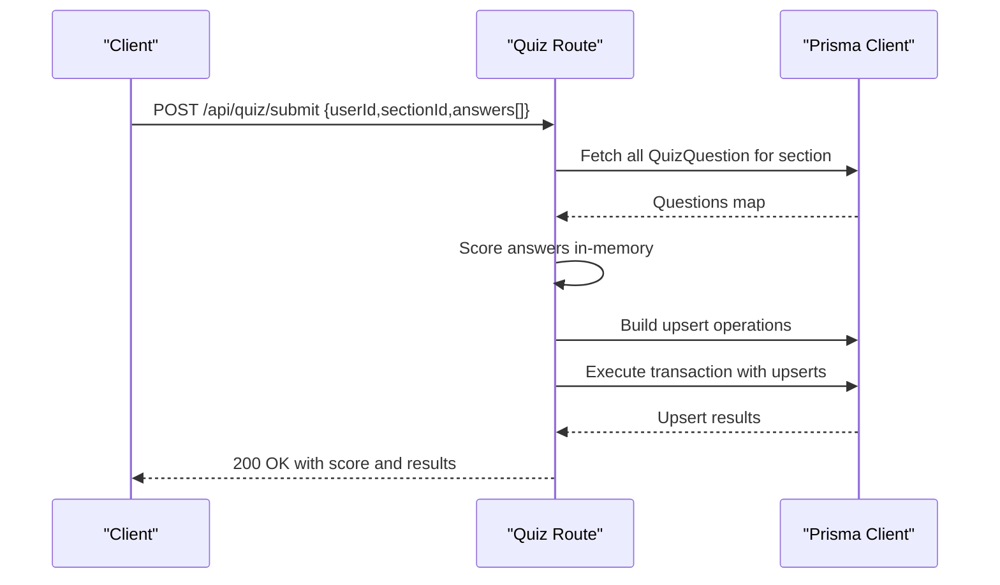

**Diagram sources**
- [quiz.ts:6-73](file://backend/src/routes/quiz.ts#L6-L73)

**Section sources**
- [quiz.ts:1-76](file://backend/src/routes/quiz.ts#L1-L76)

### Analytics
Endpoint:
- Dashboard metrics computed in parallel: total candidates, published modules, recent candidates, and average progress

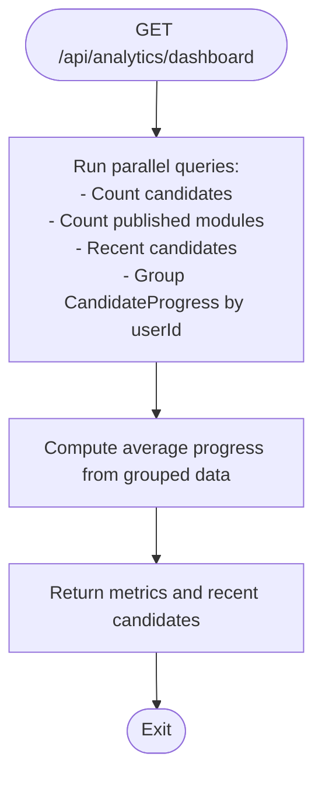

**Diagram sources**
- [analytics.ts:6-52](file://backend/src/routes/analytics.ts#L6-L52)

**Section sources**
- [analytics.ts:1-55](file://backend/src/routes/analytics.ts#L1-L55)

### Candidates Dashboard
Endpoint:
- Build a real-time dashboard for a candidate with modules, progress, and quiz scores

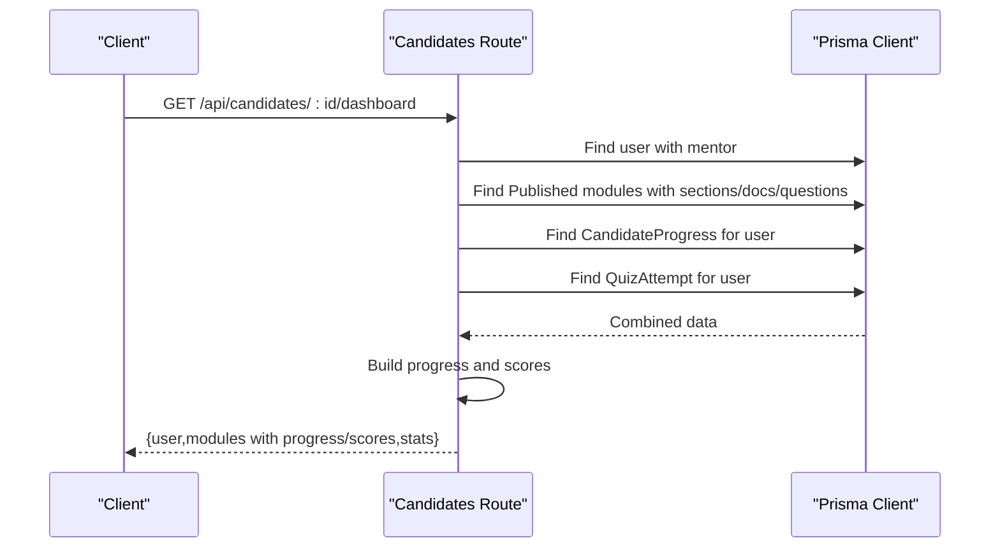

**Diagram sources**
- [candidates.ts:6-114](file://backend/src/routes/candidates.ts#L6-L114)

**Section sources**
- [candidates.ts:1-117](file://backend/src/routes/candidates.ts#L1-L117)

### Data Model Relationships
The Prisma schema defines the following entities and relationships:

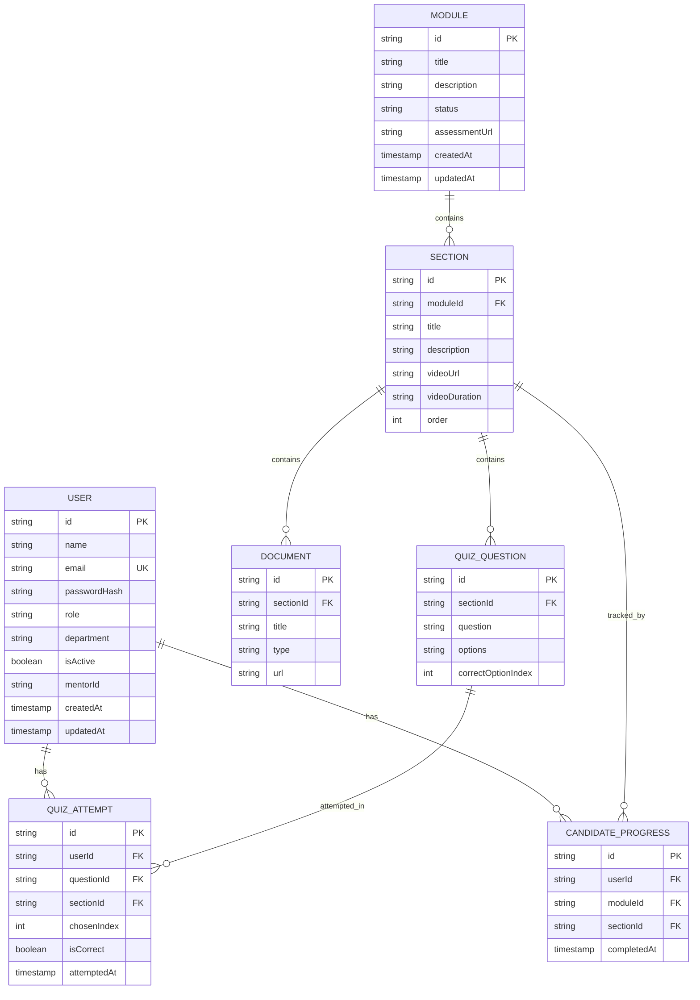

**Diagram sources**
- [schema.prisma:10-112](file://backend/prisma/schema.prisma#L10-L112)

**Section sources**
- [schema.prisma:1-112](file://backend/prisma/schema.prisma#L1-L112)

## Dependency Analysis
- Express server depends on CORS and body parsing middleware
- Route handlers depend on Prisma client for data access
- Prisma client depends on PostgreSQL datasource
- Application scripts orchestrate Prisma generation and TypeScript compilation

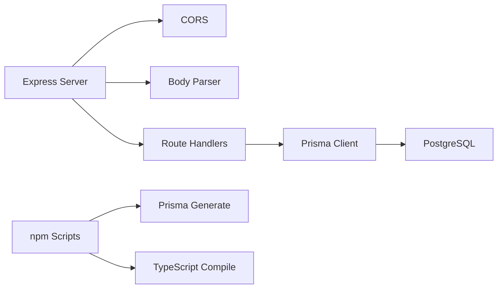

**Diagram sources**
- [index.ts:19-21](file://backend/src/index.ts#L19-L21)
- [package.json:6-11](file://backend/package.json#L6-L11)
- [prisma.ts:8-12](file://backend/src/lib/prisma.ts#L8-L12)
- [schema.prisma:5-8](file://backend/prisma/schema.prisma#L5-L8)

**Section sources**
- [package.json:1-34](file://backend/package.json#L1-L34)
- [prisma.ts:1-19](file://backend/src/lib/prisma.ts#L1-L19)

## Performance Considerations
- Parallel queries: Analytics and candidate dashboard use Promise.all to reduce latency
- Single-query batching: Quiz submission fetches all questions once and performs a transactional upsert batch
- Indexing: Prisma schema includes indexes on foreign keys and composite unique constraints to optimize lookups
- Singleton Prisma client: Prevents excessive connections and improves resource utilization
- Minimal selects: Route handlers limit returned fields to reduce payload sizes

[No sources needed since this section provides general guidance]

## Security Considerations
- Authentication
  - Passwords are hashed using bcrypt before storage
  - JWT tokens are signed with a secret and expire after 24 hours
  - Login enforces role constraints based on query parameter
  - Inactive accounts are blocked from authentication
- Data Protection
  - Sensitive fields (e.g., passwordHash) are excluded from response payloads
  - CORS allows controlled origins and headers
- Input Validation
  - Route handlers validate required fields and sanitize inputs (e.g., trimming whitespace)
  - Excel importers validate required fields and skip invalid rows while reporting errors

**Section sources**
- [auth.ts:11-61](file://backend/src/routes/auth.ts#L11-L61)
- [users.ts:114-133](file://backend/src/routes/users.ts#L114-L133)
- [modules.ts:155-205](file://backend/src/routes/modules.ts#L155-L205)
- [index.ts:18-20](file://backend/src/index.ts#L18-L20)

## Troubleshooting Guide
Common issues and resolutions:
- Health check failures
  - Verify server is listening on the configured port
  - Confirm environment variables are loaded
- Authentication errors
  - Ensure JWT_SECRET is set
  - Confirm user isActive flag and role match expectations
- Database connectivity
  - Check DATABASE_URL environment variable
  - Validate Prisma client singleton initialization
- Excel import errors
  - Validate required columns and data types
  - Review skipped rows and error logs for invalid entries

**Section sources**
- [index.ts:32-44](file://backend/src/index.ts#L32-L44)
- [auth.ts:7,48-53](file://backend/src/routes/auth.ts#L7,L48-L53)
- [prisma.ts:8-16](file://backend/src/lib/prisma.ts#L8-L16)
- [users.ts:62-112](file://backend/src/routes/users.ts#L62-L112)

## Conclusion
The Onboarding AntiGravity backend provides a robust, modular, and scalable foundation for onboarding operations. It leverages Express for HTTP handling, Prisma for type-safe database access, and JWT with bcrypt for secure authentication. The route handlers demonstrate performance-conscious patterns such as parallel queries, batched transactions, and minimal data retrieval. Adhering to the outlined security and performance recommendations will help maintain reliability and scalability.

[No sources needed since this section summarizes without analyzing specific files]

## Appendices

### API Endpoint Reference
- Authentication
  - POST /api/auth/login?role=ADMIN|CANDIDATE|MENTOR
- Modules
  - GET /api/modules
  - POST /api/modules
  - GET /api/modules/:id
  - PUT /api/modules/:id
  - DELETE /api/modules/:id
  - GET /api/modules/quiz-sample-excel
  - POST /api/modules/:moduleId/sections/:sectionId/import-questions
- Users
  - GET /api/users
  - GET /api/users/mentors
  - GET /api/users/sample-excel
  - POST /api/users/bulk-import
  - POST /api/users
  - PUT /api/users/:id/assign-mentor
  - PUT /api/users/:id/toggle-active
  - DELETE /api/users/:id
- Progress
  - POST /api/progress/section
  - GET /api/progress/:userId
- Quiz
  - POST /api/quiz/submit
- Analytics
  - GET /api/analytics/dashboard
- Candidates
  - GET /api/candidates/:id/dashboard
- Reports
  - Mounted under /api/reports (route file present)

**Section sources**
- [index.ts:23-30](file://backend/src/index.ts#L23-L30)
- [modules.ts:6-26](file://backend/src/routes/modules.ts#L6-L26)
- [users.ts:10-179](file://backend/src/routes/users.ts#L10-L179)
- [progress.ts:6-60](file://backend/src/routes/progress.ts#L6-L60)
- [quiz.ts:6-73](file://backend/src/routes/quiz.ts#L6-L73)
- [analytics.ts:6-52](file://backend/src/routes/analytics.ts#L6-L52)
- [candidates.ts:6-114](file://backend/src/routes/candidates.ts#L6-L114)