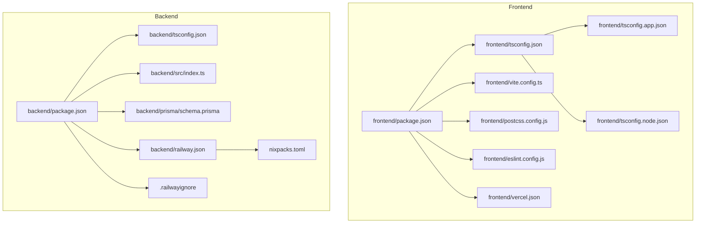
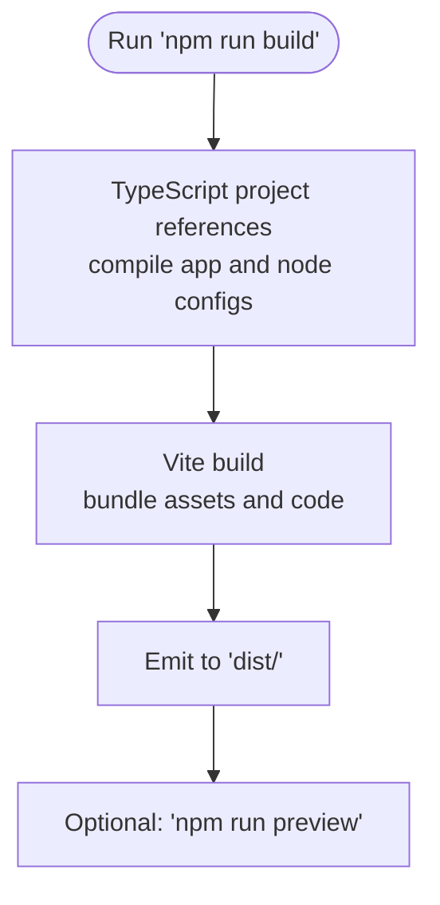
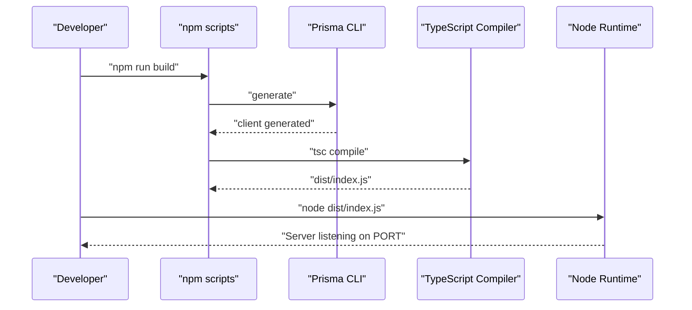
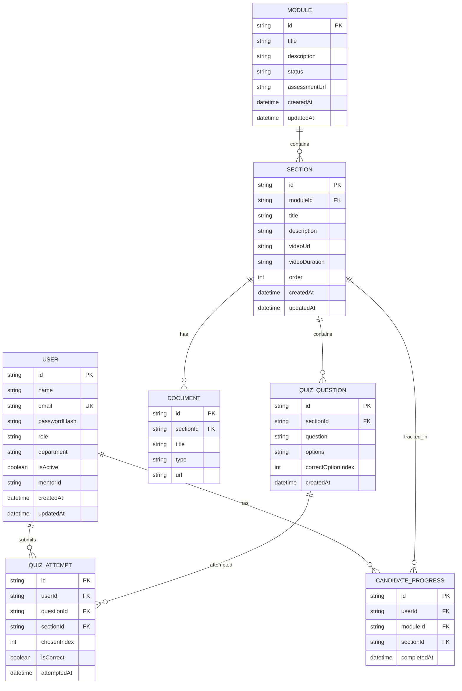
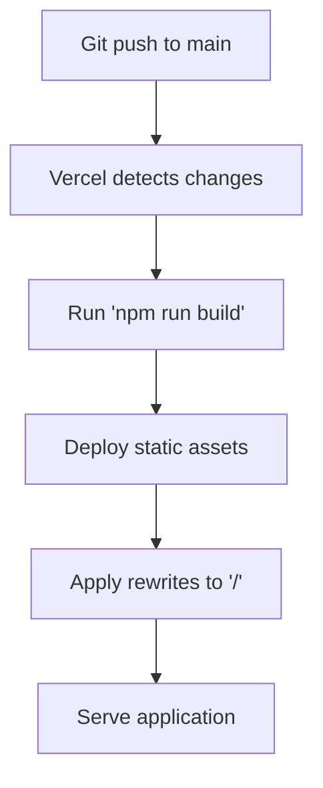
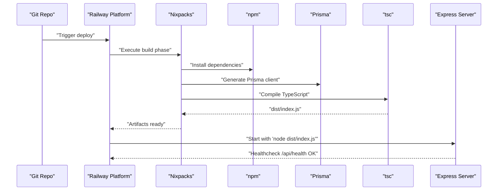
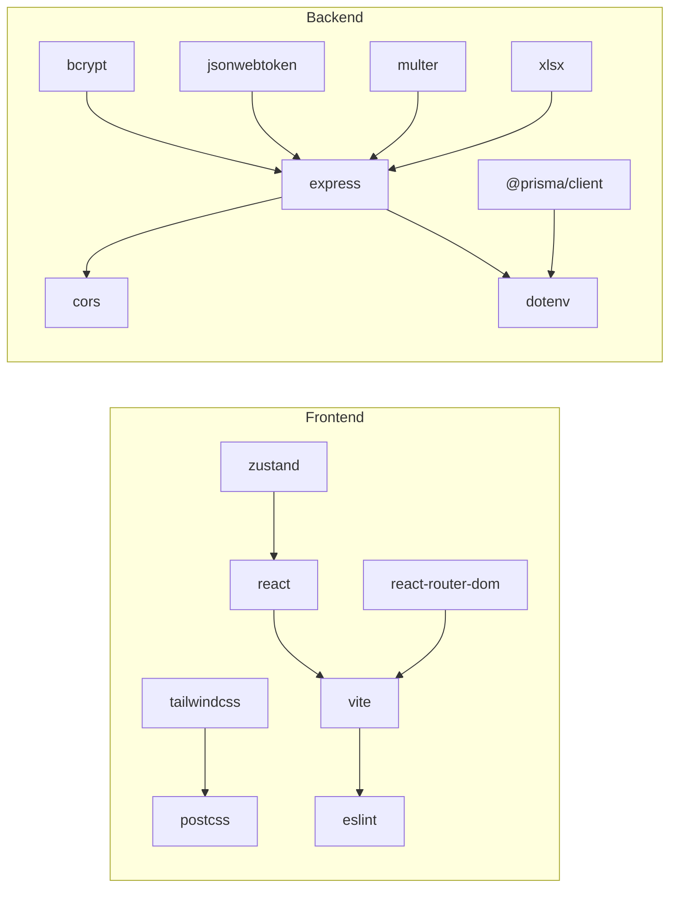

# Build and Deployment

<cite>
**Referenced Files in This Document**
- [backend/package.json](file://backend/package.json)
- [backend/tsconfig.json](file://backend/tsconfig.json)
- [backend/src/index.ts](file://backend/src/index.ts)
- [backend/prisma/schema.prisma](file://backend/prisma/schema.prisma)
- [backend/railway.json](file://backend/railway.json)
- [backend/.railwayignore](file://backend/.railwayignore)
- [frontend/package.json](file://frontend/package.json)
- [frontend/tsconfig.json](file://frontend/tsconfig.json)
- [frontend/tsconfig.app.json](file://frontend/tsconfig.app.json)
- [frontend/tsconfig.node.json](file://frontend/tsconfig.node.json)
- [frontend/vite.config.ts](file://frontend/vite.config.ts)
- [frontend/postcss.config.js](file://frontend/postcss.config.js)
- [frontend/eslint.config.js](file://frontend/eslint.config.js)
- [frontend/vercel.json](file://frontend/vercel.json)
- [nixpacks.toml](file://nixpacks.toml)
</cite>

## Table of Contents
1. [Introduction](#introduction)
2. [Project Structure](#project-structure)
3. [Core Components](#core-components)
4. [Architecture Overview](#architecture-overview)
5. [Detailed Component Analysis](#detailed-component-analysis)
6. [Dependency Analysis](#dependency-analysis)
7. [Performance Considerations](#performance-considerations)
8. [Troubleshooting Guide](#troubleshooting-guide)
9. [Conclusion](#conclusion)
10. [Appendices](#appendices)

## Introduction
This document explains how to build and deploy the Onboarding AntiGravity platform. It covers frontend and backend build configurations, environment and database setup, deployment strategies for Railway (backend) and Vercel (frontend), CI/CD considerations, environment variable management, production optimization, and troubleshooting. The goal is to enable reliable, repeatable deployments and smooth operations in production.

## Project Structure
The repository is a monorepo with two primary packages:
- Frontend: React + Vite + TypeScript, built with a dual tsconfig setup and PostCSS/Tailwind pipeline.
- Backend: Express server with TypeScript, Prisma ORM, and Nixpacks-based builds for Railway.



**Diagram sources**
- [frontend/package.json:1-43](file://frontend/package.json#L1-L43)
- [frontend/tsconfig.json:1-8](file://frontend/tsconfig.json#L1-L8)
- [frontend/tsconfig.app.json:1-29](file://frontend/tsconfig.app.json#L1-L29)
- [frontend/tsconfig.node.json:1-27](file://frontend/tsconfig.node.json#L1-L27)
- [frontend/vite.config.ts:1-8](file://frontend/vite.config.ts#L1-L8)
- [frontend/postcss.config.js:1-7](file://frontend/postcss.config.js#L1-L7)
- [frontend/eslint.config.js:1-24](file://frontend/eslint.config.js#L1-L24)
- [frontend/vercel.json:1-9](file://frontend/vercel.json#L1-L9)
- [backend/package.json:1-34](file://backend/package.json#L1-L34)
- [backend/tsconfig.json:1-15](file://backend/tsconfig.json#L1-L15)
- [backend/src/index.ts:1-45](file://backend/src/index.ts#L1-L45)
- [backend/prisma/schema.prisma:1-112](file://backend/prisma/schema.prisma#L1-L112)
- [backend/railway.json:1-14](file://backend/railway.json#L1-L14)
- [nixpacks.toml:1-12](file://nixpacks.toml#L1-L12)
- [backend/.railwayignore:1-4](file://backend/.railwayignore#L1-L4)

**Section sources**
- [frontend/package.json:1-43](file://frontend/package.json#L1-L43)
- [backend/package.json:1-34](file://backend/package.json#L1-L34)

## Core Components
- Frontend build stack: Vite, React, TypeScript, Tailwind via PostCSS, ESLint.
- Backend build stack: TypeScript compiler, Prisma client generation, Express server.
- Deployment stacks: Railway for backend (Nixpacks), Vercel for frontend.
- Environment configuration: dotenv for backend, environment variables for Prisma and runtime.

Key build scripts and commands:
- Frontend: dev, build, lint, preview.
- Backend: dev, build, start, postinstall.

**Section sources**
- [frontend/package.json:6-11](file://frontend/package.json#L6-L11)
- [backend/package.json:6-11](file://backend/package.json#L6-L11)
- [backend/src/index.ts:13-16](file://backend/src/index.ts#L13-L16)

## Architecture Overview
The platform consists of:
- Frontend hosted on Vercel, serving static assets and routing all unmatched routes to the single-page application.
- Backend hosted on Railway, exposing REST endpoints under /api/* and providing a health check endpoint.
- Database managed by Prisma with a PostgreSQL datasource configured via DATABASE_URL.

```mermaid
graph TB
Browser["Browser"]
Vercel["Vercel Frontend"]
Railway["Railway Backend"]
DB["PostgreSQL"]
Browser --> Vercel
Vercel --> |HTTP(S)| Railway
Railway --> |Prisma Client| DB
Railway --> |Health| Browser
```

**Diagram sources**
- [frontend/vercel.json:1-9](file://frontend/vercel.json#L1-L9)
- [backend/src/index.ts:32-39](file://backend/src/index.ts#L32-L39)
- [backend/prisma/schema.prisma:5-8](file://backend/prisma/schema.prisma#L5-L8)

## Detailed Component Analysis

### Frontend Build and Asset Pipeline
- TypeScript configuration:
  - Root tsconfig orchestrates app and node configs.
  - App config targets modern JS, bundler module resolution, JSX transform, strictness, and noEmit.
  - Node config targets Node APIs and bundler mode for Vite config.
- Vite configuration:
  - Uses React plugin; default export defines base configuration.
- Styling pipeline:
  - PostCSS with Tailwind and Autoprefixer.
- Linting:
  - ESLint flat config with TypeScript, React hooks, and React refresh plugins.
- Build and preview:
  - Build runs type-check and Vite bundling.
  - Preview serves built assets locally.



**Diagram sources**
- [frontend/tsconfig.json:1-8](file://frontend/tsconfig.json#L1-L8)
- [frontend/tsconfig.app.json:1-29](file://frontend/tsconfig.app.json#L1-L29)
- [frontend/tsconfig.node.json:1-27](file://frontend/tsconfig.node.json#L1-L27)
- [frontend/vite.config.ts:1-8](file://frontend/vite.config.ts#L1-L8)
- [frontend/postcss.config.js:1-7](file://frontend/postcss.config.js#L1-L7)
- [frontend/eslint.config.js:1-24](file://frontend/eslint.config.js#L1-L24)
- [frontend/package.json:6-11](file://frontend/package.json#L6-L11)

**Section sources**
- [frontend/tsconfig.json:1-8](file://frontend/tsconfig.json#L1-L8)
- [frontend/tsconfig.app.json:1-29](file://frontend/tsconfig.app.json#L1-L29)
- [frontend/tsconfig.node.json:1-27](file://frontend/tsconfig.node.json#L1-L27)
- [frontend/vite.config.ts:1-8](file://frontend/vite.config.ts#L1-L8)
- [frontend/postcss.config.js:1-7](file://frontend/postcss.config.js#L1-L7)
- [frontend/eslint.config.js:1-24](file://frontend/eslint.config.js#L1-L24)
- [frontend/package.json:6-11](file://frontend/package.json#L6-L11)

### Backend Build and Runtime
- Build pipeline:
  - Prisma client generation followed by TypeScript compilation.
  - Postinstall script ensures Prisma client regeneration after installs.
- Runtime:
  - Express server initializes CORS, JSON body parsing, and mounts route modules.
  - Health endpoint exposed at /api/health.
- Environment and secrets:
  - dotenv loads environment variables.
  - DATABASE_URL is consumed by Prisma.
- Railway deployment:
  - Nixpacks builder with explicit build and start commands.
  - Healthcheck path configured to /api/health.
  - Restart policy set to ON_FAILURE with retries.



**Diagram sources**
- [backend/package.json:6-11](file://backend/package.json#L6-L11)
- [backend/tsconfig.json:1-15](file://backend/tsconfig.json#L1-L15)
- [backend/src/index.ts:1-45](file://backend/src/index.ts#L1-L45)
- [backend/railway.json:3-12](file://backend/railway.json#L3-L12)

**Section sources**
- [backend/package.json:6-11](file://backend/package.json#L6-L11)
- [backend/tsconfig.json:1-15](file://backend/tsconfig.json#L1-L15)
- [backend/src/index.ts:13-44](file://backend/src/index.ts#L13-L44)
- [backend/railway.json:1-14](file://backend/railway.json#L1-L14)

### Database Setup with Prisma
- Provider: PostgreSQL.
- Datasource URL sourced from DATABASE_URL environment variable.
- Schema models include User, Module, Section, Document, QuizQuestion, CandidateProgress, and QuizAttempt with relations and indexes.



**Diagram sources**
- [backend/prisma/schema.prisma:10-111](file://backend/prisma/schema.prisma#L10-L111)

**Section sources**
- [backend/prisma/schema.prisma:1-112](file://backend/prisma/schema.prisma#L1-L112)

### Frontend Hosting on Vercel
- Rewrites: All unmatched paths are rewritten to the root to support client-side routing.
- Build and output: Vercel reads the frontend package scripts and Vite configuration; ensure the build output directory aligns with Vite defaults.



**Diagram sources**
- [frontend/vercel.json:1-9](file://frontend/vercel.json#L1-L9)
- [frontend/package.json:6-11](file://frontend/package.json#L6-L11)
- [frontend/vite.config.ts:1-8](file://frontend/vite.config.ts#L1-L8)

**Section sources**
- [frontend/vercel.json:1-9](file://frontend/vercel.json#L1-L9)
- [frontend/package.json:6-11](file://frontend/package.json#L6-L11)

### Backend Hosting on Railway
- Builder: Nixpacks.
- Build command: Installs dependencies, generates Prisma client, and builds TypeScript.
- Start command: Runs the compiled server.
- Healthcheck: GET /api/health.
- Restart policy: ON_FAILURE with retries.



**Diagram sources**
- [backend/railway.json:1-14](file://backend/railway.json#L1-L14)
- [nixpacks.toml:1-12](file://nixpacks.toml#L1-L12)
- [backend/package.json:6-11](file://backend/package.json#L6-L11)
- [backend/src/index.ts:32-39](file://backend/src/index.ts#L32-L39)

**Section sources**
- [backend/railway.json:1-14](file://backend/railway.json#L1-L14)
- [nixpacks.toml:1-12](file://nixpacks.toml#L1-L12)
- [backend/src/index.ts:32-39](file://backend/src/index.ts#L32-L39)

## Dependency Analysis
- Frontend dependencies: React, React Router, Tailwind, Framer Motion, Recharts, Zustand, and Vite ecosystem.
- Backend dependencies: Express, CORS, bcrypt, jsonwebtoken, multer, xlsx, Prisma client, dotenv.
- Dev dependencies: TypeScript, ts-node, Prisma, Vite, ESLint, Tailwind, PostCSS, React plugin.



**Diagram sources**
- [frontend/package.json:12-41](file://frontend/package.json#L12-L41)
- [backend/package.json:12-32](file://backend/package.json#L12-L32)

**Section sources**
- [frontend/package.json:12-41](file://frontend/package.json#L12-L41)
- [backend/package.json:12-32](file://backend/package.json#L12-L32)

## Performance Considerations
- Frontend
  - Enable production builds and minification via Vite; avoid building with development flags.
  - Keep asset sizes reasonable; split large assets and leverage lazy loading for routes/components.
  - Use Tailwind purging in production builds to reduce CSS size.
- Backend
  - Use environment-specific logging and disable verbose logs in production.
  - Configure connection pooling for database clients if scaling.
  - Set appropriate restart policies and healthchecks to ensure fast recovery.
- Network
  - Ensure CORS allows only trusted origins in production.
  - Use HTTPS termination at the edge (Vercel and Railway handle TLS termination).

[No sources needed since this section provides general guidance]

## Troubleshooting Guide
Common deployment issues and resolutions:
- Backend healthcheck failing
  - Verify the health endpoint is reachable and returns a successful response.
  - Confirm the start command matches the built artifact location.
  - Check restart policy settings to ensure automatic recovery.
  - Reference: [backend/src/index.ts:32-39](file://backend/src/index.ts#L32-L39), [backend/railway.json:7-12](file://backend/railway.json#L7-L12)
- Prisma client generation errors
  - Ensure Prisma client is regenerated during build and install steps.
  - Confirm DATABASE_URL is present in the environment.
  - Reference: [backend/package.json:9-10](file://backend/package.json#L9-L10), [backend/prisma/schema.prisma:5-8](file://backend/prisma/schema.prisma#L5-L8)
- Frontend routing issues
  - Confirm Vercel rewrites target the root to support SPA routing.
  - Reference: [frontend/vercel.json:2-7](file://frontend/vercel.json#L2-L7)
- CORS or preflight failures
  - Validate that CORS middleware accepts required origins/methods/headers.
  - Reference: [backend/src/index.ts:18-21](file://backend/src/index.ts#L18-L21)
- Railway build failures
  - Ensure Nixpacks phases install dependencies, generate Prisma client, and build TypeScript.
  - Reference: [nixpacks.toml:4-11](file://nixpacks.toml#L4-L11), [backend/railway.json:3-6](file://backend/railway.json#L3-L6)

**Section sources**
- [backend/src/index.ts:18-39](file://backend/src/index.ts#L18-L39)
- [backend/package.json:9-10](file://backend/package.json#L9-L10)
- [backend/prisma/schema.prisma:5-8](file://backend/prisma/schema.prisma#L5-L8)
- [frontend/vercel.json:2-7](file://frontend/vercel.json#L2-L7)
- [nixpacks.toml:4-11](file://nixpacks.toml#L4-L11)
- [backend/railway.json:3-12](file://backend/railway.json#L3-L12)

## Conclusion
The Onboarding AntiGravity platform uses modern, proven technologies for frontend and backend. The frontend is optimized for rapid iteration and production-ready builds with Vite and Vercel. The backend leverages Express, Prisma, and Railway with Nixpacks for streamlined deployments. Following the build and deployment steps outlined here will ensure consistent, reliable releases and operations.

[No sources needed since this section summarizes without analyzing specific files]

## Appendices

### Environment Variables Management
- Backend
  - Load environment variables with dotenv.
  - DATABASE_URL must be set for Prisma.
  - Reference: [backend/src/index.ts](file://backend/src/index.ts#L13), [backend/prisma/schema.prisma](file://backend/prisma/schema.prisma#L7)
- Railway
  - Add environment variables in the Railway dashboard; ensure DATABASE_URL is configured.
  - Reference: [backend/.railwayignore:1-4](file://backend/.railwayignore#L1-L4)
- Vercel
  - Add environment variables in the Vercel dashboard; configure NEXT_PUBLIC_* for client-side consumption.
  - Reference: [frontend/package.json:1-43](file://frontend/package.json#L1-L43)

**Section sources**
- [backend/src/index.ts](file://backend/src/index.ts#L13)
- [backend/prisma/schema.prisma](file://backend/prisma/schema.prisma#L7)
- [backend/.railwayignore:1-4](file://backend/.railwayignore#L1-L4)
- [frontend/package.json:1-43](file://frontend/package.json#L1-L43)

### CI/CD Pipeline Setup
- Recommended flow
  - Frontend: Build and deploy on Vercel via git push; optionally run lint and tests in CI.
  - Backend: Build and deploy on Railway via git push; run lint/tests in CI.
- Railway Nixpacks
  - Build and start commands are defined in configuration; ensure prerequisites are installed.
  - Reference: [backend/railway.json:3-12](file://backend/railway.json#L3-L12), [nixpacks.toml:4-11](file://nixpacks.toml#L4-L11)
- Vercel
  - Configure project settings to use the frontend directory and build output.
  - Reference: [frontend/vercel.json:1-9](file://frontend/vercel.json#L1-L9)

**Section sources**
- [backend/railway.json:3-12](file://backend/railway.json#L3-L12)
- [nixpacks.toml:4-11](file://nixpacks.toml#L4-L11)
- [frontend/vercel.json:1-9](file://frontend/vercel.json#L1-L9)

### Production Optimization Checklist
- Frontend
  - Run production builds and confirm asset sizes.
  - Enable Tailwind purging and code splitting.
  - Reference: [frontend/postcss.config.js:1-7](file://frontend/postcss.config.js#L1-L7), [frontend/package.json:6-11](file://frontend/package.json#L6-L11)
- Backend
  - Set NODE_ENV=production and configure logging.
  - Use health checks and restart policies.
  - Reference: [backend/railway.json:7-12](file://backend/railway.json#L7-L12), [backend/src/index.ts:13-16](file://backend/src/index.ts#L13-L16)
- Database
  - Ensure DATABASE_URL is set and reachable.
  - Reference: [backend/prisma/schema.prisma](file://backend/prisma/schema.prisma#L7)

**Section sources**
- [frontend/postcss.config.js:1-7](file://frontend/postcss.config.js#L1-L7)
- [frontend/package.json:6-11](file://frontend/package.json#L6-L11)
- [backend/railway.json:7-12](file://backend/railway.json#L7-L12)
- [backend/src/index.ts:13-16](file://backend/src/index.ts#L13-L16)
- [backend/prisma/schema.prisma](file://backend/prisma/schema.prisma#L7)

### Scaling Considerations
- Horizontal scaling
  - Stateless backend: scale replicas behind a load balancer; ensure shared database.
  - Stateless frontend: scale static assets via CDN/Vercel edge.
- Database scaling
  - Use managed PostgreSQL with read replicas and proper indexing.
  - Reference: [backend/prisma/schema.prisma:27-94](file://backend/prisma/schema.prisma#L27-L94)
- Health and monitoring
  - Monitor /api/health endpoint and error rates.
  - Track build success and deployment frequency.
  - Reference: [backend/src/index.ts:32-39](file://backend/src/index.ts#L32-L39), [backend/railway.json:9-12](file://backend/railway.json#L9-L12)

**Section sources**
- [backend/prisma/schema.prisma:27-94](file://backend/prisma/schema.prisma#L27-L94)
- [backend/src/index.ts:32-39](file://backend/src/index.ts#L32-L39)
- [backend/railway.json:9-12](file://backend/railway.json#L9-L12)