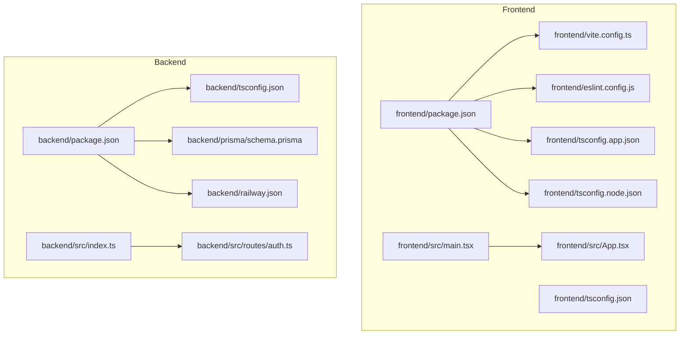
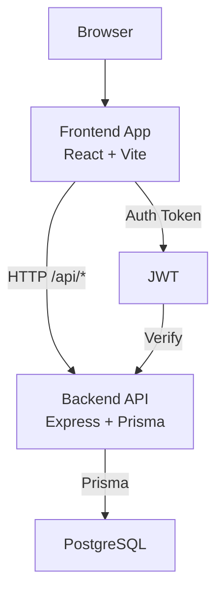
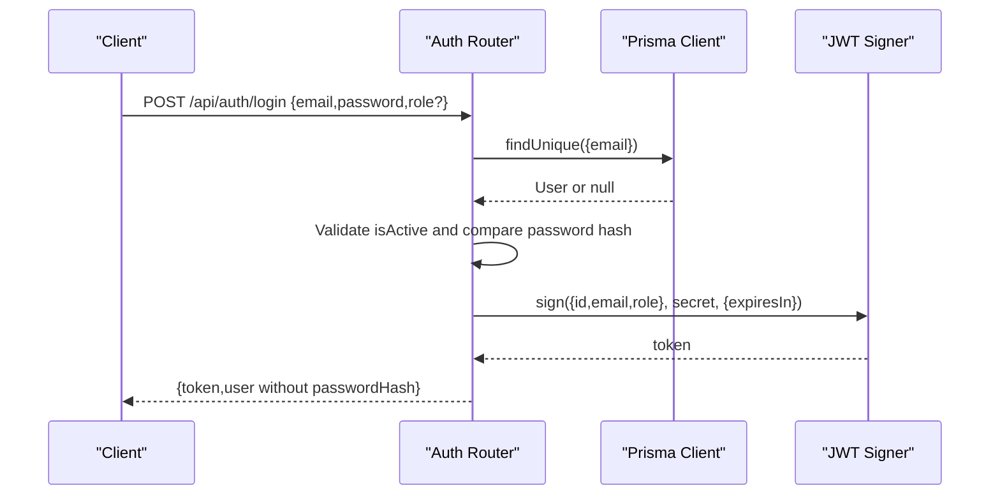
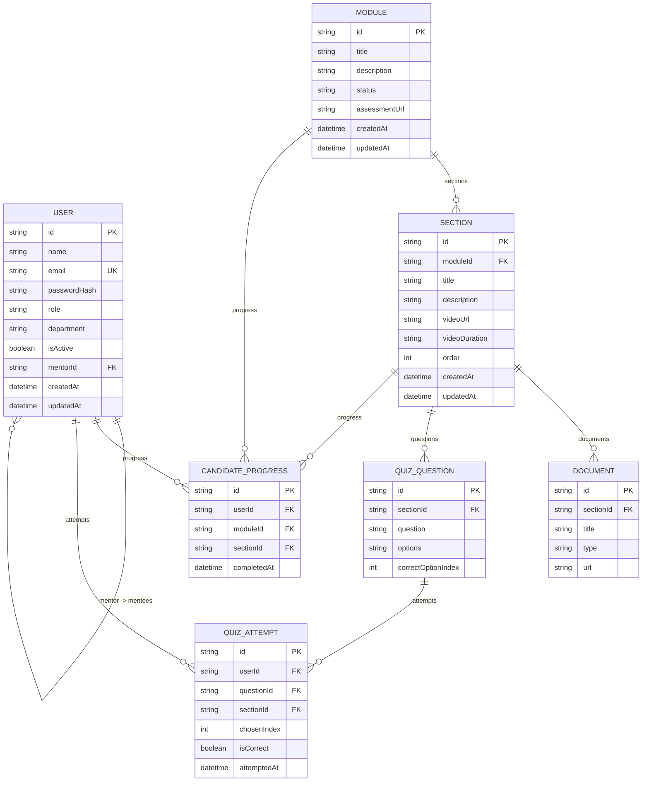
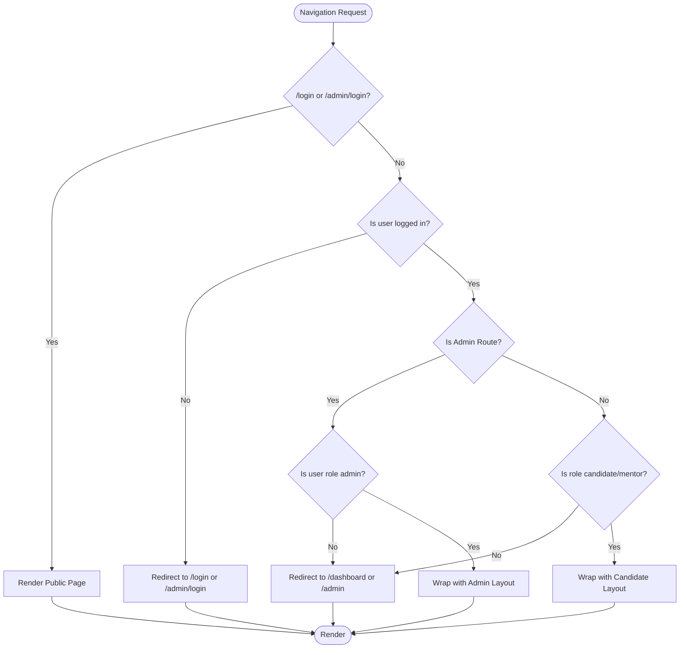
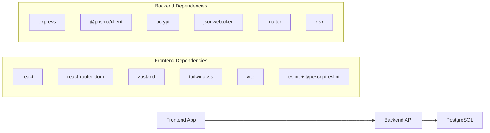

# Development Guidelines

<cite>
**Referenced Files in This Document**
- [README.md](file://README.md)
- [DEVELOPER_QUICK_REFERENCE.md](file://DEVELOPER_QUICK_REFERENCE.md)
- [backend/tsconfig.json](file://backend/tsconfig.json)
- [backend/package.json](file://backend/package.json)
- [backend/src/index.ts](file://backend/src/index.ts)
- [backend/src/routes/auth.ts](file://backend/src/routes/auth.ts)
- [backend/prisma/schema.prisma](file://backend/prisma/schema.prisma)
- [backend/railway.json](file://backend/railway.json)
- [frontend/tsconfig.json](file://frontend/tsconfig.json)
- [frontend/tsconfig.app.json](file://frontend/tsconfig.app.json)
- [frontend/tsconfig.node.json](file://frontend/tsconfig.node.json)
- [frontend/package.json](file://frontend/package.json)
- [frontend/vite.config.ts](file://frontend/vite.config.ts)
- [frontend/eslint.config.js](file://frontend/eslint.config.js)
- [frontend/src/App.tsx](file://frontend/src/App.tsx)
- [frontend/src/main.tsx](file://frontend/src/main.tsx)
</cite>

## Table of Contents
1. [Introduction](#introduction)
2. [Project Structure](#project-structure)
3. [Core Components](#core-components)
4. [Architecture Overview](#architecture-overview)
5. [Detailed Component Analysis](#detailed-component-analysis)
6. [Dependency Analysis](#dependency-analysis)
7. [Performance Considerations](#performance-considerations)
8. [Troubleshooting Guide](#troubleshooting-guide)
9. [Conclusion](#conclusion)
10. [Appendices](#appendices)

## Introduction
This document defines the development guidelines for the Onboarding AntiGravity project. It consolidates coding standards, naming conventions, code organization patterns, development workflow, testing requirements, build configuration, error handling, performance optimization, and debugging strategies. These guidelines apply to both frontend (React/Vite) and backend (Express/Prisma) components and are intended to ensure consistency, maintainability, and reliability across the platform.

## Project Structure
The repository follows a monorepo-like structure with separate frontend and backend directories, each with its own build tooling, configuration, and runtime scripts. The frontend uses Vite with React and TypeScript, while the backend uses Express with TypeScript and Prisma for data modeling and migrations.

**Diagram sources**
- [frontend/package.json:1-43](file://frontend/package.json#L1-L43)
- [frontend/tsconfig.json:1-8](file://frontend/tsconfig.json#L1-L8)
- [frontend/tsconfig.app.json:1-29](file://frontend/tsconfig.app.json#L1-L29)
- [frontend/tsconfig.node.json:1-27](file://frontend/tsconfig.node.json#L1-L27)
- [frontend/vite.config.ts:1-8](file://frontend/vite.config.ts#L1-L8)
- [frontend/eslint.config.js:1-24](file://frontend/eslint.config.js#L1-L24)
- [frontend/src/main.tsx:1-11](file://frontend/src/main.tsx#L1-L11)
- [frontend/src/App.tsx:1-79](file://frontend/src/App.tsx#L1-L79)
- [backend/package.json:1-34](file://backend/package.json#L1-L34)
- [backend/tsconfig.json:1-15](file://backend/tsconfig.json#L1-L15)
- [backend/src/index.ts:1-45](file://backend/src/index.ts#L1-L45)
- [backend/src/routes/auth.ts:1-69](file://backend/src/routes/auth.ts#L1-L69)
- [backend/prisma/schema.prisma:1-112](file://backend/prisma/schema.prisma#L1-L112)
- [backend/railway.json:1-14](file://backend/railway.json#L1-L14)

**Section sources**
- [README.md:1-28](file://README.md#L1-L28)
- [frontend/package.json:1-43](file://frontend/package.json#L1-L43)
- [backend/package.json:1-34](file://backend/package.json#L1-L34)

## Core Components
- Frontend: React application bootstrapped with Vite, TypeScript strictness, ESLint flat config, Tailwind CSS v4, and React Router DOM. Build pipeline compiles TypeScript and bundles assets via Vite.
- Backend: Express server with TypeScript, Prisma ORM for PostgreSQL, and modular route handlers. Health check endpoint and centralized CORS configuration.
- Data Modeling: Prisma schema defines Users, Modules, Sections, Documents, QuizQuestions, CandidateProgress, and QuizAttempt entities with relations and indexes.
- Deployment: Railway Nixpacks builder with healthcheck and restart policy.

**Section sources**
- [frontend/src/main.tsx:1-11](file://frontend/src/main.tsx#L1-L11)
- [frontend/src/App.tsx:1-79](file://frontend/src/App.tsx#L1-L79)
- [backend/src/index.ts:1-45](file://backend/src/index.ts#L1-L45)
- [backend/prisma/schema.prisma:1-112](file://backend/prisma/schema.prisma#L1-L112)
- [backend/railway.json:1-14](file://backend/railway.json#L1-L14)

## Architecture Overview
The system comprises a frontend SPA served by Vite and a backend REST API served by Express. The frontend consumes the backend via HTTP endpoints under /api. Authentication uses JWT tokens issued by the backend. Data persistence is handled by Prisma against PostgreSQL.

**Diagram sources**
- [frontend/src/App.tsx:1-79](file://frontend/src/App.tsx#L1-L79)
- [backend/src/index.ts:1-45](file://backend/src/index.ts#L1-L45)
- [backend/src/routes/auth.ts:1-69](file://backend/src/routes/auth.ts#L1-L69)
- [backend/prisma/schema.prisma:1-112](file://backend/prisma/schema.prisma#L1-L112)

## Detailed Component Analysis

### Backend: Express Server and Routing
- Centralized CORS configuration allows all origins and methods, with preflight handling.
- JSON body parsing middleware is enabled globally.
- Modular routes mounted under /api/* prefixes.
- Health endpoint returns service status and metadata.
- Authentication route demonstrates credential validation, role enforcement, and JWT issuance.

**Diagram sources**
- [backend/src/index.ts:1-45](file://backend/src/index.ts#L1-L45)
- [backend/src/routes/auth.ts:1-69](file://backend/src/routes/auth.ts#L1-L69)
- [backend/prisma/schema.prisma:10-28](file://backend/prisma/schema.prisma#L10-L28)

**Section sources**
- [backend/src/index.ts:1-45](file://backend/src/index.ts#L1-L45)
- [backend/src/routes/auth.ts:1-69](file://backend/src/routes/auth.ts#L1-L69)

### Backend: Prisma Data Model
- Entities: User, Module, Section, Document, QuizQuestion, CandidateProgress, QuizAttempt.
- Relationships: User-mentee/mentor, Module-sections, Section-documents/questions, User-progress/attempts.
- Indexes: Optimized lookups for mentorId, user progress uniqueness, and section/question indices.
- Constraints: UUID primary keys, timestamps, and optional fields per domain needs.

**Diagram sources**
- [backend/prisma/schema.prisma:1-112](file://backend/prisma/schema.prisma#L1-L112)

**Section sources**
- [backend/prisma/schema.prisma:1-112](file://backend/prisma/schema.prisma#L1-L112)

### Frontend: Routing and Guards
- React Router DOM routes define public and protected paths.
- Route guards enforce role-based access:
  - Candidate/Mentor routes require authentication and disallow admin.
  - Admin routes require admin role.
- Layout wrapper applies consistent sidebar and container styling.

**Diagram sources**
- [frontend/src/App.tsx:19-44](file://frontend/src/App.tsx#L19-L44)

**Section sources**
- [frontend/src/App.tsx:1-79](file://frontend/src/App.tsx#L1-L79)

### Frontend: Build and Tooling
- Vite configuration enables React plugin.
- TypeScript configurations split into app and node contexts with strict linting options.
- ESLint flat config extends recommended rules for TS, React Hooks, and React Refresh.
- Scripts: dev, build (TypeScript emit + Vite build), lint, preview.

**Section sources**
- [frontend/vite.config.ts:1-8](file://frontend/vite.config.ts#L1-L8)
- [frontend/tsconfig.app.json:1-29](file://frontend/tsconfig.app.json#L1-L29)
- [frontend/tsconfig.node.json:1-27](file://frontend/tsconfig.node.json#L1-L27)
- [frontend/eslint.config.js:1-24](file://frontend/eslint.config.js#L1-L24)
- [frontend/package.json:1-43](file://frontend/package.json#L1-L43)

### Backend: Build and Tooling
- TypeScript compiler configured for ES target, strict mode, and commonjs output.
- Scripts: dev (ts-node), build (prisma generate + tsc), start (node dist/index.js), postinstall prisma generate.
- Railway deployment uses Nixpacks builder, healthcheck path, and restart policy.

**Section sources**
- [backend/tsconfig.json:1-15](file://backend/tsconfig.json#L1-L15)
- [backend/package.json:1-34](file://backend/package.json#L1-L34)
- [backend/railway.json:1-14](file://backend/railway.json#L1-L14)

## Dependency Analysis
- Frontend depends on React, React Router DOM, Zustand for state, Tailwind CSS, and Vite for bundling. ESLint and TypeScript support development quality.
- Backend depends on Express, Prisma client, bcrypt, jsonwebtoken, multer, xlsx, and development tooling for TypeScript and ts-node.
- Cross-cutting concerns: CORS is configured centrally in the backend; frontend and backend communicate via HTTP endpoints.

**Diagram sources**
- [frontend/package.json:12-22](file://frontend/package.json#L12-L22)
- [frontend/package.json:24-41](file://frontend/package.json#L24-L41)
- [backend/package.json:12-22](file://backend/package.json#L12-L22)
- [backend/package.json:23-32](file://backend/package.json#L23-L32)

**Section sources**
- [frontend/package.json:1-43](file://frontend/package.json#L1-L43)
- [backend/package.json:1-34](file://backend/package.json#L1-L34)

## Performance Considerations
- Backend
  - Use Prisma indexes strategically to optimize frequent joins and lookups (e.g., user progress uniqueness, section/question indices).
  - Minimize payload sizes by excluding sensitive fields in responses (as demonstrated by omitting passwordHash).
  - Keep CORS configuration minimal in production; avoid wildcard origins.
  - Use connection pooling and limit long-running operations in request handlers.
- Frontend
  - Prefer component-level lazy loading and route-based code splitting.
  - Avoid unnecessary re-renders by normalizing state and using memoization patterns.
  - Use efficient chart libraries and virtualize large lists.
- Build
  - Enable minification and tree-shaking via Vite and TypeScript configuration.
  - Monitor bundle size and remove unused dependencies regularly.

[No sources needed since this section provides general guidance]

## Troubleshooting Guide
- CORS errors: Ensure frontend and backend origins match exactly; watch for trailing slashes.
- Database timeouts: Verify transactions are properly committed or rolled back; avoid long-lived connections.
- React Query cache mismatches: Ensure query key arrays are identical in shape and types.
- SQL debugging: Use the provided Docker command to connect to the database and run diagnostic queries.
- Testing coverage: Maintain minimum coverage thresholds; run coverage locally before committing.

**Section sources**
- [DEVELOPER_QUICK_REFERENCE.md:74-86](file://DEVELOPER_QUICK_REFERENCE.md#L74-L86)

## Conclusion
These guidelines establish a consistent foundation for building, testing, and deploying the Onboarding AntiGravity platform. By adhering to the coding standards, development workflow, and operational practices outlined here, contributors can collaborate effectively and deliver a robust, scalable solution.

[No sources needed since this section summarizes without analyzing specific files]

## Appendices

### Coding Standards and Naming Conventions
- TypeScript
  - Strict compiler options enabled for both frontend and backend.
  - Frontend uses separate tsconfig.app.json and tsconfig.node.json for app and tooling contexts.
  - Backend targets ES2020 with commonjs and strict mode.
- File naming
  - Backend route handlers use kebab-case filenames (e.g., auth.ts, candidates.ts).
  - Frontend pages and components use PascalCase filenames (e.g., LoginPage.tsx, ModuleCard.tsx).
- Imports and exports
  - Use explicit relative imports.
  - Group external, internal, and sibling imports distinctly.
- Error handling patterns
  - Centralized try/catch in route handlers; log errors and return structured JSON responses with appropriate HTTP status codes.
  - Avoid exposing sensitive data in responses (e.g., omit passwordHash).
- Performance optimization
  - Leverage Prisma indexes for hot paths.
  - Minimize payload sizes and avoid redundant computations in render paths.

**Section sources**
- [frontend/tsconfig.app.json:1-29](file://frontend/tsconfig.app.json#L1-L29)
- [frontend/tsconfig.node.json:1-27](file://frontend/tsconfig.node.json#L1-L27)
- [backend/tsconfig.json:1-15](file://backend/tsconfig.json#L1-L15)
- [backend/src/routes/auth.ts:1-69](file://backend/src/routes/auth.ts#L1-L69)

### Development Workflow
- Git branching
  - Use feature branches prefixed with feat/username/ticket-id-short-desc and bugfix branches with fix/username/ticket-id-short-desc.
  - Merge to staging for pre-production testing; main for production-ready code.
- Commit messages
  - Follow Conventional Commits with scopes (e.g., feat(auth):, fix(quiz):).
- Code review
  - Require at least one reviewer; ensure CI passes and coverage remains above threshold.

**Section sources**
- [DEVELOPER_QUICK_REFERENCE.md:33-43](file://DEVELOPER_QUICK_REFERENCE.md#L33-L43)

### Testing Requirements
- Unit logic/utilities: Jest
- React components: React Testing Library
- API endpoints: Supertest + Jest
- Coverage requirement: CI fails if PR coverage drops below 80%; run coverage locally before committing.

**Section sources**
- [DEVELOPER_QUICK_REFERENCE.md:80-86](file://DEVELOPER_QUICK_REFERENCE.md#L80-L86)

### Build Configuration
- Frontend
  - Scripts: dev, build (TypeScript emit + Vite build), lint, preview.
  - Vite with React plugin; ESLint flat config; Tailwind CSS v4.
- Backend
  - Scripts: dev (ts-node), build (prisma generate + tsc), start (node dist/index.js), postinstall prisma generate.
  - Railway Nixpacks builder with healthcheck and restart policy.

**Section sources**
- [frontend/package.json:6-11](file://frontend/package.json#L6-L11)
- [frontend/vite.config.ts:1-8](file://frontend/vite.config.ts#L1-L8)
- [frontend/eslint.config.js:1-24](file://frontend/eslint.config.js#L1-L24)
- [backend/package.json:6-11](file://backend/package.json#L6-L11)
- [backend/railway.json:3-12](file://backend/railway.json#L3-L12)

### Examples of Proper Code Structure
- Backend route handler structure: centralized try/catch, early returns for invalid inputs, role checks, and secure token issuance.
- Frontend route guards: role-aware wrappers around page components with navigation fallbacks.
- Prisma model relationships: clear foreign keys, indexes, and relation fields.

**Section sources**
- [backend/src/routes/auth.ts:1-69](file://backend/src/routes/auth.ts#L1-L69)
- [frontend/src/App.tsx:19-44](file://frontend/src/App.tsx#L19-L44)
- [backend/prisma/schema.prisma:10-112](file://backend/prisma/schema.prisma#L10-L112)

### Debugging Strategies and Development Tooling
- Use React Query DevTools to inspect cached queries and keys.
- Access database directly via Docker for ad-hoc queries.
- Validate CORS configuration and environment variables.
- Run local development servers for both frontend and backend as documented.

**Section sources**
- [DEVELOPER_QUICK_REFERENCE.md:57-79](file://DEVELOPER_QUICK_REFERENCE.md#L57-L79)
- [README.md:10-27](file://README.md#L10-L27)