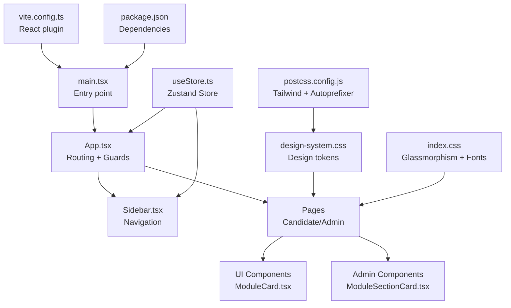
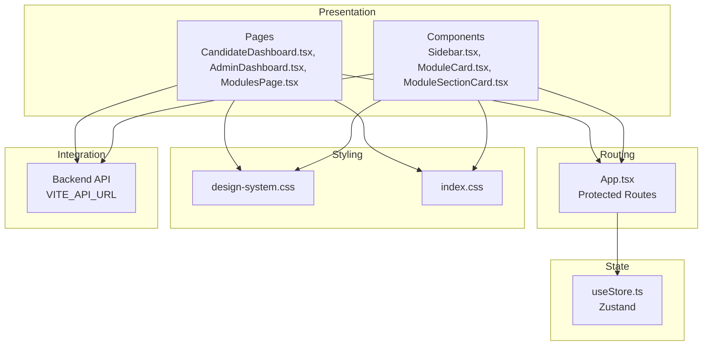
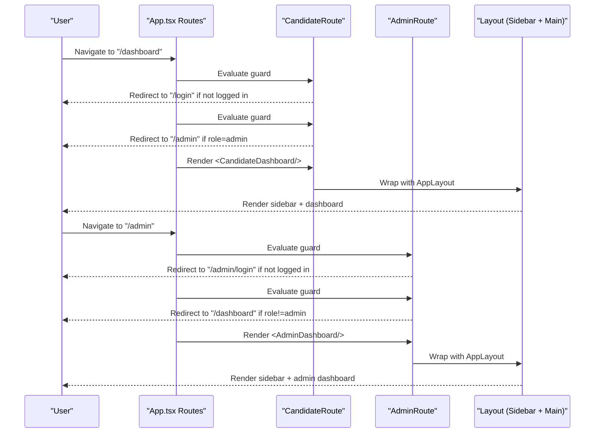
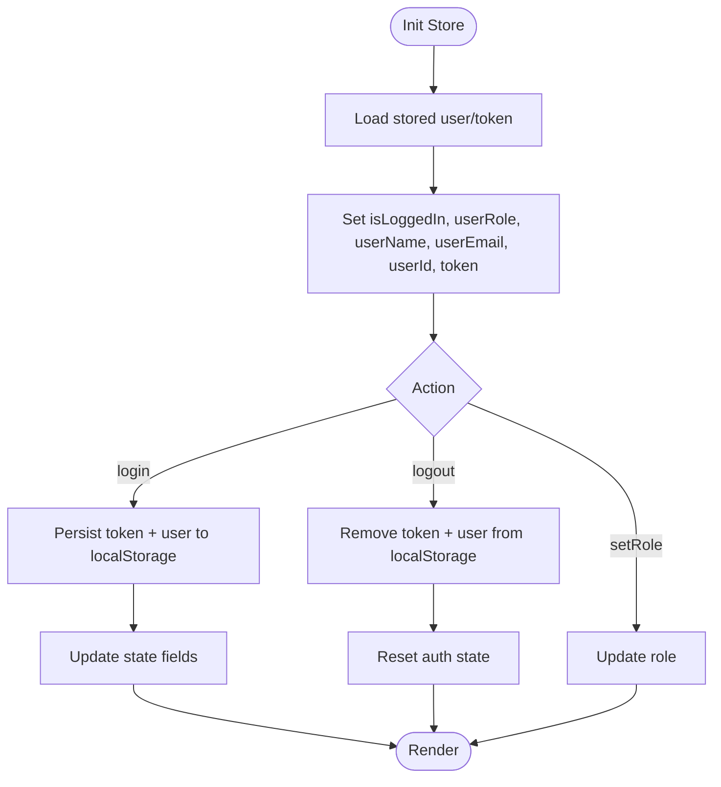
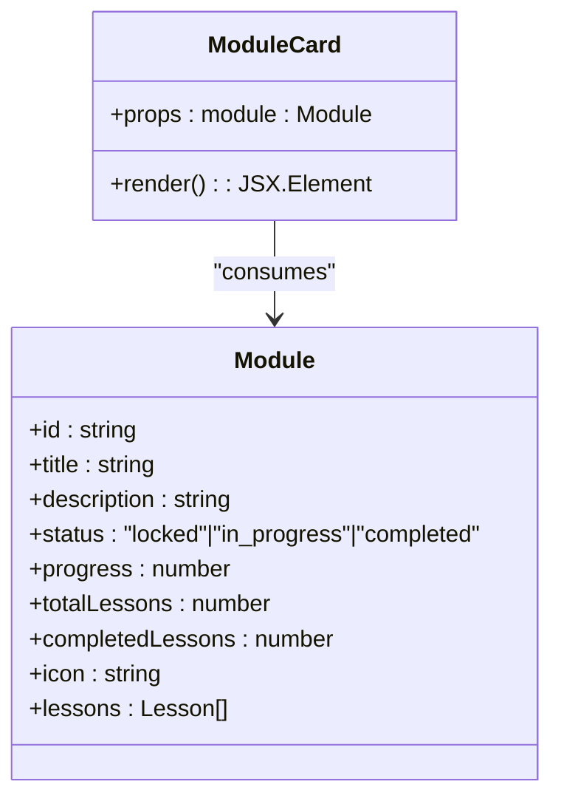
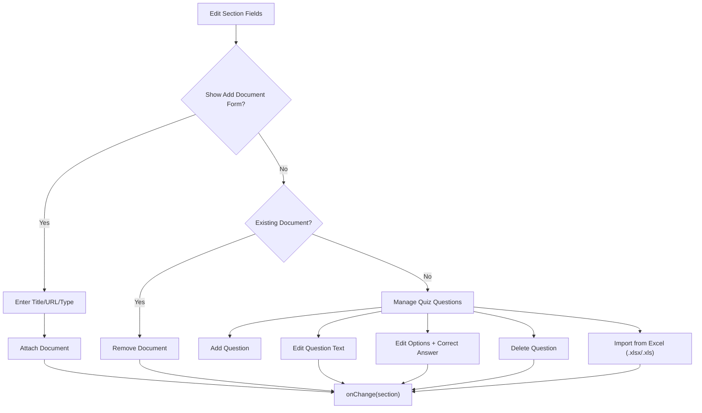
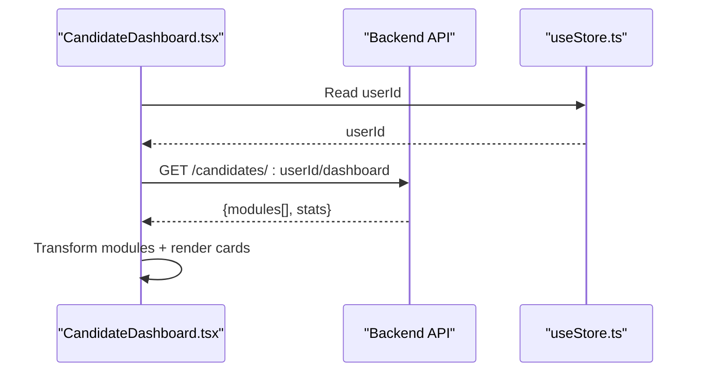
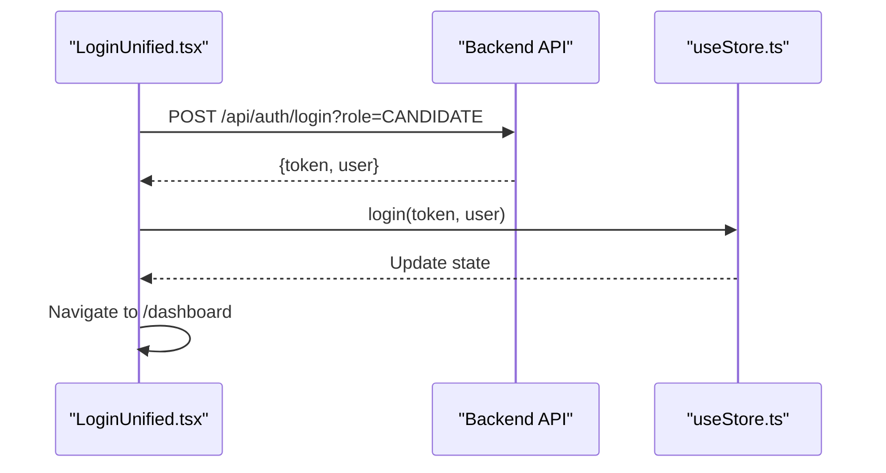
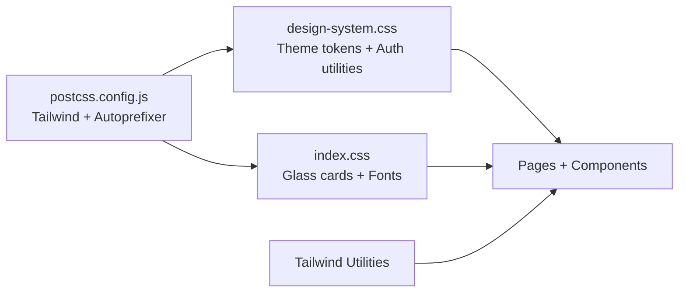
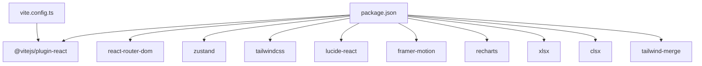

# Frontend Development

<cite>
**Referenced Files in This Document**
- [main.tsx](file://frontend/src/main.tsx)
- [App.tsx](file://frontend/src/App.tsx)
- [useStore.ts](file://frontend/src/store/useStore.ts)
- [Sidebar.tsx](file://frontend/src/components/layout/Sidebar.tsx)
- [ModuleCard.tsx](file://frontend/src/components/ui/ModuleCard.tsx)
- [ModuleSectionCard.tsx](file://frontend/src/components/admin/ModuleSectionCard.tsx)
- [LoginUnified.tsx](file://frontend/src/pages/LoginUnified.tsx)
- [AdminLoginUnified.tsx](file://frontend/src/pages/admin/AdminLoginUnified.tsx)
- [CandidateDashboard.tsx](file://frontend/src/pages/CandidateDashboard.tsx)
- [AdminDashboard.tsx](file://frontend/src/pages/AdminDashboard.tsx)
- [ModulesPage.tsx](file://frontend/src/pages/ModulesPage.tsx)
- [design-system.css](file://frontend/src/styles/design-system.css)
- [index.css](file://frontend/src/index.css)
- [vite.config.ts](file://frontend/vite.config.ts)
- [package.json](file://frontend/package.json)
- [postcss.config.js](file://frontend/postcss.config.js)
</cite>

## Table of Contents
1. [Introduction](#introduction)
2. [Project Structure](#project-structure)
3. [Core Components](#core-components)
4. [Architecture Overview](#architecture-overview)
5. [Detailed Component Analysis](#detailed-component-analysis)
6. [Dependency Analysis](#dependency-analysis)
7. [Performance Considerations](#performance-considerations)
8. [Troubleshooting Guide](#troubleshooting-guide)
9. [Conclusion](#conclusion)
10. [Appendices](#appendices)

## Introduction
This document provides comprehensive frontend development guidance for the Onboarding AntiGravity React application. It explains the React application structure, routing configuration with protected routes, state management via Zustand, component architecture (layout, UI, admin, and page components), styling approach using Tailwind CSS and the design system, role-based UI patterns (admin, candidate, mentor), examples of component usage, state management patterns, backend API integration, responsive design, accessibility considerations, and performance optimization techniques.

## Project Structure
The frontend is a Vite-powered React application configured with TypeScript and Tailwind CSS. Key areas:
- Entry point initializes the app and mounts the root component.
- Routing is centralized with protected routes for candidate/mentor and admin.
- State management is handled by a global Zustand store with persistence in localStorage.
- Components are organized by concern: layout, UI, admin, and pages.
- Styling leverages Tailwind utilities and a shared design system CSS file.



**Diagram sources**
- [main.tsx:1-11](file://frontend/src/main.tsx#L1-L11)
- [App.tsx:1-79](file://frontend/src/App.tsx#L1-L79)
- [useStore.ts:1-77](file://frontend/src/store/useStore.ts#L1-L77)
- [Sidebar.tsx:1-99](file://frontend/src/components/layout/Sidebar.tsx#L1-L99)
- [ModuleCard.tsx:1-56](file://frontend/src/components/ui/ModuleCard.tsx#L1-L56)
- [ModuleSectionCard.tsx:1-247](file://frontend/src/components/admin/ModuleSectionCard.tsx#L1-L247)
- [design-system.css:1-94](file://frontend/src/styles/design-system.css#L1-L94)
- [index.css:1-55](file://frontend/src/index.css#L1-L55)
- [vite.config.ts:1-8](file://frontend/vite.config.ts#L1-L8)
- [postcss.config.js:1-7](file://frontend/postcss.config.js#L1-L7)
- [package.json:1-43](file://frontend/package.json#L1-L43)

**Section sources**
- [main.tsx:1-11](file://frontend/src/main.tsx#L1-L11)
- [vite.config.ts:1-8](file://frontend/vite.config.ts#L1-L8)
- [postcss.config.js:1-7](file://frontend/postcss.config.js#L1-L7)
- [package.json:1-43](file://frontend/package.json#L1-L43)

## Core Components
- Global state via Zustand:
  - Stores user identity, role, authentication token, and overall progress.
  - Provides login/logout actions and role switching.
  - Persists session to localStorage and restores on startup.
- Protected routing:
  - CandidateRoute enforces access for candidate/mentor only and wraps content in a shared layout.
  - AdminRoute enforces admin-only access and wraps content in a shared layout.
- Layout:
  - Sidebar adapts navigation and branding per role and handles logout.
- UI components:
  - ModuleCard renders module tiles with progress and completion indicators.
- Admin components:
  - ModuleSectionCard supports module section editing, document attachment, and quiz import from Excel.

**Section sources**
- [useStore.ts:1-77](file://frontend/src/store/useStore.ts#L1-L77)
- [App.tsx:30-44](file://frontend/src/App.tsx#L30-L44)
- [Sidebar.tsx:1-99](file://frontend/src/components/layout/Sidebar.tsx#L1-L99)
- [ModuleCard.tsx:1-56](file://frontend/src/components/ui/ModuleCard.tsx#L1-L56)
- [ModuleSectionCard.tsx:1-247](file://frontend/src/components/admin/ModuleSectionCard.tsx#L1-L247)

## Architecture Overview
The frontend follows a layered architecture:
- Presentation layer: Pages and components.
- Routing layer: Centralized routes with guards.
- State layer: Zustand store with localStorage persistence.
- Styling layer: Tailwind CSS with a design system abstraction.
- Integration layer: API calls to the backend via environment-configured URLs.



**Diagram sources**
- [App.tsx:46-76](file://frontend/src/App.tsx#L46-L76)
- [useStore.ts:49-76](file://frontend/src/store/useStore.ts#L49-L76)
- [design-system.css:1-94](file://frontend/src/styles/design-system.css#L1-L94)
- [index.css:1-55](file://frontend/src/index.css#L1-L55)
- [CandidateDashboard.tsx:19-57](file://frontend/src/pages/CandidateDashboard.tsx#L19-L57)
- [AdminDashboard.tsx:19-73](file://frontend/src/pages/AdminDashboard.tsx#L19-L73)
- [ModulesPage.tsx:15-22](file://frontend/src/pages/ModulesPage.tsx#L15-L22)

## Detailed Component Analysis

### Routing and Protected Routes
- Public login routes for candidates and admins.
- Candidate/Mentor routes guarded by CandidateRoute, redirecting unauthenticated users or non-candidate/mentor roles.
- Admin routes guarded by AdminRoute, redirecting unauthenticated users or non-admin roles.
- Shared AppLayout provides a sidebar and main content area.



**Diagram sources**
- [App.tsx:46-76](file://frontend/src/App.tsx#L46-L76)
- [App.tsx:30-44](file://frontend/src/App.tsx#L30-L44)

**Section sources**
- [App.tsx:46-76](file://frontend/src/App.tsx#L46-L76)
- [App.tsx:30-44](file://frontend/src/App.tsx#L30-L44)

### State Management with Zustand
- Types:
  - Module and Lesson interfaces model learning content.
  - AppState defines state fields and actions.
- Persistence:
  - Restores user and token from localStorage on initialization.
  - login writes token and user to localStorage; logout clears them.
- Actions:
  - login(token, user) updates identity and role.
  - logout resets authentication state.
  - setRole(role) switches role programmatically.



**Diagram sources**
- [useStore.ts:39-76](file://frontend/src/store/useStore.ts#L39-L76)

**Section sources**
- [useStore.ts:24-76](file://frontend/src/store/useStore.ts#L24-L76)

### Layout Components
- Sidebar:
  - Role-aware navigation items (candidate vs admin).
  - Logout handler invokes store.logout and navigates to appropriate login route.
  - Dynamic branding and accent colors per role.

```mermaid
classDiagram
class Sidebar {
+props : {}
+logout() : void
+handleLogout() : void
+render() : JSX.Element
}
class useStore {
+userName : string
+userRole : string
+logout() : void
}
Sidebar --> useStore : "reads state + calls logout"
```

**Diagram sources**
- [Sidebar.tsx:1-99](file://frontend/src/components/layout/Sidebar.tsx#L1-L99)
- [useStore.ts:24-76](file://frontend/src/store/useStore.ts#L24-L76)

**Section sources**
- [Sidebar.tsx:1-99](file://frontend/src/components/layout/Sidebar.tsx#L1-L99)

### UI Components
- ModuleCard:
  - Renders module tile with lock/completion states.
  - Progress bar and lesson counters.
  - Role-specific styling and interactivity.



**Diagram sources**
- [ModuleCard.tsx:1-56](file://frontend/src/components/ui/ModuleCard.tsx#L1-L56)
- [useStore.ts:4-22](file://frontend/src/store/useStore.ts#L4-L22)

**Section sources**
- [ModuleCard.tsx:1-56](file://frontend/src/components/ui/ModuleCard.tsx#L1-L56)
- [useStore.ts:4-22](file://frontend/src/store/useStore.ts#L4-L22)

### Admin Components
- ModuleSectionCard:
  - Manages section metadata, video URL, duration, and attached documents.
  - Supports dynamic quiz creation and Excel import via xlsx.
  - Integrates with backend for quiz template download.



**Diagram sources**
- [ModuleSectionCard.tsx:34-246](file://frontend/src/components/admin/ModuleSectionCard.tsx#L34-L246)

**Section sources**
- [ModuleSectionCard.tsx:1-247](file://frontend/src/components/admin/ModuleSectionCard.tsx#L1-L247)

### Page Components and Role Patterns
- CandidateDashboard:
  - Loads modules and stats via API, renders welcome banner, stats cards, and module grid.
  - Uses motion animations for entrance effects.
- AdminDashboard:
  - Parallelizes user and analytics loads, computes metrics, and renders candidate table with status badges.
  - Provides CSV export integration with backend.
- ModulesPage:
  - Lists modules with progress bars and navigation to module view.



**Diagram sources**
- [CandidateDashboard.tsx:19-57](file://frontend/src/pages/CandidateDashboard.tsx#L19-L57)
- [useStore.ts:24-36](file://frontend/src/store/useStore.ts#L24-L36)

**Section sources**
- [CandidateDashboard.tsx:1-138](file://frontend/src/pages/CandidateDashboard.tsx#L1-L138)
- [AdminDashboard.tsx:1-211](file://frontend/src/pages/AdminDashboard.tsx#L1-L211)
- [ModulesPage.tsx:1-79](file://frontend/src/pages/ModulesPage.tsx#L1-L79)

### Authentication Pages
- LoginUnified:
  - Enforces candidate/mentor role via API query parameter.
  - Calls login action and navigates to dashboard.
- AdminLoginUnified:
  - Enforces admin role via API query parameter.
  - Calls login action and navigates to admin dashboard.



**Diagram sources**
- [LoginUnified.tsx:16-40](file://frontend/src/pages/LoginUnified.tsx#L16-L40)
- [useStore.ts:58-68](file://frontend/src/store/useStore.ts#L58-L68)

**Section sources**
- [LoginUnified.tsx:1-120](file://frontend/src/pages/LoginUnified.tsx#L1-L120)
- [AdminLoginUnified.tsx:1-132](file://frontend/src/pages/admin/AdminLoginUnified.tsx#L1-L132)

### Styling Approach and Design System
- Tailwind CSS:
  - Utility-first classes for responsive layouts, spacing, and colors.
  - PostCSS pipeline with Tailwind and Autoprefixer.
- Design system:
  - Centralized theme tokens for brand colors and fonts.
  - Auth page utilities and glassmorphism card styles.
- Index CSS:
  - Additional design tokens and glass-card hover effects.



**Diagram sources**
- [design-system.css:1-94](file://frontend/src/styles/design-system.css#L1-L94)
- [index.css:1-55](file://frontend/src/index.css#L1-L55)
- [postcss.config.js:1-7](file://frontend/postcss.config.js#L1-L7)

**Section sources**
- [design-system.css:1-94](file://frontend/src/styles/design-system.css#L1-L94)
- [index.css:1-55](file://frontend/src/index.css#L1-L55)
- [postcss.config.js:1-7](file://frontend/postcss.config.js#L1-L7)

## Dependency Analysis
- Runtime dependencies include React, React Router DOM, Zustand, Tailwind CSS v4, Lucide icons, Framer Motion, Recharts, xlsx, and clsx/tailwind-merge.
- Build toolchain uses Vite with React plugin and TypeScript.



**Diagram sources**
- [vite.config.ts:1-8](file://frontend/vite.config.ts#L1-L8)
- [package.json:12-41](file://frontend/package.json#L12-L41)

**Section sources**
- [package.json:12-41](file://frontend/package.json#L12-L41)
- [vite.config.ts:1-8](file://frontend/vite.config.ts#L1-L8)

## Performance Considerations
- Lazy loading and code splitting:
  - Consider lazy-loading heavy pages (e.g., AdminAnalyticsPage) to reduce initial bundle size.
- Efficient re-renders:
  - Keep components pure; memoize derived props where appropriate.
- API calls:
  - Batch requests (as seen in AdminDashboard) to reduce round trips.
  - Add caching strategies for static data.
- Rendering:
  - Use virtualization for long lists (e.g., candidate tables).
  - Defer non-critical animations until after hydration.
- Bundle optimization:
  - Tree-shake unused icons and components.
  - Prefer lightweight alternatives where feasible.

## Troubleshooting Guide
- Authentication failures:
  - Verify VITE_API_URL is set and reachable.
  - Confirm API endpoints support the intended role query parameter.
- Session persistence:
  - Ensure localStorage availability and integrity.
  - On logout, confirm token and user entries are removed.
- Styling issues:
  - Confirm Tailwind and PostCSS plugins are installed and configured.
  - Check that design-system.css and index.css are imported in the app entry.
- Responsive layout:
  - Test breakpoints and ensure mobile-first classes are applied.
- Accessibility:
  - Provide meaningful alt text for images and icons.
  - Ensure keyboard navigation and focus indicators for interactive elements.

**Section sources**
- [LoginUnified.tsx:22-31](file://frontend/src/pages/LoginUnified.tsx#L22-L31)
- [AdminLoginUnified.tsx:21-31](file://frontend/src/pages/admin/AdminLoginUnified.tsx#L21-L31)
- [useStore.ts:58-73](file://frontend/src/store/useStore.ts#L58-L73)
- [design-system.css:1-94](file://frontend/src/styles/design-system.css#L1-L94)
- [index.css:1-55](file://frontend/src/index.css#L1-L55)

## Conclusion
The Onboarding AntiGravity frontend is a well-structured React application leveraging protected routing, a centralized Zustand store, and a cohesive design system built on Tailwind CSS. The component architecture cleanly separates concerns across layout, UI, admin, and page layers, while role-based patterns ensure appropriate access and UX. Integration with backend APIs is straightforward via environment-configured endpoints, and the styling system promotes consistency and responsiveness. Following the recommendations herein will help maintain scalability, performance, and accessibility as the platform evolves.

## Appendices
- Example usage patterns:
  - LoginUnified and AdminLoginUnified demonstrate role-enforced authentication flows.
  - CandidateDashboard and AdminDashboard illustrate API-driven data fetching and rendering.
  - ModuleCard and ModuleSectionCard showcase reusable UI and admin editing capabilities.
- Backend integration tips:
  - Centralize API base URL in environment variables.
  - Standardize error handling and loading states across pages.
  - Use consistent data transformation helpers to normalize backend responses.