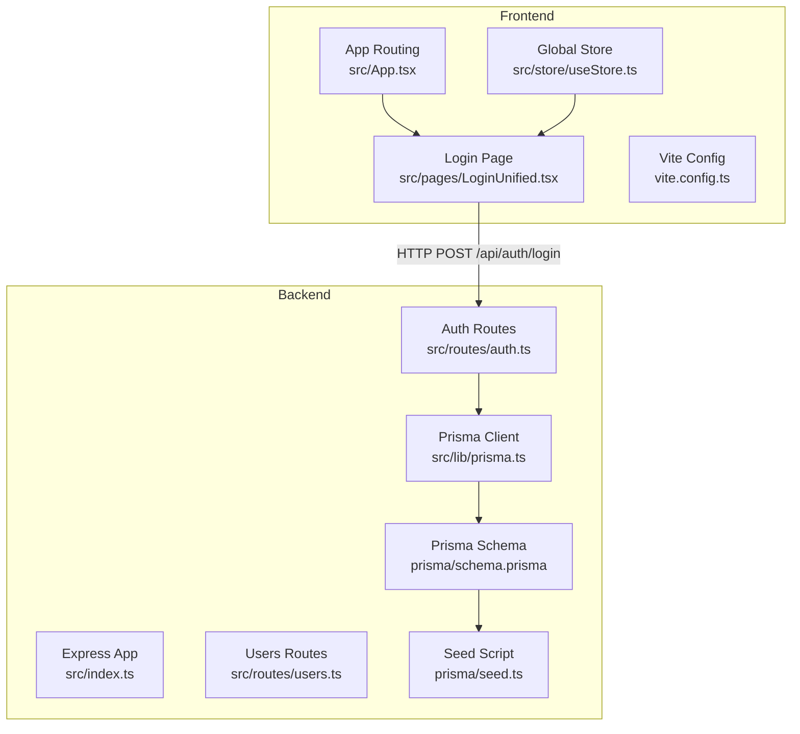
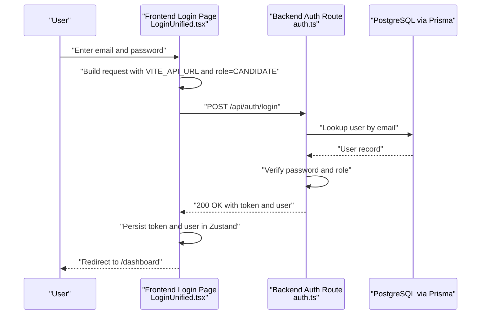
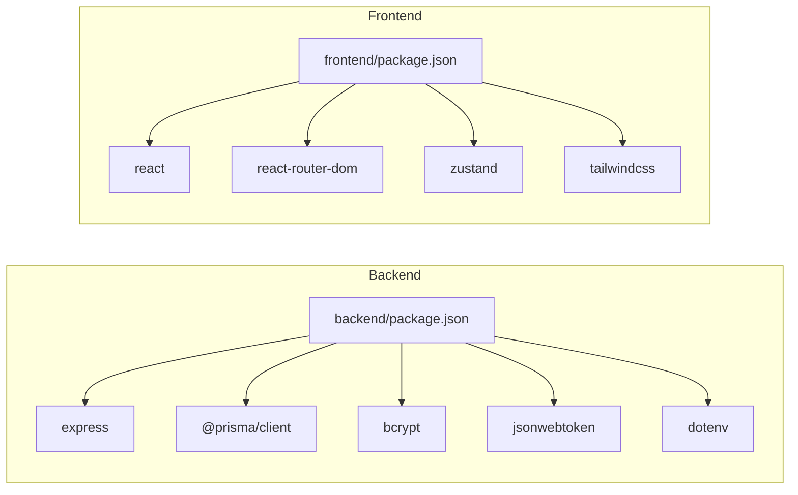

# Getting Started

<cite>
**Referenced Files in This Document**
- [README.md](file://README.md)
- [DEVELOPER_QUICK_REFERENCE.md](file://DEVELOPER_QUICK_REFERENCE.md)
- [backend/package.json](file://backend/package.json)
- [frontend/package.json](file://frontend/package.json)
- [backend/prisma/schema.prisma](file://backend/prisma/schema.prisma)
- [backend/prisma/seed.ts](file://backend/prisma/seed.ts)
- [backend/src/lib/prisma.ts](file://backend/src/lib/prisma.ts)
- [backend/src/index.ts](file://backend/src/index.ts)
- [backend/src/routes/auth.ts](file://backend/src/routes/auth.ts)
- [backend/src/routes/users.ts](file://backend/src/routes/users.ts)
- [frontend/src/App.tsx](file://frontend/src/App.tsx)
- [frontend/src/pages/LoginUnified.tsx](file://frontend/src/pages/LoginUnified.tsx)
- [frontend/src/store/useStore.ts](file://frontend/src/store/useStore.ts)
- [frontend/vite.config.ts](file://frontend/vite.config.ts)
</cite>

## Table of Contents
1. [Introduction](#introduction)
2. [Project Structure](#project-structure)
3. [Core Components](#core-components)
4. [Architecture Overview](#architecture-overview)
5. [Detailed Component Analysis](#detailed-component-analysis)
6. [Dependency Analysis](#dependency-analysis)
7. [Performance Considerations](#performance-considerations)
8. [Troubleshooting Guide](#troubleshooting-guide)
9. [Conclusion](#conclusion)
10. [Appendices](#appendices)

## Introduction
This guide helps you set up the Onboarding AntiGravity platform locally, covering prerequisites, environment setup, backend and frontend installation, database initialization, and initial seeding. It also includes verification steps, troubleshooting tips, and quick start examples so you can run the platform and log in as an admin or candidate user.

## Project Structure
The platform consists of:
- Backend service built with Node.js, Express, Prisma ORM, and PostgreSQL
- Frontend built with React 18, Vite, Tailwind CSS v4, Zustand, React Router DOM, Framer Motion, and Recharts
- Prisma schema defining the data model and seed script initializing default users

**Diagram sources**
- [backend/src/index.ts:1-45](file://backend/src/index.ts#L1-L45)
- [backend/src/routes/auth.ts:1-69](file://backend/src/routes/auth.ts#L1-L69)
- [backend/src/routes/users.ts:1-180](file://backend/src/routes/users.ts#L1-L180)
- [backend/src/lib/prisma.ts:1-19](file://backend/src/lib/prisma.ts#L1-L19)
- [backend/prisma/schema.prisma:1-112](file://backend/prisma/schema.prisma#L1-L112)
- [backend/prisma/seed.ts:1-50](file://backend/prisma/seed.ts#L1-L50)
- [frontend/src/App.tsx:1-79](file://frontend/src/App.tsx#L1-L79)
- [frontend/src/pages/LoginUnified.tsx:1-120](file://frontend/src/pages/LoginUnified.tsx#L1-L120)
- [frontend/src/store/useStore.ts:1-77](file://frontend/src/store/useStore.ts#L1-L77)
- [frontend/vite.config.ts:1-8](file://frontend/vite.config.ts#L1-L8)

**Section sources**
- [README.md:1-28](file://README.md#L1-L28)
- [backend/package.json:1-34](file://backend/package.json#L1-L34)
- [frontend/package.json:1-43](file://frontend/package.json#L1-L43)

## Core Components
- Backend
  - Express server exposing REST endpoints under /api/*
  - Authentication and user management routes
  - Prisma ORM for PostgreSQL data access
- Frontend
  - React application with routing and protected routes
  - Zustand store for authentication state and user profile
  - Login page that calls the backend authentication endpoint

Key runtime behaviors:
- Backend listens on port 3000 by default and exposes a health endpoint
- Frontend reads the API base URL from environment variables and posts to /api/auth/login with role enforcement
- Prisma singleton ensures a single database connection across the backend

**Section sources**
- [backend/src/index.ts:1-45](file://backend/src/index.ts#L1-L45)
- [backend/src/routes/auth.ts:1-69](file://backend/src/routes/auth.ts#L1-L69)
- [backend/src/lib/prisma.ts:1-19](file://backend/src/lib/prisma.ts#L1-L19)
- [frontend/src/App.tsx:1-79](file://frontend/src/App.tsx#L1-L79)
- [frontend/src/pages/LoginUnified.tsx:1-120](file://frontend/src/pages/LoginUnified.tsx#L1-L120)
- [frontend/src/store/useStore.ts:1-77](file://frontend/src/store/useStore.ts#L1-L77)

## Architecture Overview
High-level flow for login and dashboard access:
- User submits credentials on the frontend login page
- Frontend sends a POST request to the backend authentication endpoint with role=CANDIDATE
- Backend validates credentials, checks user activity, enforces role, and issues a JWT
- Frontend stores the token and user data, then navigates to the candidate dashboard

**Diagram sources**
- [frontend/src/pages/LoginUnified.tsx:16-40](file://frontend/src/pages/LoginUnified.tsx#L16-L40)
- [backend/src/routes/auth.ts:9-66](file://backend/src/routes/auth.ts#L9-L66)
- [backend/src/lib/prisma.ts:1-19](file://backend/src/lib/prisma.ts#L1-L19)

## Detailed Component Analysis

### Prerequisites
- Node.js
  - Backend and frontend use modern Node.js versions compatible with the project’s package configurations
- PostgreSQL
  - The backend expects a PostgreSQL database configured via DATABASE_URL in environment variables
- Development environment
  - The frontend uses Vite for fast development builds
  - The backend uses TypeScript and ts-node for development

Verification:
- Confirm Node.js and npm versions meet the project’s requirements
- Ensure PostgreSQL is running and accessible

**Section sources**
- [README.md:10-27](file://README.md#L10-L27)
- [backend/package.json:1-34](file://backend/package.json#L1-L34)
- [frontend/package.json:1-43](file://frontend/package.json#L1-L43)

### Environment Variable Configuration
Configure the following environment variables for local development:

Backend
- DATABASE_URL: PostgreSQL connection string used by Prisma
- JWT_SECRET: Secret key for signing JWT tokens
- PORT: Backend port (defaults to 3000 if unset)

Frontend
- VITE_API_URL: Base URL for the backend API (e.g., http://localhost:3000)

Notes:
- The backend loads environment variables via dotenv and uses them in the Express app and auth route
- The frontend reads VITE_API_URL at runtime to determine the API base URL

**Section sources**
- [backend/src/index.ts:13-16](file://backend/src/index.ts#L13-L16)
- [backend/src/routes/auth.ts:7-7](file://backend/src/routes/auth.ts#L7-L7)
- [frontend/src/pages/LoginUnified.tsx:22-22](file://frontend/src/pages/LoginUnified.tsx#L22-L22)

### Database Initialization and Seeding
Steps:
1. Ensure PostgreSQL is running locally
2. Set DATABASE_URL in the backend environment
3. Run Prisma migrations to create tables
4. Seed the database with default users

Default seeded users:
- Admin user with a known email and password
- Candidate user with a known email and password

Verification:
- After seeding, you can log in with the provided credentials

**Section sources**
- [backend/prisma/schema.prisma:5-8](file://backend/prisma/schema.prisma#L5-L8)
- [backend/prisma/seed.ts:6-44](file://backend/prisma/seed.ts#L6-L44)

### Backend Installation and Setup
Install and run the backend:
- Change to the backend directory
- Install dependencies
- Start the development server

The backend exposes:
- Health endpoint at /api/health
- Authentication and user management endpoints under /api/*

**Section sources**
- [README.md:15-20](file://README.md#L15-L20)
- [backend/src/index.ts:23-39](file://backend/src/index.ts#L23-L39)

### Frontend Installation and Setup
Install and run the frontend:
- Change to the frontend directory
- Install dependencies
- Start the development server

The frontend:
- Uses Vite for development
- Reads VITE_API_URL to determine the backend base URL
- Implements protected routes and a Zustand store for authentication state

**Section sources**
- [README.md:22-27](file://README.md#L22-L27)
- [frontend/vite.config.ts:1-8](file://frontend/vite.config.ts#L1-L8)
- [frontend/src/pages/LoginUnified.tsx:22-22](file://frontend/src/pages/LoginUnified.tsx#L22-L22)
- [frontend/src/App.tsx:46-75](file://frontend/src/App.tsx#L46-L75)
- [frontend/src/store/useStore.ts:39-76](file://frontend/src/store/useStore.ts#L39-L76)

### Verification Steps
After completing installation and seeding:
- Backend health check
  - Visit the health endpoint exposed by the backend server
- Database connectivity
  - Confirm Prisma can connect to PostgreSQL using DATABASE_URL
- Seeding verification
  - Check that default admin and candidate users exist
- Frontend login
  - Open the frontend in a browser and log in with seeded credentials

**Section sources**
- [backend/src/index.ts:32-39](file://backend/src/index.ts#L32-L39)
- [backend/prisma/seed.ts:42-44](file://backend/prisma/seed.ts#L42-L44)
- [frontend/src/pages/LoginUnified.tsx:16-40](file://frontend/src/pages/LoginUnified.tsx#L16-L40)

### Quick Start Examples
First-time user scenarios:
- Admin login
  - Use the admin email and password from the seed output
- Candidate login
  - Use the candidate email and password from the seed output
- Navigate to dashboards
  - After successful login, the frontend redirects to the appropriate dashboard based on role

**Section sources**
- [backend/prisma/seed.ts:42-44](file://backend/prisma/seed.ts#L42-L44)
- [frontend/src/pages/LoginUnified.tsx:16-40](file://frontend/src/pages/LoginUnified.tsx#L16-L40)
- [frontend/src/App.tsx:46-75](file://frontend/src/App.tsx#L46-L75)

## Dependency Analysis
Backend dependencies include Express, Prisma Client, Bcrypt, JWT, and related type definitions. Frontend dependencies include React, React Router DOM, Tailwind CSS, Zustand, and related dev tools.

**Diagram sources**
- [backend/package.json:12-32](file://backend/package.json#L12-L32)
- [frontend/package.json:12-41](file://frontend/package.json#L12-L41)

**Section sources**
- [backend/package.json:12-32](file://backend/package.json#L12-L32)
- [frontend/package.json:12-41](file://frontend/package.json#L12-L41)

## Performance Considerations
- Use the Prisma singleton pattern to avoid excessive database connections
- Keep development logs minimal in production-like environments
- Prefer incremental builds and hot reloading during development

**Section sources**
- [backend/src/lib/prisma.ts:3-16](file://backend/src/lib/prisma.ts#L3-L16)

## Troubleshooting Guide
Common issues and resolutions:
- CORS errors on the frontend
  - Ensure the frontend VITE_API_URL matches the backend origin used by the frontend
- Database timeout or connection failures
  - Verify DATABASE_URL is correct and PostgreSQL is reachable
- Role enforcement failures
  - The login endpoint enforces role=CANDIDATE for the unified candidate login; ensure you are logging in with a candidate or mentor account when using that portal
- Health endpoint not reachable
  - Confirm the backend server is running and listening on the expected port

**Section sources**
- [frontend/src/pages/LoginUnified.tsx:22-28](file://frontend/src/pages/LoginUnified.tsx#L22-L28)
- [backend/src/routes/auth.ts:38-46](file://backend/src/routes/auth.ts#L38-L46)
- [backend/src/index.ts:41-43](file://backend/src/index.ts#L41-L43)

## Conclusion
You now have the prerequisites, environment variables configured, backend and frontend installed, and the database initialized with seed data. Use the verification steps to confirm everything is working, then explore the admin and candidate dashboards using the seeded credentials.

## Appendices

### Appendix A: Developer Quick Reference Highlights
- Day 1 setup commands for environment variables, database, migrations, seeding, and development servers
- Branching strategy and commit message format
- Common tasks such as adding database tables and generating React components
- SQL queries for debugging and a debugging checklist

**Section sources**
- [DEVELOPER_QUICK_REFERENCE.md:5-31](file://DEVELOPER_QUICK_REFERENCE.md#L5-L31)
- [DEVELOPER_QUICK_REFERENCE.md:33-43](file://DEVELOPER_QUICK_REFERENCE.md#L33-L43)
- [DEVELOPER_QUICK_REFERENCE.md:44-56](file://DEVELOPER_QUICK_REFERENCE.md#L44-L56)
- [DEVELOPER_QUICK_REFERENCE.md:57-73](file://DEVELOPER_QUICK_REFERENCE.md#L57-L73)
- [DEVELOPER_QUICK_REFERENCE.md:74-79](file://DEVELOPER_QUICK_REFERENCE.md#L74-L79)