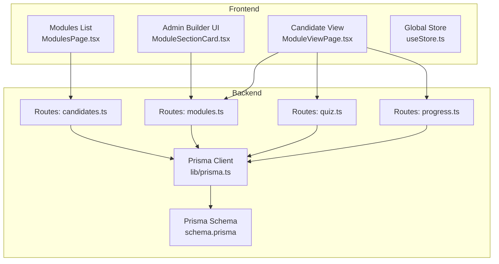
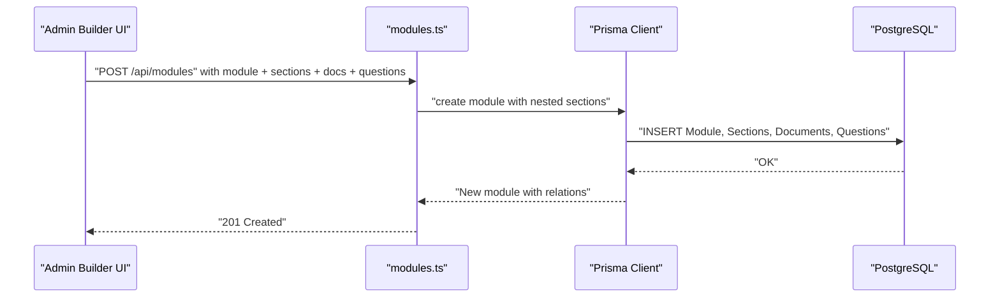
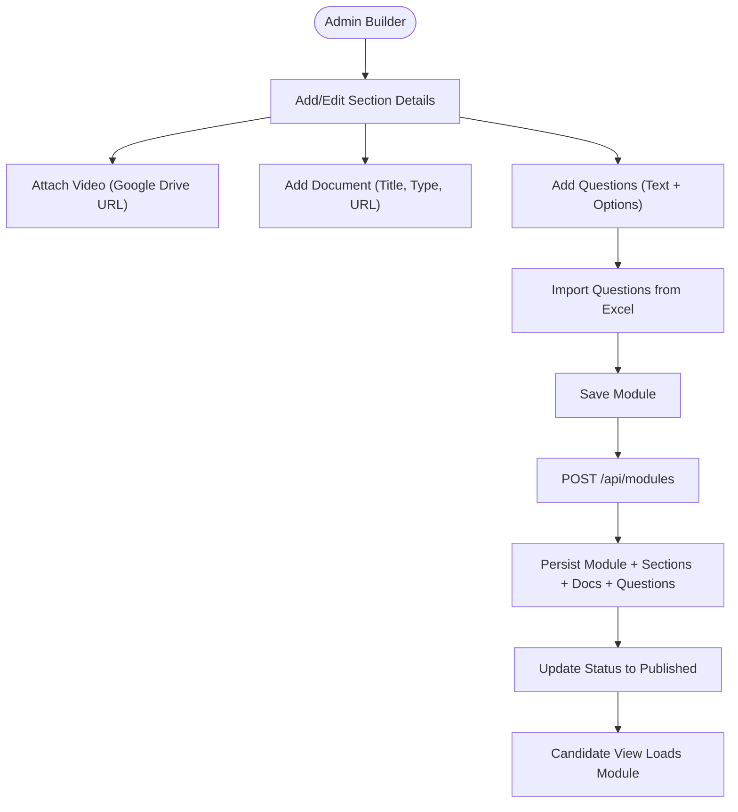
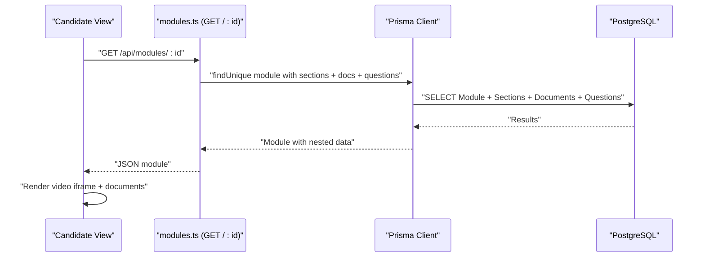
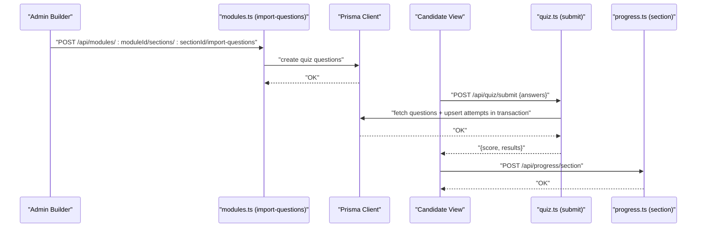
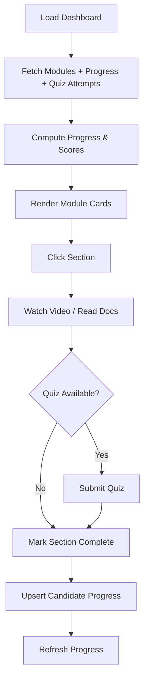
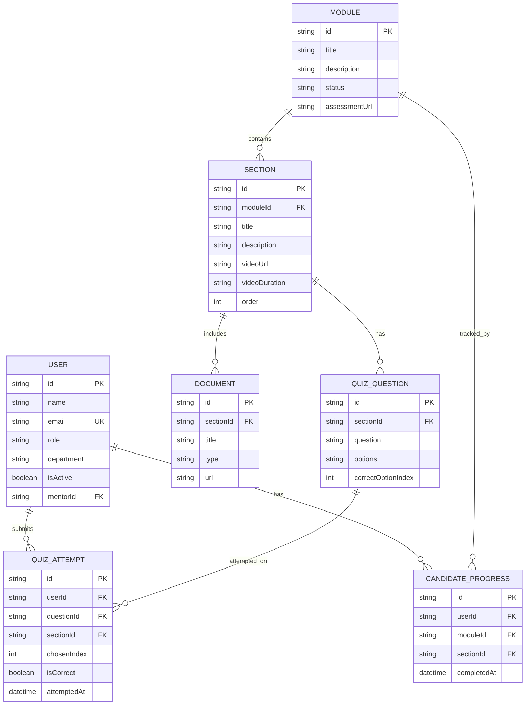
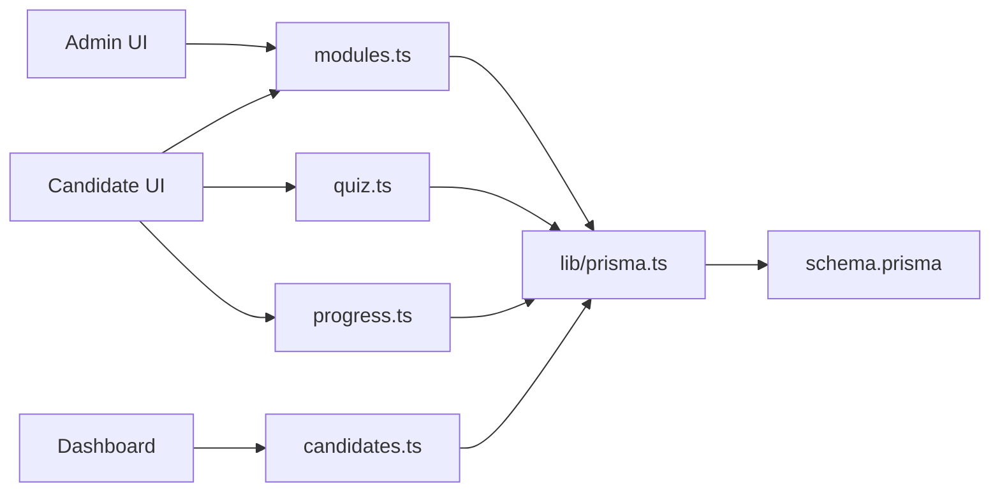

# Learning Management System

<cite>
**Referenced Files in This Document**
- [backend/src/routes/modules.ts](file://backend/src/routes/modules.ts)
- [backend/src/routes/quiz.ts](file://backend/src/routes/quiz.ts)
- [backend/src/routes/progress.ts](file://backend/src/routes/progress.ts)
- [backend/src/routes/candidates.ts](file://backend/src/routes/candidates.ts)
- [backend/src/lib/prisma.ts](file://backend/src/lib/prisma.ts)
- [backend/prisma/schema.prisma](file://backend/prisma/schema.prisma)
- [frontend/src/pages/ModuleViewPage.tsx](file://frontend/src/pages/ModuleViewPage.tsx)
- [frontend/src/pages/ModulesPage.tsx](file://frontend/src/pages/ModulesPage.tsx)
- [frontend/src/components/admin/ModuleSectionCard.tsx](file://frontend/src/components/admin/ModuleSectionCard.tsx)
- [frontend/src/components/ui/ModuleCard.tsx](file://frontend/src/components/ui/ModuleCard.tsx)
- [frontend/src/store/useStore.ts](file://frontend/src/store/useStore.ts)
</cite>

## Table of Contents
1. [Introduction](#introduction)
2. [Project Structure](#project-structure)
3. [Core Components](#core-components)
4. [Architecture Overview](#architecture-overview)
5. [Detailed Component Analysis](#detailed-component-analysis)
6. [Dependency Analysis](#dependency-analysis)
7. [Performance Considerations](#performance-considerations)
8. [Troubleshooting Guide](#troubleshooting-guide)
9. [Conclusion](#conclusion)
10. [Appendices](#appendices)

## Introduction
This document describes the Learning Management System (LMS) within Onboarding AntiGravity. It covers module creation and management via the admin builder, content delivery for videos and documents, mixed content handling, assessments with quiz creation and Excel import, and learning progression tracking with completion verification. It also includes practical examples for configuring modules, uploading content, setting up assessments, organizing content, and understanding user engagement patterns.

## Project Structure
The LMS spans a modern full-stack architecture:
- Backend built with Express and Prisma ORM, exposing REST APIs for modules, quizzes, progress, and candidate dashboards.
- Frontend built with React and TypeScript, featuring admin tools for module authoring and candidate-facing learning views.
- Data persistence using PostgreSQL via Prisma.

**Diagram sources**
- [frontend/src/components/admin/ModuleSectionCard.tsx:1-247](file://frontend/src/components/admin/ModuleSectionCard.tsx#L1-L247)
- [frontend/src/pages/ModuleViewPage.tsx:1-273](file://frontend/src/pages/ModuleViewPage.tsx#L1-L273)
- [frontend/src/pages/ModulesPage.tsx:1-79](file://frontend/src/pages/ModulesPage.tsx#L1-L79)
- [frontend/src/store/useStore.ts:1-77](file://frontend/src/store/useStore.ts#L1-L77)
- [backend/src/routes/modules.ts:1-209](file://backend/src/routes/modules.ts#L1-L209)
- [backend/src/routes/quiz.ts:1-76](file://backend/src/routes/quiz.ts#L1-L76)
- [backend/src/routes/progress.ts:1-63](file://backend/src/routes/progress.ts#L1-L63)
- [backend/src/routes/candidates.ts:1-117](file://backend/src/routes/candidates.ts#L1-L117)
- [backend/src/lib/prisma.ts:1-19](file://backend/src/lib/prisma.ts#L1-L19)
- [backend/prisma/schema.prisma:1-112](file://backend/prisma/schema.prisma#L1-L112)

**Section sources**
- [backend/src/routes/modules.ts:1-209](file://backend/src/routes/modules.ts#L1-L209)
- [backend/src/routes/quiz.ts:1-76](file://backend/src/routes/quiz.ts#L1-L76)
- [backend/src/routes/progress.ts:1-63](file://backend/src/routes/progress.ts#L1-L63)
- [backend/src/routes/candidates.ts:1-117](file://backend/src/routes/candidates.ts#L1-L117)
- [backend/src/lib/prisma.ts:1-19](file://backend/src/lib/prisma.ts#L1-L19)
- [backend/prisma/schema.prisma:1-112](file://backend/prisma/schema.prisma#L1-L112)
- [frontend/src/pages/ModuleViewPage.tsx:1-273](file://frontend/src/pages/ModuleViewPage.tsx#L1-L273)
- [frontend/src/pages/ModulesPage.tsx:1-79](file://frontend/src/pages/ModulesPage.tsx#L1-L79)
- [frontend/src/components/admin/ModuleSectionCard.tsx:1-247](file://frontend/src/components/admin/ModuleSectionCard.tsx#L1-L247)
- [frontend/src/components/ui/ModuleCard.tsx:1-56](file://frontend/src/components/ui/ModuleCard.tsx#L1-L56)
- [frontend/src/store/useStore.ts:1-77](file://frontend/src/store/useStore.ts#L1-L77)

## Core Components
- Module management API: create, update status, delete, and fetch modules with nested sections, documents, and questions.
- Quiz submission API: batch-optimized scoring and attempt persistence with transactional upserts.
- Progress tracking API: mark sections complete per user and fetch completed sections.
- Candidate dashboard API: compute module progress, quiz scores, and overall statistics.
- Admin builder UI: drag-and-drop section cards, add documents, create/edit questions, and import via Excel.
- Candidate view: watch videos, download documents, take knowledge checks, and track completion.
- Global store: manage user session and roles.

**Section sources**
- [backend/src/routes/modules.ts:28-77](file://backend/src/routes/modules.ts#L28-L77)
- [backend/src/routes/quiz.ts:6-73](file://backend/src/routes/quiz.ts#L6-L73)
- [backend/src/routes/progress.ts:6-38](file://backend/src/routes/progress.ts#L6-L38)
- [backend/src/routes/candidates.ts:6-114](file://backend/src/routes/candidates.ts#L6-L114)
- [frontend/src/components/admin/ModuleSectionCard.tsx:34-247](file://frontend/src/components/admin/ModuleSectionCard.tsx#L34-L247)
- [frontend/src/pages/ModuleViewPage.tsx:9-273](file://frontend/src/pages/ModuleViewPage.tsx#L9-L273)
- [frontend/src/store/useStore.ts:24-77](file://frontend/src/store/useStore.ts#L24-L77)

## Architecture Overview
The LMS follows a clean separation of concerns:
- Frontend renders admin and candidate experiences and calls backend endpoints.
- Backend routes orchestrate Prisma queries and transactions.
- Prisma schema defines entities and relationships.

**Diagram sources**
- [frontend/src/components/admin/ModuleSectionCard.tsx:34-247](file://frontend/src/components/admin/ModuleSectionCard.tsx#L34-L247)
- [backend/src/routes/modules.ts:28-77](file://backend/src/routes/modules.ts#L28-L77)
- [backend/src/lib/prisma.ts:1-19](file://backend/src/lib/prisma.ts#L1-L19)
- [backend/prisma/schema.prisma:30-80](file://backend/prisma/schema.prisma#L30-L80)

## Detailed Component Analysis

### Module Creation and Management Workflow
- Admin builder allows adding sections, videos, documents, and questions inline.
- The backend accepts a module payload with nested sections and persists them atomically.
- Status updates enable publishing or keeping modules in draft.

**Diagram sources**
- [frontend/src/components/admin/ModuleSectionCard.tsx:34-247](file://frontend/src/components/admin/ModuleSectionCard.tsx#L34-L247)
- [backend/src/routes/modules.ts:28-77](file://backend/src/routes/modules.ts#L28-L77)
- [backend/prisma/schema.prisma:30-80](file://backend/prisma/schema.prisma#L30-L80)

**Section sources**
- [frontend/src/components/admin/ModuleSectionCard.tsx:34-247](file://frontend/src/components/admin/ModuleSectionCard.tsx#L34-L247)
- [backend/src/routes/modules.ts:28-77](file://backend/src/routes/modules.ts#L28-L77)
- [backend/prisma/schema.prisma:30-80](file://backend/prisma/schema.prisma#L30-L80)

### Content Delivery System (Video, Documents, Mixed Content)
- Candidate view supports embedded Google Drive videos and downloadable documents.
- Mixed content handling is achieved by rendering video and document resources conditionally.
- Sidebar navigation guides learners through ordered sections.

**Diagram sources**
- [frontend/src/pages/ModuleViewPage.tsx:21-38](file://frontend/src/pages/ModuleViewPage.tsx#L21-L38)
- [backend/src/routes/modules.ts:127-153](file://backend/src/routes/modules.ts#L127-L153)
- [backend/src/lib/prisma.ts:1-19](file://backend/src/lib/prisma.ts#L1-L19)
- [backend/prisma/schema.prisma:30-80](file://backend/prisma/schema.prisma#L30-L80)

**Section sources**
- [frontend/src/pages/ModuleViewPage.tsx:144-186](file://frontend/src/pages/ModuleViewPage.tsx#L144-L186)
- [backend/src/routes/modules.ts:127-153](file://backend/src/routes/modules.ts#L127-L153)

### Assessment System (Quiz, Question Types, Excel Import, Grading)
- Question types supported: single-select with four options.
- Admin can create questions directly in the builder or import via Excel.
- Candidate submits answers; backend computes score and persists attempts in a single transaction.
- Candidate view displays quiz results inline.

**Diagram sources**
- [frontend/src/components/admin/ModuleSectionCard.tsx:89-117](file://frontend/src/components/admin/ModuleSectionCard.tsx#L89-L117)
- [backend/src/routes/modules.ts:155-205](file://backend/src/routes/modules.ts#L155-L205)
- [backend/src/routes/quiz.ts:6-73](file://backend/src/routes/quiz.ts#L6-L73)
- [backend/src/routes/progress.ts:6-38](file://backend/src/routes/progress.ts#L6-L38)

**Section sources**
- [frontend/src/components/admin/ModuleSectionCard.tsx:89-117](file://frontend/src/components/admin/ModuleSectionCard.tsx#L89-L117)
- [backend/src/routes/modules.ts:155-205](file://backend/src/routes/modules.ts#L155-L205)
- [backend/src/routes/quiz.ts:6-73](file://backend/src/routes/quiz.ts#L6-L73)

### Learning Progression Tracking and Completion Verification
- Candidate dashboard aggregates module progress and quiz scores.
- Per-section completion records are stored and used to unlock subsequent sections.
- Candidate view marks sections complete after content consumption or quiz submission.

**Diagram sources**
- [backend/src/routes/candidates.ts:6-114](file://backend/src/routes/candidates.ts#L6-L114)
- [frontend/src/pages/ModulesPage.tsx:9-79](file://frontend/src/pages/ModulesPage.tsx#L9-L79)
- [frontend/src/components/ui/ModuleCard.tsx:6-56](file://frontend/src/components/ui/ModuleCard.tsx#L6-L56)
- [frontend/src/pages/ModuleViewPage.tsx:57-94](file://frontend/src/pages/ModuleViewPage.tsx#L57-L94)
- [backend/src/routes/progress.ts:6-38](file://backend/src/routes/progress.ts#L6-L38)

**Section sources**
- [backend/src/routes/candidates.ts:6-114](file://backend/src/routes/candidates.ts#L6-L114)
- [frontend/src/pages/ModulesPage.tsx:9-79](file://frontend/src/pages/ModulesPage.tsx#L9-L79)
- [frontend/src/components/ui/ModuleCard.tsx:6-56](file://frontend/src/components/ui/ModuleCard.tsx#L6-L56)
- [frontend/src/pages/ModuleViewPage.tsx:57-94](file://frontend/src/pages/ModuleViewPage.tsx#L57-L94)
- [backend/src/routes/progress.ts:6-38](file://backend/src/routes/progress.ts#L6-L38)

### Data Model Overview
The LMS relies on a normalized schema with clear relationships among users, modules, sections, documents, quiz questions, quiz attempts, and progress records.

**Diagram sources**
- [backend/prisma/schema.prisma:10-112](file://backend/prisma/schema.prisma#L10-L112)

**Section sources**
- [backend/prisma/schema.prisma:10-112](file://backend/prisma/schema.prisma#L10-L112)

## Dependency Analysis
- Backend routes depend on a singleton Prisma client to prevent connection pool exhaustion.
- Frontend components depend on environment variables for API base URLs.
- Candidate dashboard aggregates data from multiple sources to compute meaningful metrics.

**Diagram sources**
- [frontend/src/components/admin/ModuleSectionCard.tsx:1-247](file://frontend/src/components/admin/ModuleSectionCard.tsx#L1-L247)
- [frontend/src/pages/ModuleViewPage.tsx:1-273](file://frontend/src/pages/ModuleViewPage.tsx#L1-L273)
- [backend/src/routes/modules.ts:1-209](file://backend/src/routes/modules.ts#L1-L209)
- [backend/src/routes/quiz.ts:1-76](file://backend/src/routes/quiz.ts#L1-L76)
- [backend/src/routes/progress.ts:1-63](file://backend/src/routes/progress.ts#L1-L63)
- [backend/src/routes/candidates.ts:1-117](file://backend/src/routes/candidates.ts#L1-L117)
- [backend/src/lib/prisma.ts:1-19](file://backend/src/lib/prisma.ts#L1-L19)
- [backend/prisma/schema.prisma:1-112](file://backend/prisma/schema.prisma#L1-L112)

**Section sources**
- [backend/src/lib/prisma.ts:1-19](file://backend/src/lib/prisma.ts#L1-L19)
- [backend/src/routes/modules.ts:1-209](file://backend/src/routes/modules.ts#L1-L209)
- [backend/src/routes/quiz.ts:1-76](file://backend/src/routes/quiz.ts#L1-L76)
- [backend/src/routes/progress.ts:1-63](file://backend/src/routes/progress.ts#L1-L63)
- [backend/src/routes/candidates.ts:1-117](file://backend/src/routes/candidates.ts#L1-L117)

## Performance Considerations
- N+1 prevention: The quiz submission endpoint fetches all relevant questions in one query and uses a transaction to upsert attempts, minimizing round-trips.
- Parallelization: Candidate dashboard fetches modules, progress, and quiz attempts concurrently.
- Dedicated endpoints: A single-module endpoint avoids loading unnecessary data for the candidate view.
- Singleton Prisma client: Ensures efficient connection pooling and reduces overhead.

**Section sources**
- [backend/src/routes/quiz.ts:16-57](file://backend/src/routes/quiz.ts#L16-L57)
- [backend/src/routes/candidates.ts:21-40](file://backend/src/routes/candidates.ts#L21-L40)
- [backend/src/routes/modules.ts:127-153](file://backend/src/routes/modules.ts#L127-L153)
- [backend/src/lib/prisma.ts:3-12](file://backend/src/lib/prisma.ts#L3-L12)

## Troubleshooting Guide
- Quiz import errors: Verify Excel column names and ensure correct option numbering; the backend validates presence and range of fields.
- Empty spreadsheets: Import endpoint rejects empty sheets.
- Upload failures: Ensure the file is attached and readable; the backend handles multer errors.
- Progress recording: Confirm required fields (userId, moduleId, sectionId) are present.
- Video embedding: Google Drive links are transformed from /view to /preview for embedding.

**Section sources**
- [backend/src/routes/modules.ts:155-205](file://backend/src/routes/modules.ts#L155-L205)
- [backend/src/routes/progress.ts:10-31](file://backend/src/routes/progress.ts#L10-L31)
- [frontend/src/pages/ModuleViewPage.tsx:48-55](file://frontend/src/pages/ModuleViewPage.tsx#L48-L55)

## Conclusion
The LMS provides a robust foundation for module authoring, content delivery, assessments, and progress tracking. Its design emphasizes performance, maintainability, and scalability through careful API design, transactional operations, and a clear data model. Administrators can efficiently build modules with mixed content, while candidates enjoy a guided, progress-aware learning experience.

## Appendices

### Examples and Procedures

- Example: Module configuration
  - Use the admin builder to define sections, attach a video, add a document, and create questions.
  - Save the module and update its status to published.

  **Section sources**
  - [frontend/src/components/admin/ModuleSectionCard.tsx:34-247](file://frontend/src/components/admin/ModuleSectionCard.tsx#L34-L247)
  - [backend/src/routes/modules.ts:28-77](file://backend/src/routes/modules.ts#L28-L77)

- Example: Content upload procedure
  - Add a document with title, type, and URL in the section card.
  - Candidate view will render resource links for download.

  **Section sources**
  - [frontend/src/components/admin/ModuleSectionCard.tsx:158-189](file://frontend/src/components/admin/ModuleSectionCard.tsx#L158-L189)
  - [frontend/src/pages/ModuleViewPage.tsx:161-176](file://frontend/src/pages/ModuleViewPage.tsx#L161-L176)

- Example: Assessment setup
  - Create questions inline or import from Excel using the provided template.
  - Candidate view presents questions and records results upon submission.

  **Section sources**
  - [frontend/src/components/admin/ModuleSectionCard.tsx:89-117](file://frontend/src/components/admin/ModuleSectionCard.tsx#L89-L117)
  - [backend/src/routes/modules.ts:107-125](file://backend/src/routes/modules.ts#L107-L125)
  - [backend/src/routes/quiz.ts:6-73](file://backend/src/routes/quiz.ts#L6-L73)

- Example: Content organization strategies
  - Order sections logically; use video for orientation and documents for reference.
  - Keep quiz questions aligned with section content and use consistent option labeling.

  **Section sources**
  - [backend/prisma/schema.prisma:43-59](file://backend/prisma/schema.prisma#L43-L59)
  - [frontend/src/pages/ModuleViewPage.tsx:242-267](file://frontend/src/pages/ModuleViewPage.tsx#L242-L267)

- Example: User engagement patterns
  - Candidates tend to watch videos, review documents, and complete knowledge checks.
  - Progress bars and completion badges encourage continued learning.

  **Section sources**
  - [frontend/src/pages/ModulesPage.tsx:44-75](file://frontend/src/pages/ModulesPage.tsx#L44-L75)
  - [frontend/src/components/ui/ModuleCard.tsx:6-56](file://frontend/src/components/ui/ModuleCard.tsx#L6-L56)
  - [frontend/src/pages/ModuleViewPage.tsx:120-142](file://frontend/src/pages/ModuleViewPage.tsx#L120-L142)