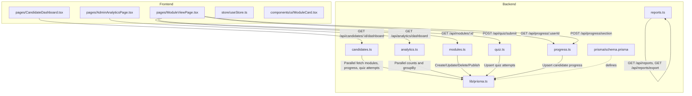
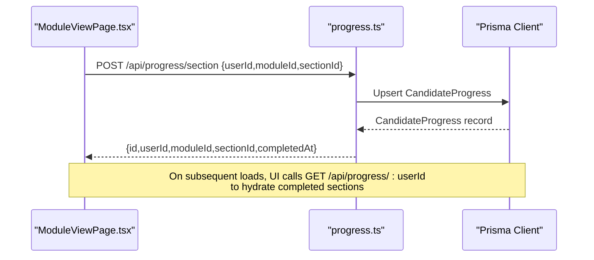
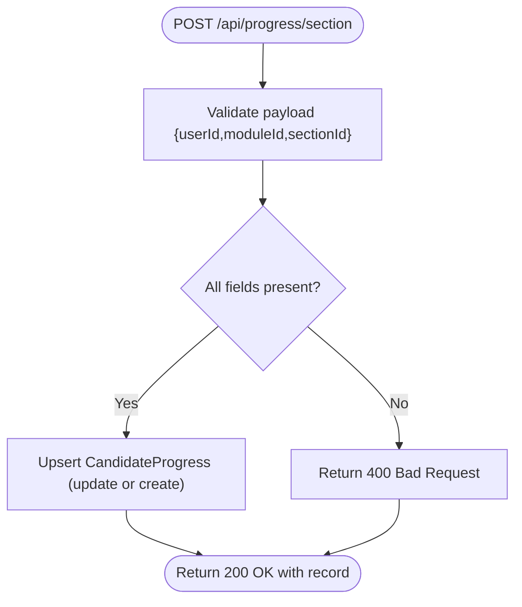
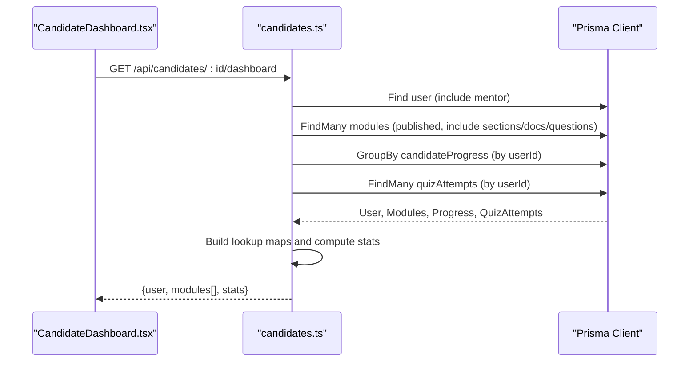
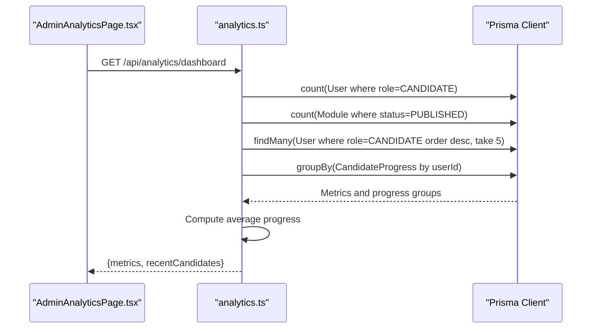
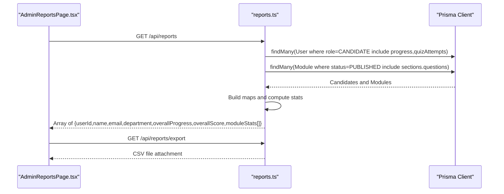
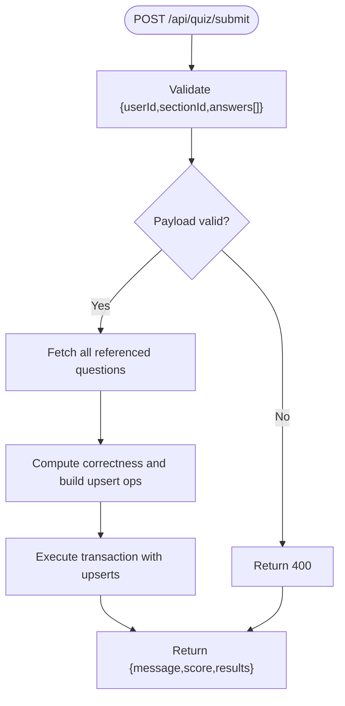
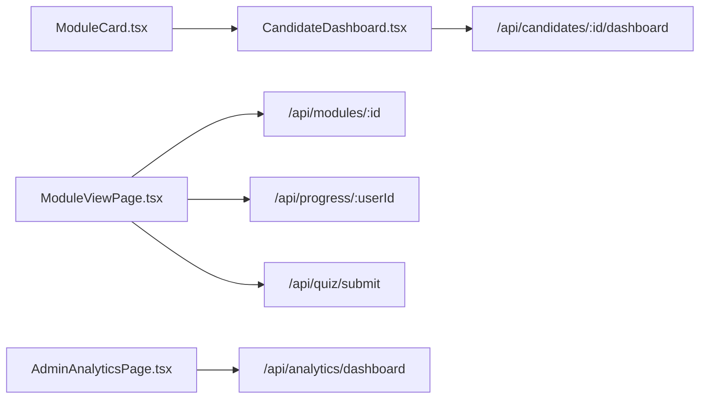
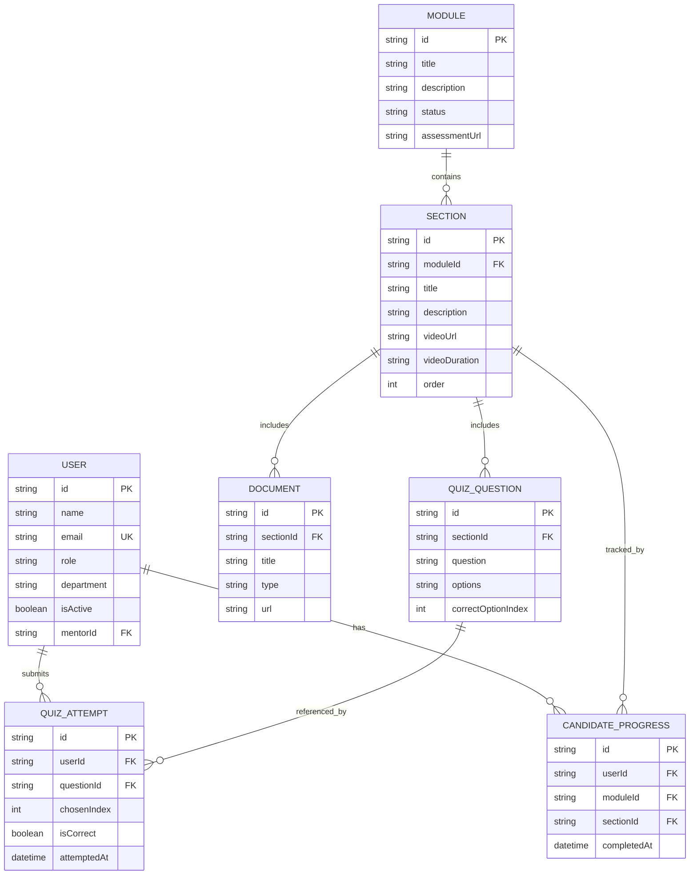
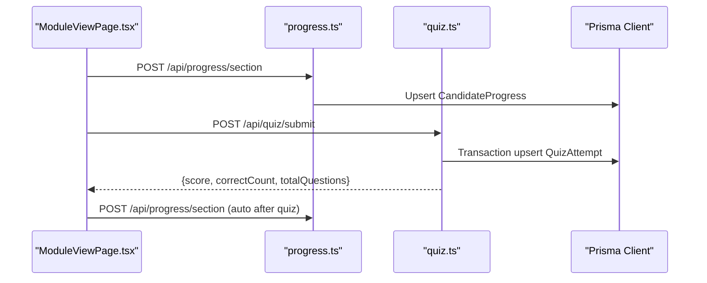

# Progress Tracking and Analytics

<cite>
**Referenced Files in This Document**
- [backend/src/routes/progress.ts](file://backend/src/routes/progress.ts)
- [backend/src/routes/analytics.ts](file://backend/src/routes/analytics.ts)
- [backend/src/routes/candidates.ts](file://backend/src/routes/candidates.ts)
- [backend/src/routes/modules.ts](file://backend/src/routes/modules.ts)
- [backend/src/routes/reports.ts](file://backend/src/routes/reports.ts)
- [backend/src/routes/quiz.ts](file://backend/src/routes/quiz.ts)
- [backend/src/lib/prisma.ts](file://backend/src/lib/prisma.ts)
- [backend/prisma/schema.prisma](file://backend/prisma/schema.prisma)
- [frontend/src/pages/CandidateDashboard.tsx](file://frontend/src/pages/CandidateDashboard.tsx)
- [frontend/src/pages/ModuleViewPage.tsx](file://frontend/src/pages/ModuleViewPage.tsx)
- [frontend/src/pages/AdminAnalyticsPage.tsx](file://frontend/src/pages/AdminAnalyticsPage.tsx)
- [frontend/src/store/useStore.ts](file://frontend/src/store/useStore.ts)
- [frontend/src/components/ui/ModuleCard.tsx](file://frontend/src/components/ui/ModuleCard.tsx)
</cite>

## Table of Contents
1. [Introduction](#introduction)
2. [Project Structure](#project-structure)
3. [Core Components](#core-components)
4. [Architecture Overview](#architecture-overview)
5. [Detailed Component Analysis](#detailed-component-analysis)
6. [Dependency Analysis](#dependency-analysis)
7. [Performance Considerations](#performance-considerations)
8. [Troubleshooting Guide](#troubleshooting-guide)
9. [Conclusion](#conclusion)
10. [Appendices](#appendices)

## Introduction
This document explains the progress tracking and analytics system in Onboarding AntiGravity. It covers real-time progress monitoring, module and section completion tracking, analytics dashboards, reporting capabilities, and system health monitoring. It also provides practical workflows, analytics interpretation tips, performance insights, and guidance on data privacy and reporting customization.

## Project Structure
The system comprises:
- Backend API routes for progress, analytics, candidates, modules, reports, and quiz scoring
- Prisma ORM models defining the data schema and relationships
- Frontend pages for candidate dashboards, module views, and admin analytics
- A shared Zustand store for user session and UI state

**Diagram sources**
- [backend/src/routes/progress.ts:1-63](file://backend/src/routes/progress.ts#L1-L63)
- [backend/src/routes/analytics.ts:1-55](file://backend/src/routes/analytics.ts#L1-L55)
- [backend/src/routes/candidates.ts:1-117](file://backend/src/routes/candidates.ts#L1-L117)
- [backend/src/routes/modules.ts:1-209](file://backend/src/routes/modules.ts#L1-L209)
- [backend/src/routes/reports.ts:1-114](file://backend/src/routes/reports.ts#L1-L114)
- [backend/src/routes/quiz.ts:1-76](file://backend/src/routes/quiz.ts#L1-L76)
- [backend/src/lib/prisma.ts:1-19](file://backend/src/lib/prisma.ts#L1-L19)
- [backend/prisma/schema.prisma:1-112](file://backend/prisma/schema.prisma#L1-L112)
- [frontend/src/pages/CandidateDashboard.tsx:1-138](file://frontend/src/pages/CandidateDashboard.tsx#L1-L138)
- [frontend/src/pages/ModuleViewPage.tsx:1-273](file://frontend/src/pages/ModuleViewPage.tsx#L1-L273)
- [frontend/src/pages/AdminAnalyticsPage.tsx:1-120](file://frontend/src/pages/AdminAnalyticsPage.tsx#L1-L120)
- [frontend/src/store/useStore.ts:1-77](file://frontend/src/store/useStore.ts#L1-L77)
- [frontend/src/components/ui/ModuleCard.tsx:1-56](file://frontend/src/components/ui/ModuleCard.tsx#L1-L56)

**Section sources**
- [backend/src/routes/progress.ts:1-63](file://backend/src/routes/progress.ts#L1-L63)
- [backend/src/routes/analytics.ts:1-55](file://backend/src/routes/analytics.ts#L1-L55)
- [backend/src/routes/candidates.ts:1-117](file://backend/src/routes/candidates.ts#L1-L117)
- [backend/src/routes/modules.ts:1-209](file://backend/src/routes/modules.ts#L1-L209)
- [backend/src/routes/reports.ts:1-114](file://backend/src/routes/reports.ts#L1-L114)
- [backend/src/routes/quiz.ts:1-76](file://backend/src/routes/quiz.ts#L1-L76)
- [backend/src/lib/prisma.ts:1-19](file://backend/src/lib/prisma.ts#L1-L19)
- [backend/prisma/schema.prisma:1-112](file://backend/prisma/schema.prisma#L1-L112)
- [frontend/src/pages/CandidateDashboard.tsx:1-138](file://frontend/src/pages/CandidateDashboard.tsx#L1-L138)
- [frontend/src/pages/ModuleViewPage.tsx:1-273](file://frontend/src/pages/ModuleViewPage.tsx#L1-L273)
- [frontend/src/pages/AdminAnalyticsPage.tsx:1-120](file://frontend/src/pages/AdminAnalyticsPage.tsx#L1-L120)
- [frontend/src/store/useStore.ts:1-77](file://frontend/src/store/useStore.ts#L1-L77)
- [frontend/src/components/ui/ModuleCard.tsx:1-56](file://frontend/src/components/ui/ModuleCard.tsx#L1-L56)

## Core Components
- Progress tracking API: Records section completion and retrieves a user’s completed sections.
- Candidate dashboard API: Computes real-time module progress, quiz scores, and overall stats.
- Analytics dashboard API: Aggregates platform-wide metrics via parallelized queries.
- Reports API: Generates per-candidate summaries and exports CSV.
- Quiz scoring API: Scores answers in bulk and persists attempt records.
- Frontend dashboards: Render real-time progress, module cards, and admin analytics.
- Prisma schema: Defines entities and relationships for progress, quiz attempts, modules, and sections.

Key responsibilities:
- Real-time progress monitoring: Section completion events and retrieval.
- Module progress calculation: Percentages derived from completed sections per module.
- Analytics: KPIs, weekly completions, and distribution charts.
- Reporting: Per-candidate progress and scores, with CSV export.
- Data privacy: Minimal PII exposure; sensitive fields excluded from responses.

**Section sources**
- [backend/src/routes/progress.ts:6-38](file://backend/src/routes/progress.ts#L6-L38)
- [backend/src/routes/candidates.ts:8-114](file://backend/src/routes/candidates.ts#L8-L114)
- [backend/src/routes/analytics.ts:7-52](file://backend/src/routes/analytics.ts#L7-L52)
- [backend/src/routes/reports.ts:83-111](file://backend/src/routes/reports.ts#L83-L111)
- [backend/src/routes/quiz.ts:6-73](file://backend/src/routes/quiz.ts#L6-L73)
- [frontend/src/pages/CandidateDashboard.tsx:7-57](file://frontend/src/pages/CandidateDashboard.tsx#L7-L57)
- [frontend/src/pages/ModuleViewPage.tsx:21-94](file://frontend/src/pages/ModuleViewPage.tsx#L21-L94)
- [frontend/src/pages/AdminAnalyticsPage.tsx:25-118](file://frontend/src/pages/AdminAnalyticsPage.tsx#L25-L118)
- [backend/prisma/schema.prisma:81-111](file://backend/prisma/schema.prisma#L81-L111)

## Architecture Overview
The system follows a clean separation of concerns:
- Backend routes orchestrate data retrieval and transformations.
- Prisma handles database operations and maintains referential integrity.
- Frontend pages consume APIs and render real-time dashboards.

**Diagram sources**
- [frontend/src/pages/ModuleViewPage.tsx:57-69](file://frontend/src/pages/ModuleViewPage.tsx#L57-L69)
- [backend/src/routes/progress.ts:8-38](file://backend/src/routes/progress.ts#L8-L38)
- [backend/src/lib/prisma.ts:1-19](file://backend/src/lib/prisma.ts#L1-L19)

## Detailed Component Analysis

### Progress Tracking API
- Purpose: Persist and retrieve section completion for a user.
- Endpoints:
  - POST /api/progress/section: Upserts a completion record keyed by user and section.
  - GET /api/progress/:userId: Returns all completed section records for a user.

Processing logic:
- Validation ensures required fields are present.
- Upsert semantics update completion timestamp or create a new record.
- Retrieval returns sectionId, moduleId, and completion timestamp for UI hydration.

**Diagram sources**
- [backend/src/routes/progress.ts:8-38](file://backend/src/routes/progress.ts#L8-L38)

**Section sources**
- [backend/src/routes/progress.ts:6-38](file://backend/src/routes/progress.ts#L6-L38)

### Candidate Dashboard API
- Purpose: Serve a real-time, enriched view of modules, progress, and quiz scores for a candidate.
- Behavior:
  - Fetches published modules with sections and questions.
  - Retrieves user progress and quiz attempts in parallel.
  - Builds lookup structures for O(1) access.
  - Computes per-module progress percentage and per-module quiz score.
  - Determines module status (unlocked/in_progress/completed).
  - Aggregates overall progress and average quiz score.

**Diagram sources**
- [frontend/src/pages/CandidateDashboard.tsx:19-57](file://frontend/src/pages/CandidateDashboard.tsx#L19-L57)
- [backend/src/routes/candidates.ts:8-114](file://backend/src/routes/candidates.ts#L8-L114)
- [backend/src/lib/prisma.ts:1-19](file://backend/src/lib/prisma.ts#L1-L19)

**Section sources**
- [backend/src/routes/candidates.ts:8-114](file://backend/src/routes/candidates.ts#L8-L114)
- [frontend/src/pages/CandidateDashboard.tsx:7-57](file://frontend/src/pages/CandidateDashboard.tsx#L7-L57)

### Analytics Dashboard API
- Purpose: Provide platform-wide KPIs and recent candidates.
- Behavior:
  - Executes parallel queries for total candidates, published modules, recent candidates, and per-user progress counts.
  - Calculates average progress across users.
  - Returns metrics and recent candidates list.

**Diagram sources**
- [frontend/src/pages/AdminAnalyticsPage.tsx:25-32](file://frontend/src/pages/AdminAnalyticsPage.tsx#L25-L32)
- [backend/src/routes/analytics.ts:7-52](file://backend/src/routes/analytics.ts#L7-L52)
- [backend/src/lib/prisma.ts:1-19](file://backend/src/lib/prisma.ts#L1-L19)

**Section sources**
- [backend/src/routes/analytics.ts:7-52](file://backend/src/routes/analytics.ts#L7-L52)
- [frontend/src/pages/AdminAnalyticsPage.tsx:25-118](file://frontend/src/pages/AdminAnalyticsPage.tsx#L25-L118)

### Reports API
- Purpose: Generate per-candidate progress and quiz score summaries, with CSV export.
- Behavior:
  - Fetches all published modules and candidate data in parallel.
  - Builds maps for O(1) progress and quiz attempt lookups.
  - Computes module-level progress and score percentages.
  - Produces an overall summary and exports CSV.

**Diagram sources**
- [backend/src/routes/reports.ts:83-111](file://backend/src/routes/reports.ts#L83-L111)
- [backend/src/lib/prisma.ts:1-19](file://backend/src/lib/prisma.ts#L1-L19)

**Section sources**
- [backend/src/routes/reports.ts:6-81](file://backend/src/routes/reports.ts#L6-L81)
- [backend/src/routes/reports.ts:83-111](file://backend/src/routes/reports.ts#L83-L111)

### Quiz Scoring API
- Purpose: Submit answers for a section and persist attempt records.
- Behavior:
  - Validates payload and fetches all referenced questions in one query.
  - Computes correctness in-memory and batches upsert operations.
  - Executes all upserts in a single transaction for consistency.
  - Returns score percentage and counts.

**Diagram sources**
- [backend/src/routes/quiz.ts:6-73](file://backend/src/routes/quiz.ts#L6-L73)

**Section sources**
- [backend/src/routes/quiz.ts:6-73](file://backend/src/routes/quiz.ts#L6-L73)

### Frontend Dashboards and UI Components
- CandidateDashboard:
  - Loads modules and stats via the candidate dashboard endpoint.
  - Renders overall progress ring, stats cards, and module cards.
- ModuleViewPage:
  - Hydrates module content and completed sections in parallel.
  - Provides “Mark Section Complete” and “Submit Answers” flows.
  - Updates local state after progress submission.
- AdminAnalyticsPage:
  - Displays KPIs and charts; placeholder loading indicates where live data would be fetched.
- ModuleCard:
  - Visualizes module progress and completion status.

**Diagram sources**
- [frontend/src/pages/CandidateDashboard.tsx:19-57](file://frontend/src/pages/CandidateDashboard.tsx#L19-L57)
- [frontend/src/pages/ModuleViewPage.tsx:21-94](file://frontend/src/pages/ModuleViewPage.tsx#L21-L94)
- [frontend/src/pages/AdminAnalyticsPage.tsx:25-32](file://frontend/src/pages/AdminAnalyticsPage.tsx#L25-L32)
- [frontend/src/components/ui/ModuleCard.tsx:6-55](file://frontend/src/components/ui/ModuleCard.tsx#L6-L55)

**Section sources**
- [frontend/src/pages/CandidateDashboard.tsx:7-137](file://frontend/src/pages/CandidateDashboard.tsx#L7-L137)
- [frontend/src/pages/ModuleViewPage.tsx:21-273](file://frontend/src/pages/ModuleViewPage.tsx#L21-L273)
- [frontend/src/pages/AdminAnalyticsPage.tsx:25-118](file://frontend/src/pages/AdminAnalyticsPage.tsx#L25-L118)
- [frontend/src/components/ui/ModuleCard.tsx:6-55](file://frontend/src/components/ui/ModuleCard.tsx#L6-L55)

## Dependency Analysis
- Backend routes depend on Prisma for data access and transactions.
- Candidate dashboard and reports rely on parallel queries and map-based lookups for performance.
- Frontend pages depend on backend endpoints for real-time data.
- Prisma schema defines foreign keys and indexes that support efficient queries.

**Diagram sources**
- [backend/prisma/schema.prisma:10-111](file://backend/prisma/schema.prisma#L10-L111)

**Section sources**
- [backend/prisma/schema.prisma:10-111](file://backend/prisma/schema.prisma#L10-L111)

## Performance Considerations
- Parallelization:
  - Analytics dashboard runs multiple queries concurrently to reduce latency.
  - Candidate dashboard and module view fetch related data in parallel.
- Efficient lookups:
  - Hash maps and sets enable O(1) access for progress and quiz attempts.
- Transactional writes:
  - Quiz submissions batch upserts in a single transaction to minimize round-trips.
- Indexing:
  - Unique and indexed fields (e.g., user-section composite key) optimize upserts and joins.

Recommendations:
- Monitor Prisma query logs in development to identify slow queries.
- Consider caching frequently accessed module metadata for high traffic.
- Add pagination for large lists (e.g., reports) to control payload sizes.

**Section sources**
- [backend/src/routes/analytics.ts:9-30](file://backend/src/routes/analytics.ts#L9-L30)
- [backend/src/routes/candidates.ts:21-40](file://backend/src/routes/candidates.ts#L21-L40)
- [backend/src/routes/quiz.ts:16-57](file://backend/src/routes/quiz.ts#L16-L57)
- [backend/src/lib/prisma.ts:3-16](file://backend/src/lib/prisma.ts#L3-L16)

## Troubleshooting Guide
Common issues and resolutions:
- Missing required fields on progress submission:
  - Ensure userId, moduleId, and sectionId are provided.
  - Verify the payload structure matches expectations.
- Quiz submission errors:
  - Confirm question IDs exist and answers include questionId and chosenIndex.
  - Check that the chosen index aligns with the stored options array.
- Dashboard not rendering data:
  - Confirm the user exists and has associated progress/quiz attempts.
  - Verify published modules are available.
- Analytics endpoint failures:
  - Review Prisma client logs for database errors.
  - Ensure database connectivity and credentials are correct.

Operational checks:
- Validate Prisma client singleton initialization and logging levels.
- Inspect network tab for failed requests and error payloads.
- Confirm frontend environment variables for API base URL are set.

**Section sources**
- [backend/src/routes/progress.ts:10-14](file://backend/src/routes/progress.ts#L10-L14)
- [backend/src/routes/quiz.ts:10-14](file://backend/src/routes/quiz.ts#L10-L14)
- [backend/src/routes/candidates.ts:12-19](file://backend/src/routes/candidates.ts#L12-L19)
- [backend/src/lib/prisma.ts:3-16](file://backend/src/lib/prisma.ts#L3-L16)

## Conclusion
Onboarding AntiGravity’s progress tracking and analytics system combines efficient backend APIs with real-time frontend dashboards. Section completion and quiz scoring are captured reliably, while candidate and admin dashboards reflect accurate, computed metrics. Parallel queries, map-based lookups, and transactional writes underpin performance. Reporting and export capabilities provide actionable insights, and the schema supports scalability and integrity.

## Appendices

### Progress Tracking Workflows
- Section completion:
  - Candidate completes learning material and clicks “Mark Section Complete.”
  - Frontend posts to the progress endpoint; UI updates immediately.
- Quiz submission:
  - Candidate answers questions and submits.
  - Backend validates, computes score, persists attempts, and marks section complete.

**Diagram sources**
- [frontend/src/pages/ModuleViewPage.tsx:57-94](file://frontend/src/pages/ModuleViewPage.tsx#L57-L94)
- [backend/src/routes/progress.ts:8-38](file://backend/src/routes/progress.ts#L8-L38)
- [backend/src/routes/quiz.ts:6-73](file://backend/src/routes/quiz.ts#L6-L73)

### Analytics Interpretation Tips
- Average progress: Reflects overall completion rate across users; rising trends indicate improved engagement.
- Weekly completions: Use to identify peak activity days and plan content releases accordingly.
- Progress distribution: Highlights completion buckets; investigate low-performing segments for targeted interventions.

### Performance Insights
- Parallel queries reduce dashboard load times.
- Map-based aggregations minimize repeated scans over large datasets.
- Transactions ensure quiz scoring consistency without partial writes.

### Data Privacy Considerations
- Candidate dashboard excludes sensitive fields (e.g., password hash) from user payloads.
- Analytics and reports focus on aggregated metrics; personal identifiers are not exposed in charts.
- Access controls should be enforced at the API gateway/admin panel level to prevent unauthorized access.

### Reporting Customization Options
- Reports endpoint returns per-candidate summaries suitable for CSV export.
- Admin analytics page currently uses mock data; integrate with the analytics endpoint for live metrics.
- Extend endpoints to filter by date range, department, or module to tailor insights.