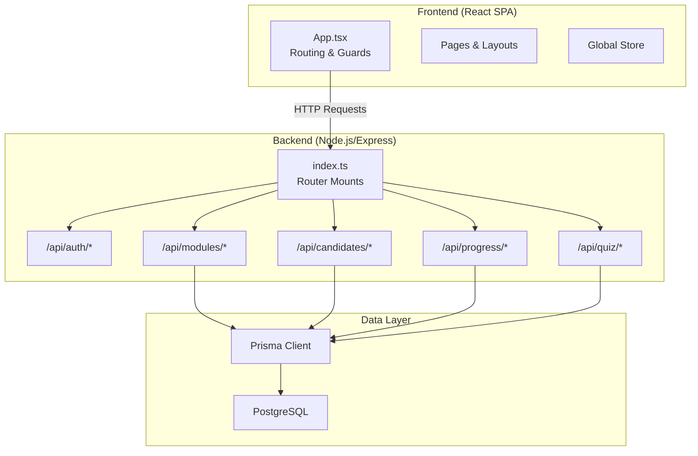
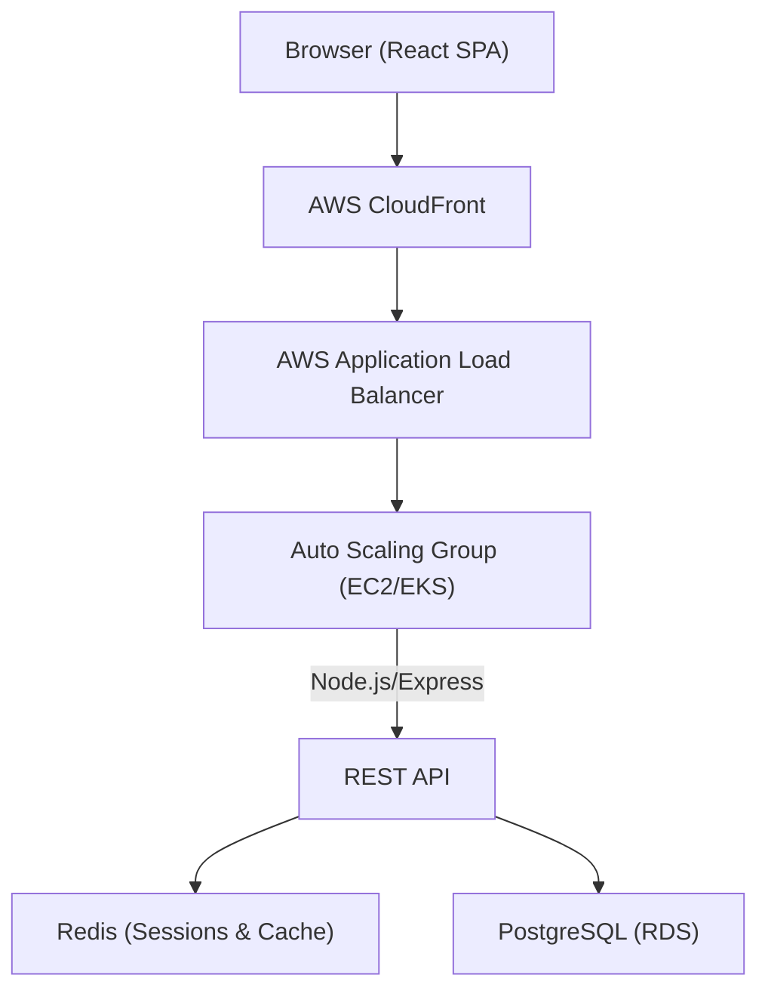
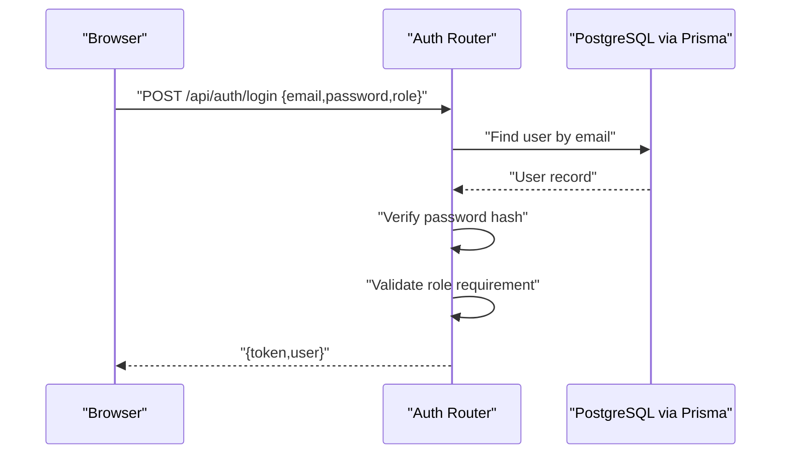
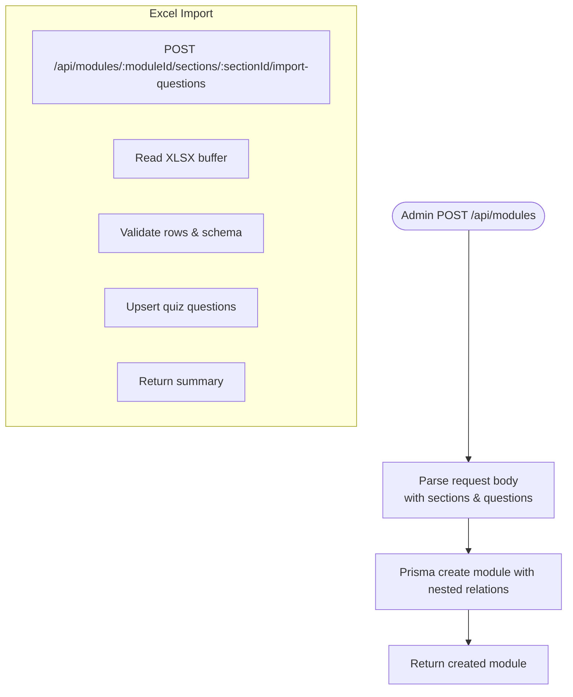
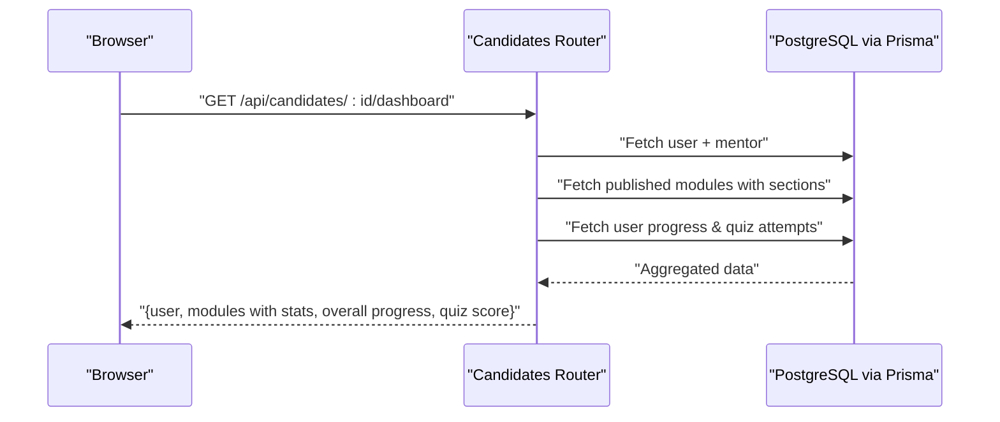
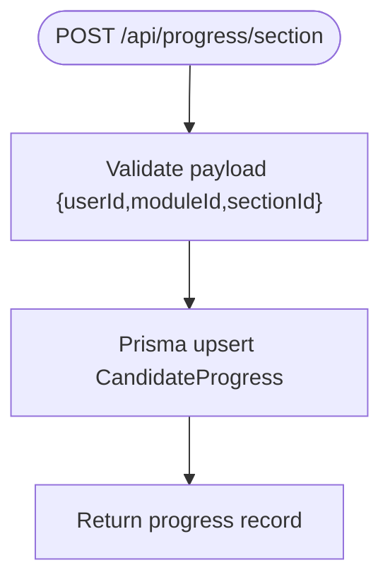
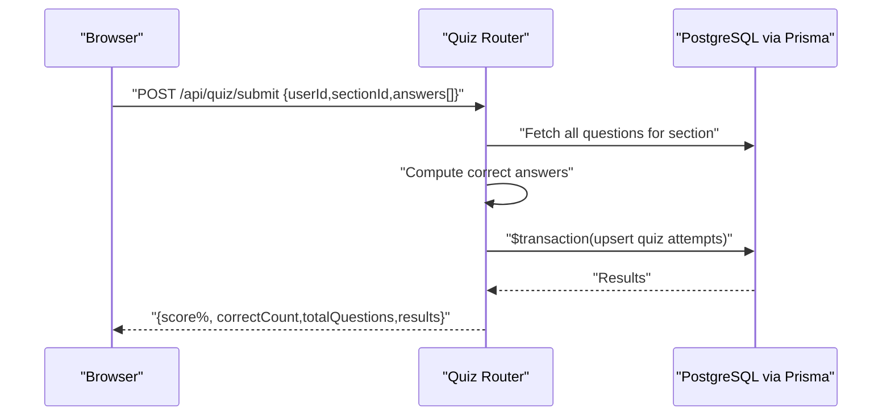
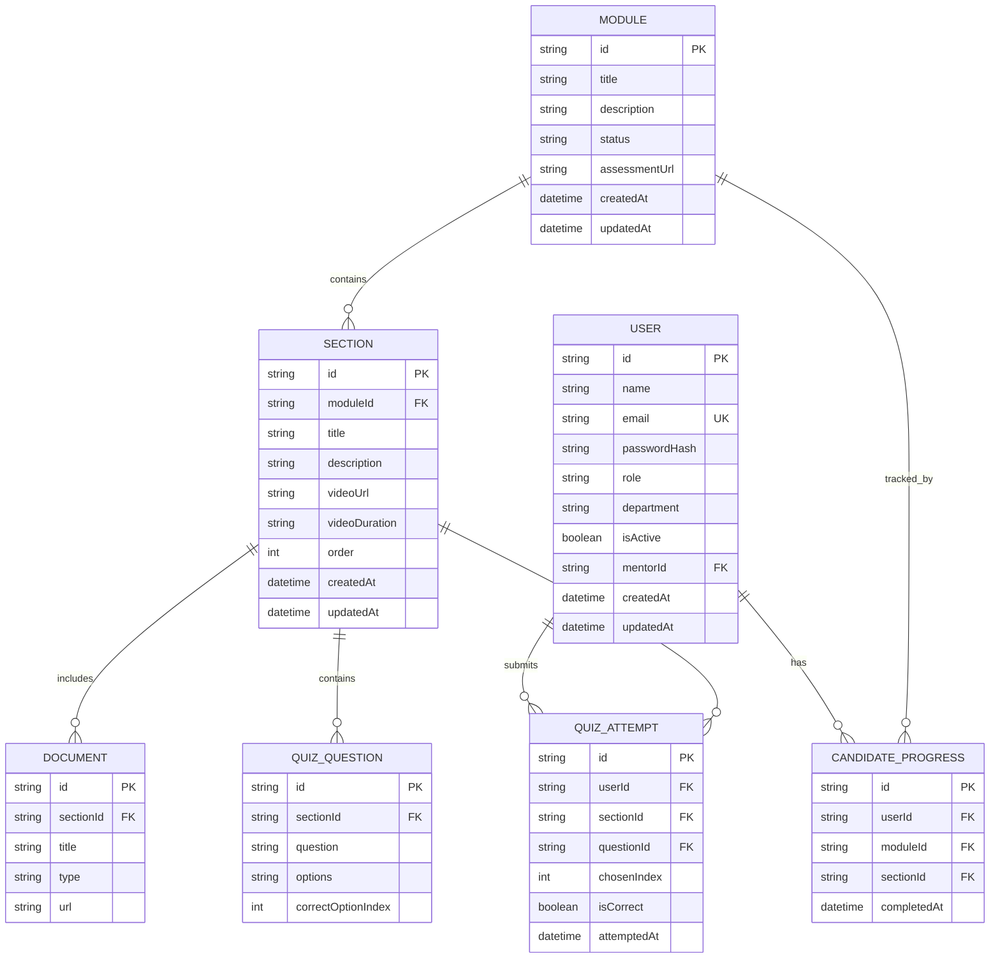
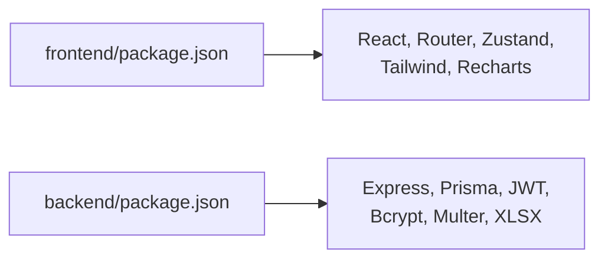

# Project Overview

<cite>
**Referenced Files in This Document**
- [README.md](file://README.md)
- [EXECUTIVE_SUMMARY.md](file://EXECUTIVE_SUMMARY.md)
- [ONBOARDING_PLATFORM_ARCHITECTURE_PLAN.md](file://ONBOARDING_PLATFORM_ARCHITECTURE_PLAN.md)
- [TECH_STACK_DECISION_MATRIX.md](file://TECH_STACK_DECISION_MATRIX.md)
- [DEVELOPER_QUICK_REFERENCE.md](file://DEVELOPER_QUICK_REFERENCE.md)
- [backend/src/index.ts](file://backend/src/index.ts)
- [backend/src/routes/auth.ts](file://backend/src/routes/auth.ts)
- [backend/src/routes/modules.ts](file://backend/src/routes/modules.ts)
- [backend/src/routes/candidates.ts](file://backend/src/routes/candidates.ts)
- [backend/src/routes/progress.ts](file://backend/src/routes/progress.ts)
- [backend/src/routes/quiz.ts](file://backend/src/routes/quiz.ts)
- [backend/prisma/schema.prisma](file://backend/prisma/schema.prisma)
- [frontend/src/App.tsx](file://frontend/src/App.tsx)
- [frontend/package.json](file://frontend/package.json)
- [backend/package.json](file://backend/package.json)
</cite>

## Table of Contents
1. [Introduction](#introduction)
2. [Project Structure](#project-structure)
3. [Core Components](#core-components)
4. [Architecture Overview](#architecture-overview)
5. [Detailed Component Analysis](#detailed-component-analysis)
6. [Dependency Analysis](#dependency-analysis)
7. [Performance Considerations](#performance-considerations)
8. [Troubleshooting Guide](#troubleshooting-guide)
9. [Conclusion](#conclusion)
10. [Appendices](#appendices)

## Introduction
Onboarding AntiGravity is a production-grade employee onboarding platform designed to streamline new hire experiences. Its core value proposition is to centralize learning modules, task tracking, quiz assessments, and mentoring into a single, scalable, and highly performant web application. This enables HR departments and organizations to reduce administrative overhead, accelerate time-to-productivity, and deliver a consistent, intuitive experience for candidates and mentors alike.

Target audience:
- HR departments seeking automation and visibility into onboarding workflows
- Organizations aiming to standardize and scale onboarding across teams and locations
- Administrators who manage modules, track progress, and generate insights
- Candidates and Mentors who engage with modules, quizzes, tasks, and mentorship

Key features:
- Candidate management: Role-based access, dashboard with progress and quiz stats, and mentor assignment
- Interactive module builders: Admin-driven creation of modules with nested sections, documents, and embedded quizzes
- Real-time analytics: Cohort completion, progress, and quiz performance dashboards
- Mentorship tracking: Pairing, status management, and notifications

Technology stack integration and design philosophy:
- Frontend: React 18 with Vite, state management, routing, and charting libraries
- Backend: Node.js/Express with Prisma ORM and PostgreSQL, secured with JWT and hashing
- Design system: Glassmorphism with a cohesive color palette
- Cloud and DevOps: AWS services, containerization, and CI/CD aligned with the architecture plan

Practical examples:
- Admins create a module with multiple sections and import quiz questions from Excel
- Candidates log in, view modules, complete sections, take quizzes, and receive mentorship updates
- Managers review real-time analytics and export cohort reports

**Section sources**
- [README.md:1-28](file://README.md#L1-L28)
- [EXECUTIVE_SUMMARY.md:8-30](file://EXECUTIVE_SUMMARY.md#L8-L30)
- [ONBOARDING_PLATFORM_ARCHITECTURE_PLAN.md:46-71](file://ONBOARDING_PLATFORM_ARCHITECTURE_PLAN.md#L46-L71)

## Project Structure
The repository follows a modular monolith structure with clear separation between frontend and backend, complemented by a Prisma schema defining the domain models. The frontend uses React Router for navigation and a centralized store for state. The backend exposes RESTful endpoints organized by feature domains.

**Diagram sources**
- [frontend/src/App.tsx:46-79](file://frontend/src/App.tsx#L46-L79)
- [backend/src/index.ts:1-45](file://backend/src/index.ts#L1-L45)
- [backend/src/routes/auth.ts:1-69](file://backend/src/routes/auth.ts#L1-L69)
- [backend/src/routes/modules.ts:1-209](file://backend/src/routes/modules.ts#L1-L209)
- [backend/src/routes/candidates.ts:1-117](file://backend/src/routes/candidates.ts#L1-L117)
- [backend/src/routes/progress.ts:1-63](file://backend/src/routes/progress.ts#L1-L63)
- [backend/src/routes/quiz.ts:1-76](file://backend/src/routes/quiz.ts#L1-L76)
- [backend/prisma/schema.prisma:10-112](file://backend/prisma/schema.prisma#L10-L112)

**Section sources**
- [frontend/src/App.tsx:46-79](file://frontend/src/App.tsx#L46-L79)
- [backend/src/index.ts:1-45](file://backend/src/index.ts#L1-L45)
- [backend/prisma/schema.prisma:10-112](file://backend/prisma/schema.prisma#L10-L112)

## Core Components
- Authentication and user management: Login with role enforcement, JWT issuance, and protected routes
- Modules and sections: CRUD for modules, nested sections, documents, and quiz questions; Excel import support
- Candidate dashboard: Aggregated progress, quiz scores, and mentor info
- Progress tracking: Upsert section completion records per user
- Quiz engine: Batch submission scoring with transactional upserts
- Analytics and reporting: Cohort insights and downloadable exports

**Section sources**
- [backend/src/routes/auth.ts:9-66](file://backend/src/routes/auth.ts#L9-L66)
- [backend/src/routes/modules.ts:6-205](file://backend/src/routes/modules.ts#L6-L205)
- [backend/src/routes/candidates.ts:6-114](file://backend/src/routes/candidates.ts#L6-L114)
- [backend/src/routes/progress.ts:6-60](file://backend/src/routes/progress.ts#L6-L60)
- [backend/src/routes/quiz.ts:6-73](file://backend/src/routes/quiz.ts#L6-L73)

## Architecture Overview
The platform employs a Modular Monolith architecture with bounded domains. The frontend is a React SPA served via CDN, while the backend is a Node.js/Express service behind an application load balancer. Data is persisted in PostgreSQL with Prisma ORM, and Redis is used for caching and sessions. The architecture plan defines API contracts, database schema, scalability targets, and security baselines.

**Diagram sources**
- [ONBOARDING_PLATFORM_ARCHITECTURE_PLAN.md:7-15](file://ONBOARDING_PLATFORM_ARCHITECTURE_PLAN.md#L7-L15)

**Section sources**
- [ONBOARDING_PLATFORM_ARCHITECTURE_PLAN.md:7-15](file://ONBOARDING_PLATFORM_ARCHITECTURE_PLAN.md#L7-L15)

## Detailed Component Analysis

### Authentication and Authorization
The authentication flow validates credentials, enforces role-based portals, and issues JWT tokens. The frontend guards protect routes based on user roles.

**Diagram sources**
- [backend/src/routes/auth.ts:11-61](file://backend/src/routes/auth.ts#L11-L61)

**Section sources**
- [backend/src/routes/auth.ts:9-66](file://backend/src/routes/auth.ts#L9-L66)
- [frontend/src/App.tsx:30-44](file://frontend/src/App.tsx#L30-L44)

### Module Builder and Quiz Import
Admins can create modules with nested sections, documents, and questions. An Excel import endpoint supports bulk quiz question creation.

**Diagram sources**
- [backend/src/routes/modules.ts:29-77](file://backend/src/routes/modules.ts#L29-L77)
- [backend/src/routes/modules.ts:156-205](file://backend/src/routes/modules.ts#L156-L205)

**Section sources**
- [backend/src/routes/modules.ts:28-77](file://backend/src/routes/modules.ts#L28-L77)
- [backend/src/routes/modules.ts:107-125](file://backend/src/routes/modules.ts#L107-L125)
- [backend/src/routes/modules.ts:155-205](file://backend/src/routes/modules.ts#L155-L205)

### Candidate Dashboard and Progress
The candidate dashboard aggregates published modules, user progress, and quiz attempts to compute real-time stats.

**Diagram sources**
- [backend/src/routes/candidates.ts:8-114](file://backend/src/routes/candidates.ts#L8-L114)

**Section sources**
- [backend/src/routes/candidates.ts:6-114](file://backend/src/routes/candidates.ts#L6-L114)

### Progress Tracking
Section completion is recorded via an upsert operation keyed by user and section to ensure idempotency.

**Diagram sources**
- [backend/src/routes/progress.ts:6-38](file://backend/src/routes/progress.ts#L6-L38)

**Section sources**
- [backend/src/routes/progress.ts:6-38](file://backend/src/routes/progress.ts#L6-L38)

### Quiz Submission and Scoring
Quiz submissions are scored in a single transaction to ensure atomicity and correctness, with batched question retrieval to avoid N+1 queries.

**Diagram sources**
- [backend/src/routes/quiz.ts:6-73](file://backend/src/routes/quiz.ts#L6-L73)

**Section sources**
- [backend/src/routes/quiz.ts:6-73](file://backend/src/routes/quiz.ts#L6-L73)

### Data Model Overview
The Prisma schema defines identity, learning, assessment, and social/notification domains with UUID primary keys, indexes, and relations.

**Diagram sources**
- [backend/prisma/schema.prisma:10-112](file://backend/prisma/schema.prisma#L10-L112)

**Section sources**
- [backend/prisma/schema.prisma:10-112](file://backend/prisma/schema.prisma#L10-L112)

## Dependency Analysis
- Frontend dependencies include React, React Router, Zustand, Tailwind CSS, Recharts, and motion libraries for UI and state management.
- Backend dependencies include Express, Prisma, JWT, Bcrypt, Multer, and XLSX for file handling and spreadsheets.
- The backend mounts multiple routers under a unified Express server, each handling a bounded domain.

**Diagram sources**
- [frontend/package.json:12-22](file://frontend/package.json#L12-L22)
- [backend/package.json:12-21](file://backend/package.json#L12-L21)

**Section sources**
- [frontend/package.json:12-22](file://frontend/package.json#L12-L22)
- [backend/package.json:12-21](file://backend/package.json#L12-L21)

## Performance Considerations
- API latency targets: <200ms p95 response times for critical endpoints
- Caching strategy: Global module structures cached in Redis; user-specific progress bypasses cache for real-time accuracy
- Background jobs: Export operations offloaded to a queue with S3-backed download links
- Database pooling: PgBouncer connection pooling to handle throughput
- Frontend perceived performance: TanStack Query for caching and background sync; Vite for fast builds and HMR

**Section sources**
- [ONBOARDING_PLATFORM_ARCHITECTURE_PLAN.md:74-82](file://ONBOARDING_PLATFORM_ARCHITECTURE_PLAN.md#L74-L82)
- [TECH_STACK_DECISION_MATRIX.md:35-37](file://TECH_STACK_DECISION_MATRIX.md#L35-L37)

## Troubleshooting Guide
Common development and runtime issues:
- CORS errors: Ensure frontend and backend allowed origins match exactly
- Database timeouts: Verify transactions are properly committed and pools are configured
- React Query cache mismatches: Use exact query key arrays and leverage DevTools to inspect cache
- Excel import failures: Confirm uploaded file format and required columns

Operational guidance:
- Health checks: Use the backend health endpoint to confirm service availability
- Local setup: Follow the developer quick reference for environment variables, migrations, and seeds

**Section sources**
- [DEVELOPER_QUICK_REFERENCE.md:74-86](file://DEVELOPER_QUICK_REFERENCE.md#L74-L86)
- [backend/src/index.ts:32-39](file://backend/src/index.ts#L32-L39)

## Conclusion
Onboarding AntiGravity delivers a production-ready onboarding solution with a clear modular architecture, robust data modeling, and a modern tech stack. It empowers HR teams to automate workflows, provides candidates and mentors with a seamless experience, and equips administrators with actionable insights. The documented APIs, data model, and performance strategies enable confident development and scaling.

[No sources needed since this section summarizes without analyzing specific files]

## Appendices

### API Contracts Overview
- Authentication: Login with role enforcement and JWT issuance
- Modules: List/create/update/delete modules; import quiz questions from Excel
- Candidates: Dashboard aggregation of modules, progress, and quiz stats
- Progress: Upsert section completion records
- Quiz: Batch submission scoring with transactional upserts

**Section sources**
- [ONBOARDING_PLATFORM_ARCHITECTURE_PLAN.md:46-71](file://ONBOARDING_PLATFORM_ARCHITECTURE_PLAN.md#L46-L71)
- [backend/src/routes/auth.ts:9-66](file://backend/src/routes/auth.ts#L9-L66)
- [backend/src/routes/modules.ts:6-205](file://backend/src/routes/modules.ts#L6-L205)
- [backend/src/routes/candidates.ts:6-114](file://backend/src/routes/candidates.ts#L6-L114)
- [backend/src/routes/progress.ts:6-60](file://backend/src/routes/progress.ts#L6-L60)
- [backend/src/routes/quiz.ts:6-73](file://backend/src/routes/quiz.ts#L6-L73)