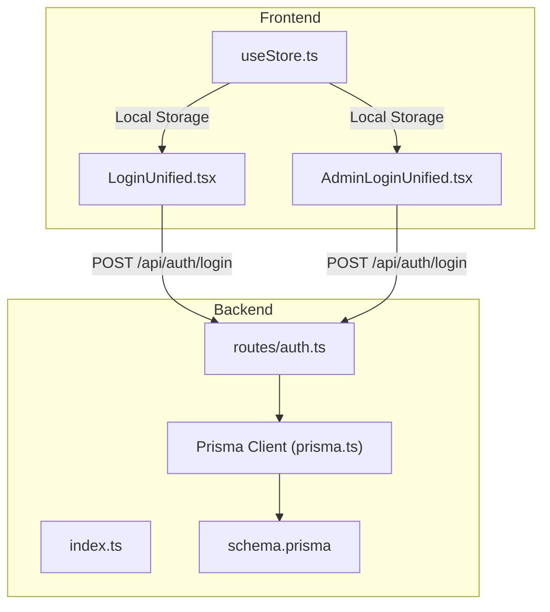
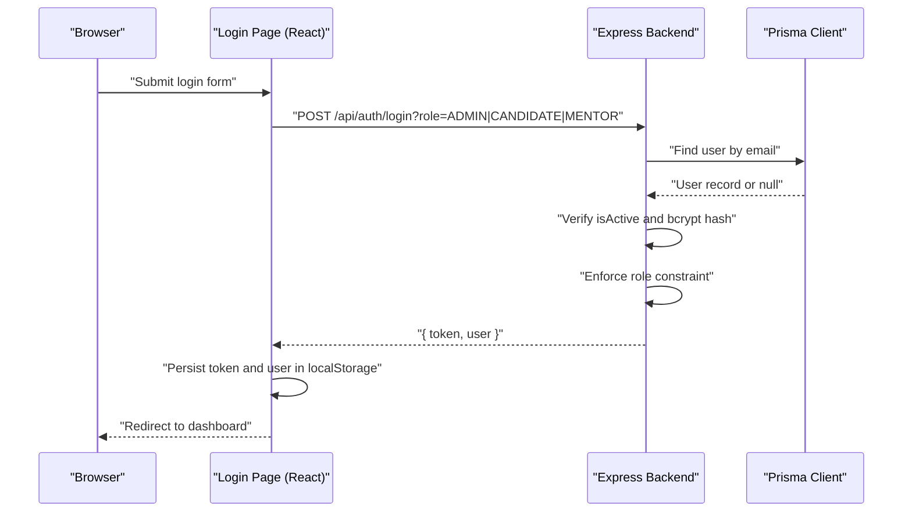
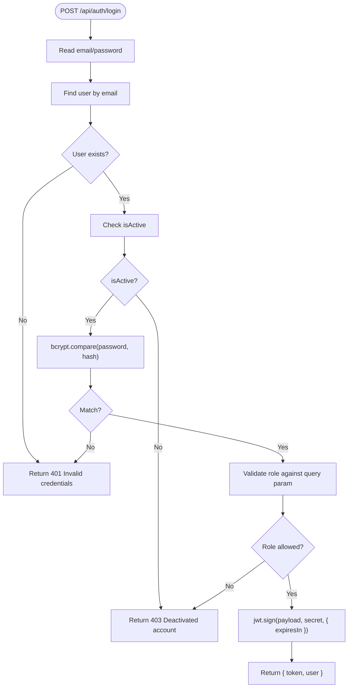
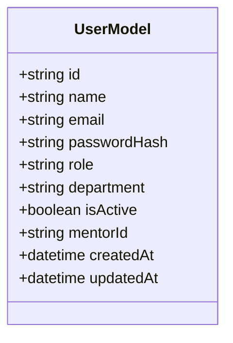
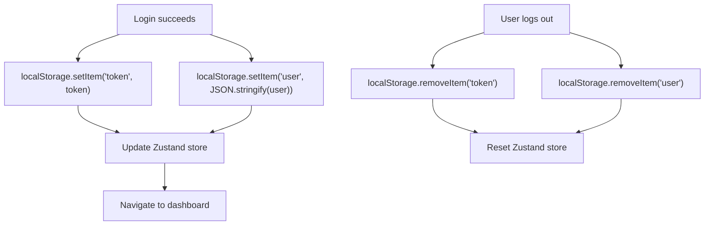
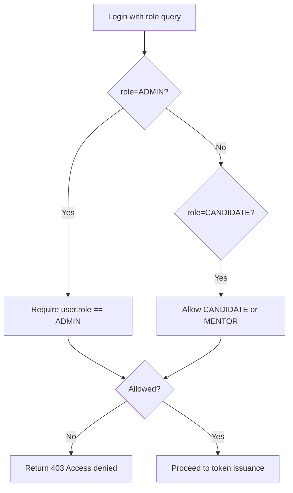
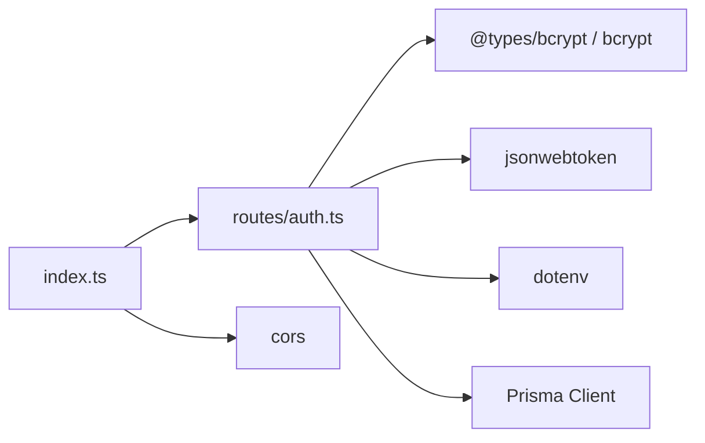

# Security and Authentication

<cite>
**Referenced Files in This Document**
- [backend/src/routes/auth.ts](file://backend/src/routes/auth.ts)
- [backend/src/index.ts](file://backend/src/index.ts)
- [backend/prisma/schema.prisma](file://backend/prisma/schema.prisma)
- [backend/src/lib/prisma.ts](file://backend/src/lib/prisma.ts)
- [frontend/src/pages/LoginUnified.tsx](file://frontend/src/pages/LoginUnified.tsx)
- [frontend/src/pages/admin/AdminLoginUnified.tsx](file://frontend/src/pages/admin/AdminLoginUnified.tsx)
- [frontend/src/store/useStore.ts](file://frontend/src/store/useStore.ts)
- [backend/package.json](file://backend/package.json)
</cite>

## Table of Contents
1. [Introduction](#introduction)
2. [Project Structure](#project-structure)
3. [Core Components](#core-components)
4. [Architecture Overview](#architecture-overview)
5. [Detailed Component Analysis](#detailed-component-analysis)
6. [Dependency Analysis](#dependency-analysis)
7. [Performance Considerations](#performance-considerations)
8. [Troubleshooting Guide](#troubleshooting-guide)
9. [Conclusion](#conclusion)
10. [Appendices](#appendices)

## Introduction
This document provides comprehensive security and authentication documentation for the Onboarding AntiGravity platform. It covers JWT-based authentication, password hashing with bcrypt, session storage, role-based access control (RBAC), and route protection strategies. It also outlines security best practices implemented across the backend and frontend, including input validation, SQL injection prevention via Prisma, and XSS considerations. Finally, it includes secure API usage examples, authentication flow patterns, authorization enforcement, and mitigation strategies for common vulnerabilities.

## Project Structure
The security model spans both backend and frontend layers:
- Backend exposes protected routes under /api and implements authentication and authorization logic.
- Frontend authenticates users and stores tokens and user metadata locally.
- Prisma ORM provides database access with strong typing and safe query construction.

**Diagram sources**
- [backend/src/index.ts:19-30](file://backend/src/index.ts#L19-L30)
- [backend/src/routes/auth.ts:11-66](file://backend/src/routes/auth.ts#L11-L66)
- [backend/src/lib/prisma.ts:8-16](file://backend/src/lib/prisma.ts#L8-L16)
- [backend/prisma/schema.prisma:10-28](file://backend/prisma/schema.prisma#L10-L28)
- [frontend/src/pages/LoginUnified.tsx:24-34](file://frontend/src/pages/LoginUnified.tsx#L24-L34)
- [frontend/src/pages/admin/AdminLoginUnified.tsx:24-34](file://frontend/src/pages/admin/AdminLoginUnified.tsx#L24-L34)
- [frontend/src/store/useStore.ts:58-74](file://frontend/src/store/useStore.ts#L58-L74)

**Section sources**
- [backend/src/index.ts:19-30](file://backend/src/index.ts#L19-L30)
- [backend/src/routes/auth.ts:11-66](file://backend/src/routes/auth.ts#L11-L66)
- [backend/src/lib/prisma.ts:8-16](file://backend/src/lib/prisma.ts#L8-L16)
- [backend/prisma/schema.prisma:10-28](file://backend/prisma/schema.prisma#L10-L28)
- [frontend/src/pages/LoginUnified.tsx:24-34](file://frontend/src/pages/LoginUnified.tsx#L24-L34)
- [frontend/src/pages/admin/AdminLoginUnified.tsx:24-34](file://frontend/src/pages/admin/AdminLoginUnified.tsx#L24-L34)
- [frontend/src/store/useStore.ts:58-74](file://frontend/src/store/useStore.ts#L58-L74)

## Core Components
- JWT-based authentication: Login endpoint validates credentials, checks activation status, enforces role constraints, and issues signed tokens with expiration.
- Password security: bcrypt hashing is used for storing passwordHash and verification during login.
- Session management: Tokens and user metadata are persisted in browser local storage after successful login.
- Role-based access control: The role field determines access to portals and routes; enforced at login and via frontend routing.
- Route protection: Authorization is implicit through token presence and role checks; explicit middleware is not present in the analyzed files.

Key implementation references:
- JWT secret and signing: [backend/src/routes/auth.ts:7-53](file://backend/src/routes/auth.ts#L7-L53)
- bcrypt compare: [backend/src/routes/auth.ts](file://backend/src/routes/auth.ts#L33)
- User model and isActive flag: [backend/prisma/schema.prisma:10-28](file://backend/prisma/schema.prisma#L10-L28)
- Frontend login invocation with role query: [frontend/src/pages/LoginUnified.tsx:24-28](file://frontend/src/pages/LoginUnified.tsx#L24-L28), [frontend/src/pages/admin/AdminLoginUnified.tsx:24-28](file://frontend/src/pages/admin/AdminLoginUnified.tsx#L24-L28)
- Token and user persistence: [frontend/src/store/useStore.ts:58-74](file://frontend/src/store/useStore.ts#L58-L74)

**Section sources**
- [backend/src/routes/auth.ts:7-53](file://backend/src/routes/auth.ts#L7-L53)
- [backend/src/routes/auth.ts](file://backend/src/routes/auth.ts#L33)
- [backend/prisma/schema.prisma:10-28](file://backend/prisma/schema.prisma#L10-L28)
- [frontend/src/pages/LoginUnified.tsx:24-28](file://frontend/src/pages/LoginUnified.tsx#L24-L28)
- [frontend/src/pages/admin/AdminLoginUnified.tsx:24-28](file://frontend/src/pages/admin/AdminLoginUnified.tsx#L24-L28)
- [frontend/src/store/useStore.ts:58-74](file://frontend/src/store/useStore.ts#L58-L74)

## Architecture Overview
The authentication flow integrates frontend login pages, backend routes, and persistent storage.

**Diagram sources**
- [frontend/src/pages/LoginUnified.tsx:24-34](file://frontend/src/pages/LoginUnified.tsx#L24-L34)
- [frontend/src/pages/admin/AdminLoginUnified.tsx:24-34](file://frontend/src/pages/admin/AdminLoginUnified.tsx#L24-L34)
- [backend/src/routes/auth.ts:11-66](file://backend/src/routes/auth.ts#L11-L66)
- [backend/src/lib/prisma.ts:8-16](file://backend/src/lib/prisma.ts#L8-L16)

## Detailed Component Analysis

### Backend Authentication Route
- Endpoint: POST /api/auth/login
- Responsibilities:
  - Parse email and password from request body.
  - Retrieve user by exact email using Prisma.
  - Reject inactive accounts.
  - Verify password using bcrypt.
  - Enforce portal-specific roles via query parameter role.
  - Issue JWT with id, email, role, and 24-hour expiry.
  - Return token and sanitized user payload.

**Diagram sources**
- [backend/src/routes/auth.ts:11-66](file://backend/src/routes/auth.ts#L11-L66)

**Section sources**
- [backend/src/routes/auth.ts:11-66](file://backend/src/routes/auth.ts#L11-L66)

### Password Security and Hashing
- bcrypt is used for password hashing and verification.
- The user model stores passwordHash, ensuring plaintext passwords are never stored.
- Prisma schema defines the passwordHash field and enforces uniqueness on email.

**Diagram sources**
- [backend/prisma/schema.prisma:10-28](file://backend/prisma/schema.prisma#L10-L28)

**Section sources**
- [backend/src/routes/auth.ts](file://backend/src/routes/auth.ts#L33)
- [backend/prisma/schema.prisma:10-28](file://backend/prisma/schema.prisma#L10-L28)

### Session Management and Local Storage
- After successful login, the frontend stores:
  - token in localStorage
  - user object (without passwordHash) in localStorage
- The Zustand store manages userRole, userId, and isLoggedIn state.
- Logout clears localStorage and resets state.

**Diagram sources**
- [frontend/src/store/useStore.ts:58-74](file://frontend/src/store/useStore.ts#L58-L74)
- [frontend/src/pages/LoginUnified.tsx:33-34](file://frontend/src/pages/LoginUnified.tsx#L33-L34)
- [frontend/src/pages/admin/AdminLoginUnified.tsx:33-34](file://frontend/src/pages/admin/AdminLoginUnified.tsx#L33-L34)

**Section sources**
- [frontend/src/store/useStore.ts:58-74](file://frontend/src/store/useStore.ts#L58-L74)
- [frontend/src/pages/LoginUnified.tsx:33-34](file://frontend/src/pages/LoginUnified.tsx#L33-L34)
- [frontend/src/pages/admin/AdminLoginUnified.tsx:33-34](file://frontend/src/pages/admin/AdminLoginUnified.tsx#L33-L34)

### Role-Based Access Control and Portal Enforcement
- Role values: ADMIN, CANDIDATE, MENTOR.
- The login route enforces role constraints based on the role query parameter:
  - ADMIN requires user.role === ADMIN.
  - CANDIDATE portal accepts CANDIDATE or MENTOR.
- Frontend login pages specify the role query parameter to enforce portal-specific access.

**Diagram sources**
- [backend/src/routes/auth.ts:39-46](file://backend/src/routes/auth.ts#L39-L46)
- [frontend/src/pages/LoginUnified.tsx:24-28](file://frontend/src/pages/LoginUnified.tsx#L24-L28)
- [frontend/src/pages/admin/AdminLoginUnified.tsx:24-28](file://frontend/src/pages/admin/AdminLoginUnified.tsx#L24-L28)

**Section sources**
- [backend/src/routes/auth.ts:39-46](file://backend/src/routes/auth.ts#L39-L46)
- [frontend/src/pages/LoginUnified.tsx:24-28](file://frontend/src/pages/LoginUnified.tsx#L24-L28)
- [frontend/src/pages/admin/AdminLoginUnified.tsx:24-28](file://frontend/src/pages/admin/AdminLoginUnified.tsx#L24-L28)

### Route Protection Mechanisms
- Current implementation does not include explicit middleware to protect routes.
- Authorization relies on:
  - Token presence and validity (handled by the frontend store and backend login).
  - Role checks enforced at login.
- Recommendation: Add middleware to verify JWT and enforce RBAC on protected routes.

[No sources needed since this section provides general guidance]

### Secure API Usage Examples
- Admin login:
  - Endpoint: POST /api/auth/login?role=ADMIN
  - Request body: { email, password }
  - Response: { token, user }
  - Frontend usage reference: [frontend/src/pages/admin/AdminLoginUnified.tsx:24-34](file://frontend/src/pages/admin/AdminLoginUnified.tsx#L24-L34)
- Candidate/Mentor login:
  - Endpoint: POST /api/auth/login?role=CANDIDATE
  - Request body: { email, password }
  - Response: { token, user }
  - Frontend usage reference: [frontend/src/pages/LoginUnified.tsx:24-34](file://frontend/src/pages/LoginUnified.tsx#L24-L34)

**Section sources**
- [frontend/src/pages/admin/AdminLoginUnified.tsx:24-34](file://frontend/src/pages/admin/AdminLoginUnified.tsx#L24-L34)
- [frontend/src/pages/LoginUnified.tsx:24-34](file://frontend/src/pages/LoginUnified.tsx#L24-L34)

## Dependency Analysis
- Backend dependencies relevant to security:
  - bcrypt: password hashing and verification.
  - jsonwebtoken: JWT token generation and signing.
  - dotenv: environment variable loading for JWT_SECRET.
  - Prisma client: database access with safe queries.
- CORS configuration allows Authorization header and preflight handling.

**Diagram sources**
- [backend/src/routes/auth.ts:2-4](file://backend/src/routes/auth.ts#L2-L4)
- [backend/src/index.ts](file://backend/src/index.ts#L19)
- [backend/package.json:12-22](file://backend/package.json#L12-L22)

**Section sources**
- [backend/src/routes/auth.ts:2-4](file://backend/src/routes/auth.ts#L2-L4)
- [backend/src/index.ts](file://backend/src/index.ts#L19)
- [backend/package.json:12-22](file://backend/package.json#L12-L22)

## Performance Considerations
- JWT token lifetime: 24 hours balances usability and risk; consider shorter expirations with refresh strategies for higher security.
- bcrypt cost: default cost is acceptable; avoid excessively high costs that increase login latency.
- Prisma client reuse: singleton pattern prevents connection pool exhaustion and reduces latency.
- CORS wildcard origin: convenient but can weaken security; restrict origins in production.

[No sources needed since this section provides general guidance]

## Troubleshooting Guide
Common issues and mitigations:
- Invalid credentials:
  - Symptom: 401 responses during login.
  - Cause: Incorrect email/password or missing user.
  - Mitigation: Ensure bcrypt hashing is applied consistently and user.isActive is true.
  - Reference: [backend/src/routes/auth.ts:23-25](file://backend/src/routes/auth.ts#L23-L25), [backend/src/routes/auth.ts](file://backend/src/routes/auth.ts#L34)
- Access denied:
  - Symptom: 403 responses when role mismatch occurs.
  - Cause: role query parameter conflicts with user.role.
  - Mitigation: Use correct portal login page to match intended role.
  - Reference: [backend/src/routes/auth.ts:40-45](file://backend/src/routes/auth.ts#L40-L45), [frontend/src/pages/LoginUnified.tsx:24-28](file://frontend/src/pages/LoginUnified.tsx#L24-L28), [frontend/src/pages/admin/AdminLoginUnified.tsx:24-28](file://frontend/src/pages/admin/AdminLoginUnified.tsx#L24-L28)
- Deactivated account:
  - Symptom: 403 responses with deactivation message.
  - Cause: user.isActive is false.
  - Mitigation: Activate user in admin panel or contact administrator.
  - Reference: [backend/src/routes/auth.ts:28-30](file://backend/src/routes/auth.ts#L28-L30)
- Token not persisted:
  - Symptom: Not redirected after login.
  - Cause: localStorage not writable or cleared.
  - Mitigation: Check browser privacy settings and localStorage availability.
  - Reference: [frontend/src/store/useStore.ts:58-74](file://frontend/src/store/useStore.ts#L58-L74)

**Section sources**
- [backend/src/routes/auth.ts:23-30](file://backend/src/routes/auth.ts#L23-L30)
- [backend/src/routes/auth.ts:40-45](file://backend/src/routes/auth.ts#L40-L45)
- [frontend/src/store/useStore.ts:58-74](file://frontend/src/store/useStore.ts#L58-L74)
- [frontend/src/pages/LoginUnified.tsx:24-28](file://frontend/src/pages/LoginUnified.tsx#L24-L28)
- [frontend/src/pages/admin/AdminLoginUnified.tsx:24-28](file://frontend/src/pages/admin/AdminLoginUnified.tsx#L24-L28)

## Conclusion
The Onboarding AntiGravity platform implements a robust foundation for authentication and access control:
- Strong password handling via bcrypt and secure token issuance with JWT.
- Role-based enforcement at login and portal-specific routing.
- Persistent session management using local storage with Zustand.
Recommendations for further hardening include adding middleware to validate JWTs and enforce RBAC on protected routes, rotating JWT_SECRET, and restricting CORS origins in production.

[No sources needed since this section summarizes without analyzing specific files]

## Appendices

### Best Practices Implemented
- Password hashing with bcrypt: [backend/src/routes/auth.ts](file://backend/src/routes/auth.ts#L33)
- Safe database queries via Prisma: [backend/src/lib/prisma.ts:8-16](file://backend/src/lib/prisma.ts#L8-L16), [backend/prisma/schema.prisma:10-28](file://backend/prisma/schema.prisma#L10-L28)
- Environment-driven secrets: [backend/src/routes/auth.ts](file://backend/src/routes/auth.ts#L7)
- Explicit role gating at login: [backend/src/routes/auth.ts:39-46](file://backend/src/routes/auth.ts#L39-L46)

**Section sources**
- [backend/src/routes/auth.ts](file://backend/src/routes/auth.ts#L7)
- [backend/src/routes/auth.ts](file://backend/src/routes/auth.ts#L33)
- [backend/src/lib/prisma.ts:8-16](file://backend/src/lib/prisma.ts#L8-L16)
- [backend/prisma/schema.prisma:10-28](file://backend/prisma/schema.prisma#L10-L28)