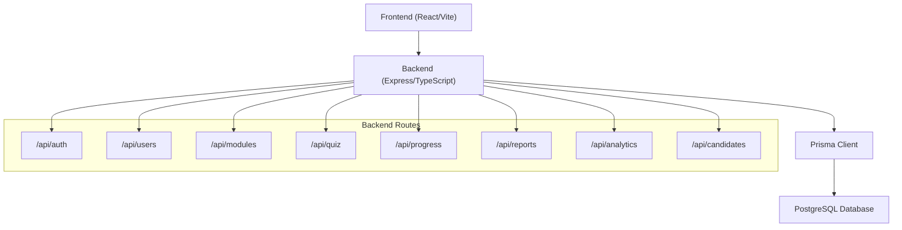
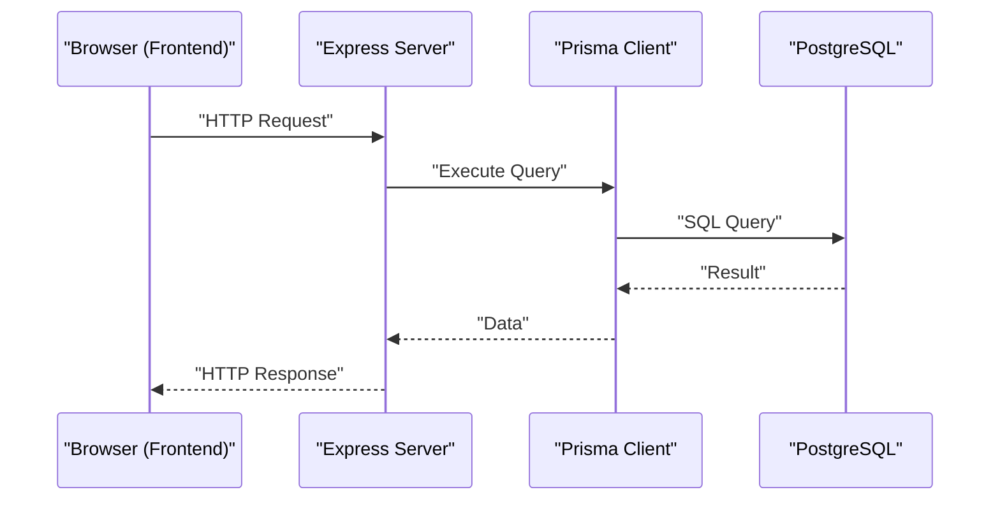
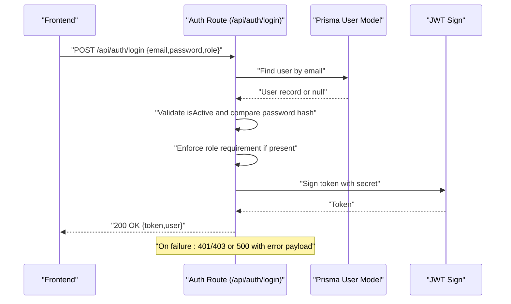
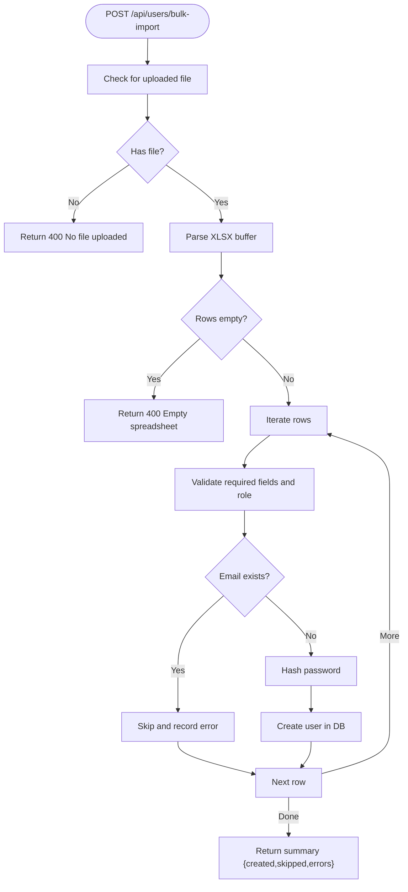
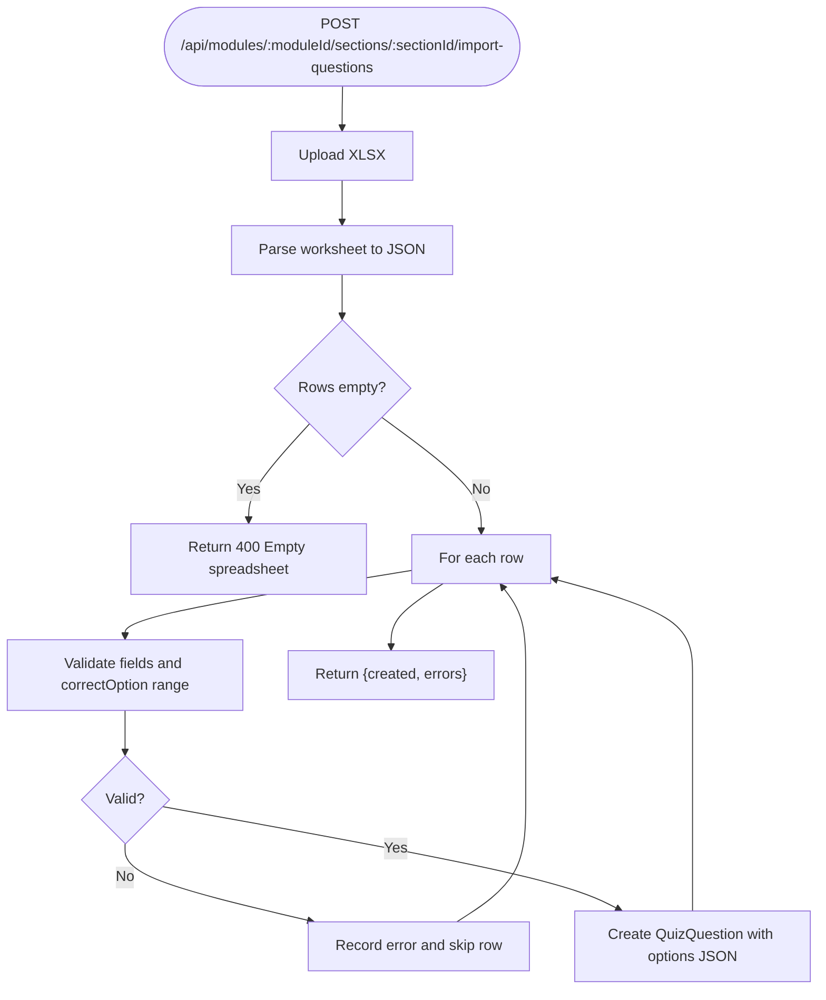
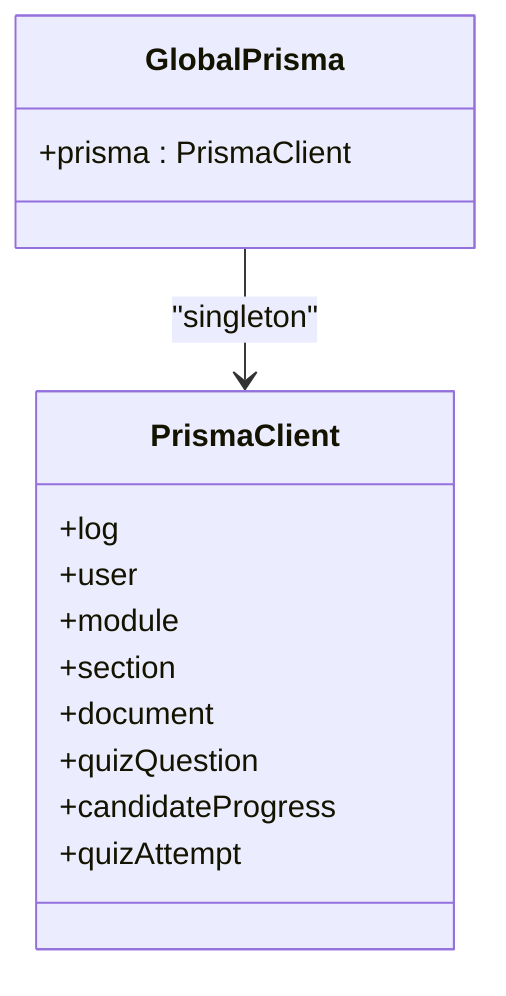
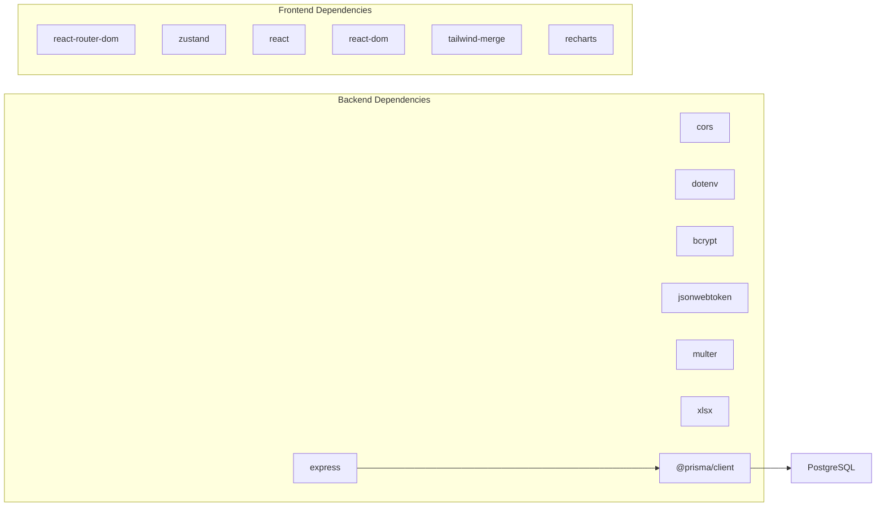

# Troubleshooting and Debugging

<cite>
**Referenced Files in This Document**
- [backend/src/index.ts](file://backend/src/index.ts)
- [backend/src/lib/prisma.ts](file://backend/src/lib/prisma.ts)
- [backend/prisma/schema.prisma](file://backend/prisma/schema.prisma)
- [backend/src/routes/auth.ts](file://backend/src/routes/auth.ts)
- [backend/src/routes/users.ts](file://backend/src/routes/users.ts)
- [backend/src/routes/modules.ts](file://backend/src/routes/modules.ts)
- [backend/package.json](file://backend/package.json)
- [frontend/package.json](file://frontend/package.json)
- [frontend/vite.config.ts](file://frontend/vite.config.ts)
- [frontend/src/App.tsx](file://frontend/src/App.tsx)
</cite>

## Table of Contents
1. [Introduction](#introduction)
2. [Project Structure](#project-structure)
3. [Core Components](#core-components)
4. [Architecture Overview](#architecture-overview)
5. [Detailed Component Analysis](#detailed-component-analysis)
6. [Dependency Analysis](#dependency-analysis)
7. [Performance Considerations](#performance-considerations)
8. [Troubleshooting Guide](#troubleshooting-guide)
9. [Conclusion](#conclusion)
10. [Appendices](#appendices)

## Introduction
This document provides a comprehensive troubleshooting and debugging guide for the Onboarding AntiGravity platform. It focuses on diagnosing and resolving common issues such as CORS configuration problems, database connection failures, authentication errors, and performance bottlenecks. It also outlines logging strategies, error monitoring, and performance profiling techniques for both frontend and backend components. Step-by-step resolution guides and escalation procedures are included to support efficient incident response in development and production environments.

## Project Structure
The platform consists of:
- A backend built with Express and TypeScript, exposing REST APIs under /api/*.
- A PostgreSQL-backed Prisma ORM layer for data persistence.
- A React-based frontend using Vite for development and building.

**Diagram sources**
- [backend/src/index.ts:1-45](file://backend/src/index.ts#L1-L45)
- [backend/src/lib/prisma.ts:1-19](file://backend/src/lib/prisma.ts#L1-L19)
- [backend/prisma/schema.prisma:1-112](file://backend/prisma/schema.prisma#L1-L112)

**Section sources**
- [backend/src/index.ts:1-45](file://backend/src/index.ts#L1-L45)
- [backend/src/lib/prisma.ts:1-19](file://backend/src/lib/prisma.ts#L1-L19)
- [backend/prisma/schema.prisma:1-112](file://backend/prisma/schema.prisma#L1-L112)
- [frontend/vite.config.ts:1-8](file://frontend/vite.config.ts#L1-L8)

## Core Components
- Backend entrypoint and middleware stack:
  - CORS configured to allow all origins with preflight handling.
  - JSON body parsing enabled.
  - Health check endpoint exposed at /api/health.
- Prisma client singleton pattern with environment-aware logging.
- Route modules for authentication, users, modules, progress, quiz, reports, analytics, and candidates.

Key implementation references:
- [backend/src/index.ts:18-21](file://backend/src/index.ts#L18-L21)
- [backend/src/index.ts:32-39](file://backend/src/index.ts#L32-L39)
- [backend/src/lib/prisma.ts:3-12](file://backend/src/lib/prisma.ts#L3-L12)

**Section sources**
- [backend/src/index.ts:1-45](file://backend/src/index.ts#L1-L45)
- [backend/src/lib/prisma.ts:1-19](file://backend/src/lib/prisma.ts#L1-L19)

## Architecture Overview
The system follows a classic client-server architecture:
- Frontend (React) communicates with backend (Express) via HTTP.
- Backend uses Prisma to interact with PostgreSQL.
- Authentication relies on JWT tokens issued by the backend.

**Diagram sources**
- [backend/src/index.ts:1-45](file://backend/src/index.ts#L1-L45)
- [backend/src/lib/prisma.ts:1-19](file://backend/src/lib/prisma.ts#L1-L19)
- [backend/prisma/schema.prisma:1-112](file://backend/prisma/schema.prisma#L1-L112)

## Detailed Component Analysis

### Authentication Flow and Error Handling
Common issues:
- Invalid credentials or deactivated accounts.
- Role-based access denials.
- Internal server errors during login.

**Diagram sources**
- [backend/src/routes/auth.ts:9-66](file://backend/src/routes/auth.ts#L9-L66)
- [backend/src/lib/prisma.ts:1-19](file://backend/src/lib/prisma.ts#L1-L19)

**Section sources**
- [backend/src/routes/auth.ts:1-69](file://backend/src/routes/auth.ts#L1-L69)

### Users Management and Bulk Import
Common issues:
- Duplicate emails during creation.
- Upload failures or empty spreadsheets during bulk import.
- General internal server errors.

**Diagram sources**
- [backend/src/routes/users.ts:62-112](file://backend/src/routes/users.ts#L62-L112)

**Section sources**
- [backend/src/routes/users.ts:1-180](file://backend/src/routes/users.ts#L1-L180)

### Modules and Quiz Question Import
Common issues:
- Missing or malformed fields in quiz import.
- Incorrect conversion of correct option index.
- General internal server errors.

**Diagram sources**
- [backend/src/routes/modules.ts:155-205](file://backend/src/routes/modules.ts#L155-L205)

**Section sources**
- [backend/src/routes/modules.ts:1-209](file://backend/src/routes/modules.ts#L1-L209)

### Database Layer and Connection Management
Key points:
- Prisma client is initialized as a singleton to prevent excessive connections.
- Logging is enabled in development and restricted in production.
- Environment variable DATABASE_URL must be set for connectivity.

**Diagram sources**
- [backend/src/lib/prisma.ts:1-19](file://backend/src/lib/prisma.ts#L1-L19)
- [backend/prisma/schema.prisma:1-112](file://backend/prisma/schema.prisma#L1-L112)

**Section sources**
- [backend/src/lib/prisma.ts:1-19](file://backend/src/lib/prisma.ts#L1-L19)
- [backend/prisma/schema.prisma:1-112](file://backend/prisma/schema.prisma#L1-L112)

## Dependency Analysis
- Backend runtime dependencies include Express, CORS, dotenv, bcrypt, jsonwebtoken, multer, xlsx, and Prisma client.
- Frontend dependencies include React, React Router, Tailwind, Zustand, and Vite for dev/build.

**Diagram sources**
- [backend/package.json:12-32](file://backend/package.json#L12-L32)
- [frontend/package.json:12-41](file://frontend/package.json#L12-L41)

**Section sources**
- [backend/package.json:1-34](file://backend/package.json#L1-L34)
- [frontend/package.json:1-43](file://frontend/package.json#L1-L43)

## Performance Considerations
- Prefer targeted queries:
  - Use the dedicated single-module endpoint to avoid loading all modules and sections when only one is needed.
- Minimize payload sizes:
  - Avoid unnecessary includes and selections in routes.
- Database connection limits:
  - The singleton Prisma client prevents pool exhaustion and reduces latency.
- Logging overhead:
  - Development logs include warnings and errors; production logs restrict to errors to reduce I/O.

Actionable references:
- [backend/src/routes/modules.ts:127-153](file://backend/src/routes/modules.ts#L127-L153)
- [backend/src/lib/prisma.ts:3-12](file://backend/src/lib/prisma.ts#L3-L12)

**Section sources**
- [backend/src/routes/modules.ts:127-153](file://backend/src/routes/modules.ts#L127-L153)
- [backend/src/lib/prisma.ts:3-12](file://backend/src/lib/prisma.ts#L3-L12)

## Troubleshooting Guide

### CORS Configuration Problems
Symptoms:
- Preflight OPTIONS requests failing or blocked by browsers.
- Cross-origin requests from frontend to backend being rejected.

Diagnosis steps:
- Verify that CORS middleware is loaded and allows required methods and headers.
- Confirm that preflight OPTIONS is handled for all routes.

Resolution:
- Ensure the CORS configuration includes wildcard origin and necessary methods/headers.
- Keep preflight handling for all paths.

References:
- [backend/src/index.ts:18-21](file://backend/src/index.ts#L18-L21)

**Section sources**
- [backend/src/index.ts:18-21](file://backend/src/index.ts#L18-L21)

### Database Connection Failures
Symptoms:
- Application fails to start or throws connection-related errors.
- Health endpoint indicates database status as mocked.

Diagnosis steps:
- Confirm DATABASE_URL environment variable is set and reachable.
- Check Prisma client initialization and environment-specific logging.
- Review Prisma schema provider and datasource URL.

Resolution:
- Set DATABASE_URL to a valid PostgreSQL connection string.
- Ensure the database is running and network/firewall allows connections.
- Verify Prisma client singleton initialization and environment logging.

References:
- [backend/prisma/schema.prisma:5-8](file://backend/prisma/schema.prisma#L5-L8)
- [backend/src/lib/prisma.ts:3-12](file://backend/src/lib/prisma.ts#L3-L12)

**Section sources**
- [backend/prisma/schema.prisma:5-8](file://backend/prisma/schema.prisma#L5-L8)
- [backend/src/lib/prisma.ts:3-12](file://backend/src/lib/prisma.ts#L3-L12)

### Authentication Errors
Symptoms:
- Login returns 401 for invalid credentials.
- Access denied for role mismatches.
- Account deactivated errors.
- Internal server errors during login.

Diagnosis steps:
- Inspect login request payload and role query parameter.
- Verify user existence, activation status, and password hash comparison.
- Confirm JWT secret availability and token issuance.

Resolution:
- Ensure correct credentials and role parameter for portal-specific login.
- Activate user accounts before login.
- Provide a valid JWT_SECRET in environment variables.

References:
- [backend/src/routes/auth.ts:9-66](file://backend/src/routes/auth.ts#L9-L66)

**Section sources**
- [backend/src/routes/auth.ts:9-66](file://backend/src/routes/auth.ts#L9-L66)

### Frontend Routing and Navigation Issues
Symptoms:
- Unauthorized redirects to login/admin/login.
- Incorrect guards for candidate/mentor vs admin routes.

Diagnosis steps:
- Verify authentication state and user role in the store.
- Confirm route guards and sidebar layout wrapping.

Resolution:
- Ensure proper authentication state is persisted and reflected in the store.
- Adjust route guards to match expected roles.

References:
- [frontend/src/App.tsx:30-44](file://frontend/src/App.tsx#L30-L44)

**Section sources**
- [frontend/src/App.tsx:30-44](file://frontend/src/App.tsx#L30-L44)

### Bulk Import and Quiz Question Import Failures
Symptoms:
- 400 errors for missing file or empty spreadsheet.
- Row validation errors during bulk user import.
- Field validation errors during quiz question import.

Diagnosis steps:
- Check multipart/form-data upload handling.
- Validate required fields and role constraints for users.
- Validate question text, options, and correct option index for quiz import.

Resolution:
- Ensure the correct form field name and file presence.
- Provide a valid spreadsheet with required columns and correct data types.
- Correct the correct option index to be within the options range.

References:
- [backend/src/routes/users.ts:62-112](file://backend/src/routes/users.ts#L62-L112)
- [backend/src/routes/modules.ts:155-205](file://backend/src/routes/modules.ts#L155-L205)

**Section sources**
- [backend/src/routes/users.ts:62-112](file://backend/src/routes/users.ts#L62-L112)
- [backend/src/routes/modules.ts:155-205](file://backend/src/routes/modules.ts#L155-L205)

### Health Endpoint and Monitoring
Symptoms:
- Health endpoint returns success but database status is mocked.
- Unexpected downtime or degraded performance.

Diagnosis steps:
- Call the health endpoint to confirm service status.
- Monitor logs for errors and warnings.

Resolution:
- Investigate database connectivity and Prisma client configuration.
- Scale resources or optimize queries if performance degrades.

References:
- [backend/src/index.ts:32-39](file://backend/src/index.ts#L32-L39)
- [backend/src/lib/prisma.ts:3-12](file://backend/src/lib/prisma.ts#L3-L12)

**Section sources**
- [backend/src/index.ts:32-39](file://backend/src/index.ts#L32-L39)
- [backend/src/lib/prisma.ts:3-12](file://backend/src/lib/prisma.ts#L3-L12)

### Logging Strategies and Error Monitoring
- Backend:
  - Development logs include warnings and errors; production logs restrict to errors.
  - Centralized error handling in routes logs unexpected errors and returns generic messages.
- Frontend:
  - Use browser DevTools Console and Network tabs to inspect requests and responses.
  - Enable React DevTools to monitor component state and navigation.

References:
- [backend/src/lib/prisma.ts:10-12](file://backend/src/lib/prisma.ts#L10-L12)
- [backend/src/routes/auth.ts:62-66](file://backend/src/routes/auth.ts#L62-L66)
- [backend/src/routes/users.ts:23-27](file://backend/src/routes/users.ts#L23-L27)
- [backend/src/routes/modules.ts:22-26](file://backend/src/routes/modules.ts#L22-L26)

**Section sources**
- [backend/src/lib/prisma.ts:10-12](file://backend/src/lib/prisma.ts#L10-L12)
- [backend/src/routes/auth.ts:62-66](file://backend/src/routes/auth.ts#L62-L66)
- [backend/src/routes/users.ts:23-27](file://backend/src/routes/users.ts#L23-L27)
- [backend/src/routes/modules.ts:22-26](file://backend/src/routes/modules.ts#L22-L26)

### Performance Profiling Techniques
- Backend:
  - Use the dedicated single-module endpoint to reduce payload size and improve responsiveness.
  - Monitor Prisma client logs and adjust logging level per environment.
- Frontend:
  - Profile bundle size and runtime performance using Vite’s dev server and browser performance tools.
  - Optimize route guards and layout rendering to minimize re-renders.

References:
- [backend/src/routes/modules.ts:127-153](file://backend/src/routes/modules.ts#L127-L153)
- [backend/src/lib/prisma.ts:3-12](file://backend/src/lib/prisma.ts#L3-L12)
- [frontend/vite.config.ts:1-8](file://frontend/vite.config.ts#L1-L8)

**Section sources**
- [backend/src/routes/modules.ts:127-153](file://backend/src/routes/modules.ts#L127-L153)
- [backend/src/lib/prisma.ts:3-12](file://backend/src/lib/prisma.ts#L3-L12)
- [frontend/vite.config.ts:1-8](file://frontend/vite.config.ts#L1-L8)

### Escalation Procedures
- For CORS and routing issues:
  - Verify middleware order and preflight handling.
  - Confirm frontend base URL and proxy settings if applicable.
- For database connectivity:
  - Validate environment variables and network connectivity.
  - Check Prisma client initialization and connection pool limits.
- For authentication failures:
  - Confirm JWT secret and token validity.
  - Review role enforcement logic and user activation status.
- For performance issues:
  - Collect metrics on response times and error rates.
  - Audit queries and optimize where necessary.

[No sources needed since this section provides general guidance]

## Conclusion
This guide consolidates practical troubleshooting and debugging strategies for the Onboarding AntiGravity platform. By focusing on CORS, database connectivity, authentication, and performance, teams can quickly diagnose and resolve incidents. Adopting the recommended logging, monitoring, and profiling practices ensures sustainable operations across development and production environments.

## Appendices

### Quick Reference: Common Commands and Checks
- Backend:
  - Build: [backend/package.json:9](file://backend/package.json#L9)
  - Start: [backend/package.json:7](file://backend/package.json#L7)
  - Dev: [backend/package.json:8](file://backend/package.json#L8)
- Frontend:
  - Dev: [frontend/package.json:7](file://frontend/package.json#L7)
  - Build: [frontend/package.json:8](file://frontend/package.json#L8)
  - Preview: [frontend/package.json:10](file://frontend/package.json#L10)

**Section sources**
- [backend/package.json:7-11](file://backend/package.json#L7-L11)
- [frontend/package.json:6-11](file://frontend/package.json#L6-L11)