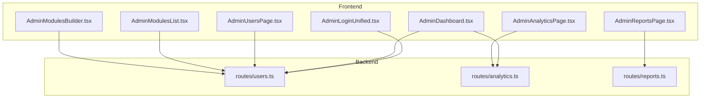
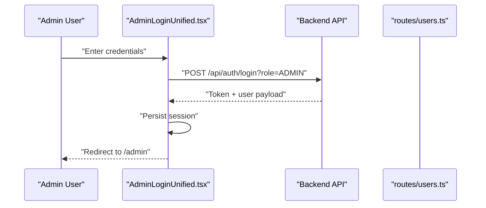
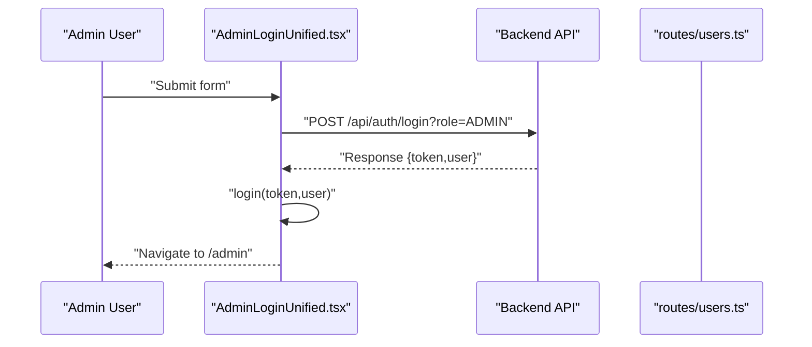
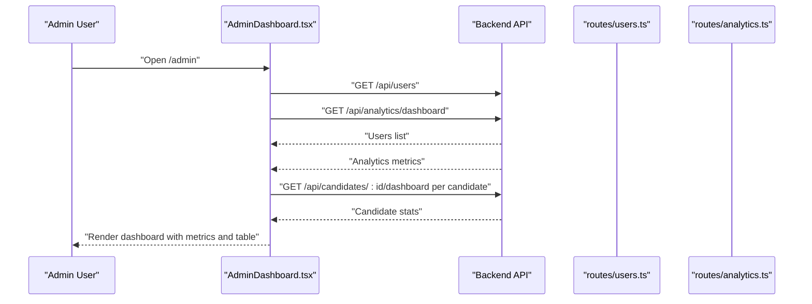
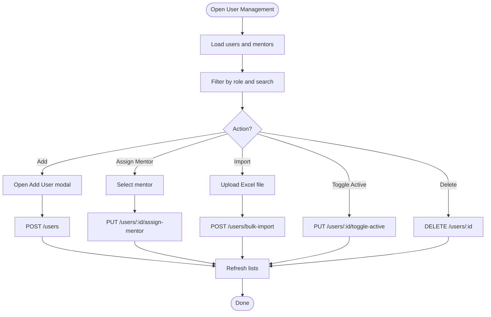
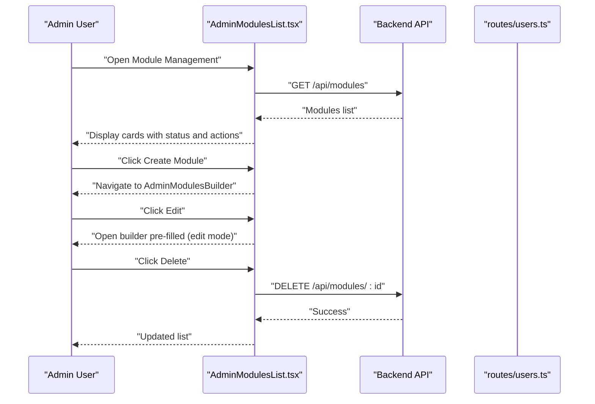
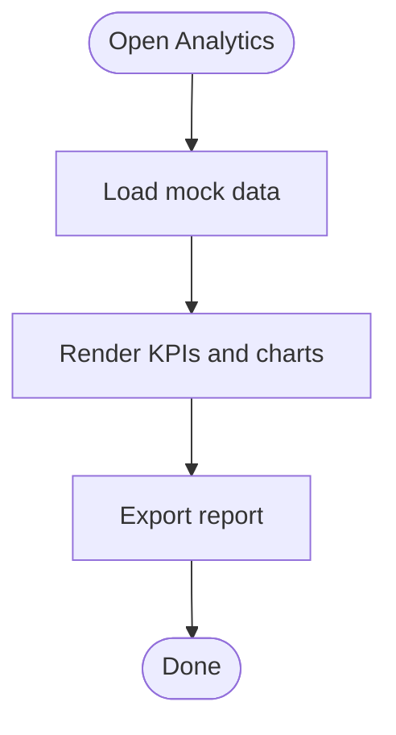
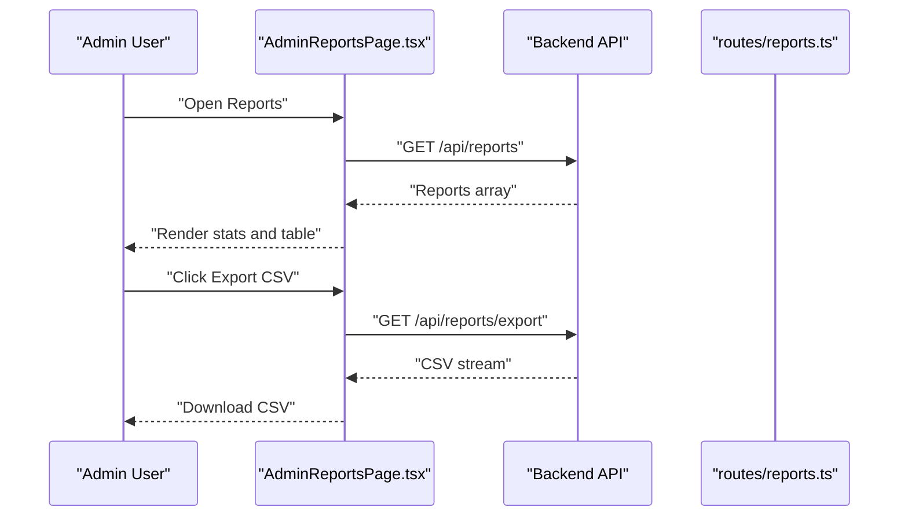
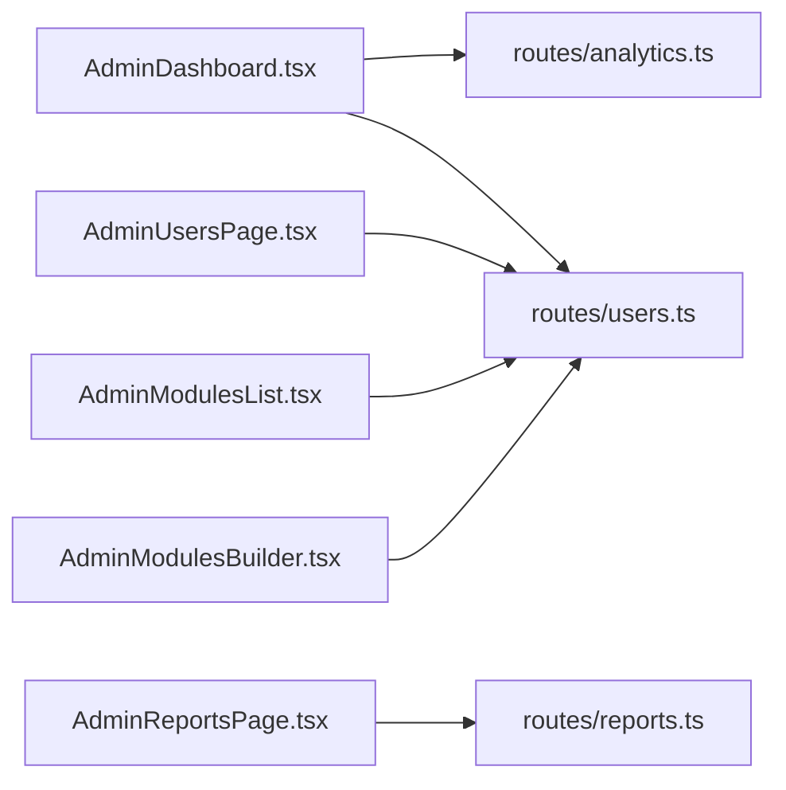

# Administrator Portal

<cite>
**Referenced Files in This Document**
- [AdminLoginUnified.tsx](file://frontend/src/pages/admin/AdminLoginUnified.tsx)
- [AdminDashboard.tsx](file://frontend/src/pages/AdminDashboard.tsx)
- [AdminUsersPage.tsx](file://frontend/src/pages/AdminUsersPage.tsx)
- [AdminModulesList.tsx](file://frontend/src/pages/AdminModulesList.tsx)
- [AdminModulesBuilder.tsx](file://frontend/src/pages/AdminModulesBuilder.tsx)
- [AdminAnalyticsPage.tsx](file://frontend/src/pages/AdminAnalyticsPage.tsx)
- [AdminReportsPage.tsx](file://frontend/src/pages/AdminReportsPage.tsx)
- [users.ts](file://backend/src/routes/users.ts)
- [analytics.ts](file://backend/src/routes/analytics.ts)
- [reports.ts](file://backend/src/routes/reports.ts)
</cite>

## Table of Contents
1. [Introduction](#introduction)
2. [Project Structure](#project-structure)
3. [Core Components](#core-components)
4. [Architecture Overview](#architecture-overview)
5. [Detailed Component Analysis](#detailed-component-analysis)
6. [Dependency Analysis](#dependency-analysis)
7. [Performance Considerations](#performance-considerations)
8. [Troubleshooting Guide](#troubleshooting-guide)
9. [Conclusion](#conclusion)
10. [Appendices](#appendices)

## Introduction
This document describes the Administrator Portal for Onboarding AntiGravity. It covers the admin dashboard, user management, module administration, analytics, and reporting. It also documents the admin login process, user registration and management workflows, module creation/editing, progress analytics visualization, and report generation. Administrative permissions, access controls, and best practices for optimizing admin workflows are included.

## Project Structure
The Administrator Portal spans a frontend React application and a backend Express server. Admin-facing pages reside under frontend/src/pages/admin and frontend/src/pages, while backend routes are located under backend/src/routes.

**Diagram sources**
- [AdminLoginUnified.tsx:1-132](file://frontend/src/pages/admin/AdminLoginUnified.tsx#L1-L132)
- [AdminDashboard.tsx:1-211](file://frontend/src/pages/AdminDashboard.tsx#L1-L211)
- [AdminUsersPage.tsx:1-326](file://frontend/src/pages/AdminUsersPage.tsx#L1-L326)
- [AdminModulesList.tsx:1-140](file://frontend/src/pages/AdminModulesList.tsx#L1-L140)
- [AdminModulesBuilder.tsx:1-166](file://frontend/src/pages/AdminModulesBuilder.tsx#L1-L166)
- [AdminAnalyticsPage.tsx:1-120](file://frontend/src/pages/AdminAnalyticsPage.tsx#L1-L120)
- [AdminReportsPage.tsx:1-141](file://frontend/src/pages/AdminReportsPage.tsx#L1-L141)
- [users.ts:1-180](file://backend/src/routes/users.ts#L1-L180)
- [analytics.ts:1-55](file://backend/src/routes/analytics.ts#L1-L55)
- [reports.ts:1-114](file://backend/src/routes/reports.ts#L1-L114)

**Section sources**
- [AdminLoginUnified.tsx:1-132](file://frontend/src/pages/admin/AdminLoginUnified.tsx#L1-L132)
- [AdminDashboard.tsx:1-211](file://frontend/src/pages/AdminDashboard.tsx#L1-L211)
- [AdminUsersPage.tsx:1-326](file://frontend/src/pages/AdminUsersPage.tsx#L1-L326)
- [AdminModulesList.tsx:1-140](file://frontend/src/pages/AdminModulesList.tsx#L1-L140)
- [AdminModulesBuilder.tsx:1-166](file://frontend/src/pages/AdminModulesBuilder.tsx#L1-L166)
- [AdminAnalyticsPage.tsx:1-120](file://frontend/src/pages/AdminAnalyticsPage.tsx#L1-L120)
- [AdminReportsPage.tsx:1-141](file://frontend/src/pages/AdminReportsPage.tsx#L1-L141)
- [users.ts:1-180](file://backend/src/routes/users.ts#L1-L180)
- [analytics.ts:1-55](file://backend/src/routes/analytics.ts#L1-L55)
- [reports.ts:1-114](file://backend/src/routes/reports.ts#L1-L114)

## Core Components
- Admin Login: Enforces ADMIN role and redirects to the admin dashboard upon successful authentication.
- Admin Dashboard: Aggregates platform metrics, candidate progress, and quick actions.
- User Management: Lists, filters, adds, assigns mentors, activates/deactivates, and bulk-imports users.
- Module Administration: Lists modules, supports search, edit, and delete; creates new modules via a builder.
- Analytics Dashboard: Visualizes KPIs and distributions using charts.
- Reporting System: Provides aggregated candidate progress and scores, with CSV export.

**Section sources**
- [AdminLoginUnified.tsx:16-40](file://frontend/src/pages/admin/AdminLoginUnified.tsx#L16-L40)
- [AdminDashboard.tsx:19-73](file://frontend/src/pages/AdminDashboard.tsx#L19-L73)
- [AdminUsersPage.tsx:41-64](file://frontend/src/pages/AdminUsersPage.tsx#L41-L64)
- [AdminModulesList.tsx:22-37](file://frontend/src/pages/AdminModulesList.tsx#L22-L37)
- [AdminModulesBuilder.tsx:40-63](file://frontend/src/pages/AdminModulesBuilder.tsx#L40-L63)
- [AdminAnalyticsPage.tsx:25-32](file://frontend/src/pages/AdminAnalyticsPage.tsx#L25-L32)
- [AdminReportsPage.tsx:12-18](file://frontend/src/pages/AdminReportsPage.tsx#L12-L18)

## Architecture Overview
The admin portal is a client-server system. The frontend renders admin pages and interacts with backend endpoints. Backend routes implement user management, analytics aggregation, and reporting.

**Diagram sources**
- [AdminLoginUnified.tsx:16-40](file://frontend/src/pages/admin/AdminLoginUnified.tsx#L16-L40)
- [users.ts:1-180](file://backend/src/routes/users.ts#L1-L180)

## Detailed Component Analysis

### Admin Login Process
- Enforces ADMIN role by appending role=ADMIN to the login endpoint.
- Submits email and password to the backend.
- On success, stores token and user data and navigates to the admin dashboard.
- Displays user-friendly error messages on failure.

**Diagram sources**
- [AdminLoginUnified.tsx:16-40](file://frontend/src/pages/admin/AdminLoginUnified.tsx#L16-L40)
- [users.ts:1-180](file://backend/src/routes/users.ts#L1-L180)

**Section sources**
- [AdminLoginUnified.tsx:16-40](file://frontend/src/pages/admin/AdminLoginUnified.tsx#L16-L40)

### Admin Dashboard
- Loads metrics and candidate progress in parallel for responsiveness.
- Computes completion counts and average progress from fetched data.
- Renders summary cards and a candidate table with progress bars and status badges.
- Provides CSV export action.

**Diagram sources**
- [AdminDashboard.tsx:23-73](file://frontend/src/pages/AdminDashboard.tsx#L23-L73)
- [users.ts:10-27](file://backend/src/routes/users.ts#L10-L27)
- [analytics.ts:6-52](file://backend/src/routes/analytics.ts#L6-L52)

**Section sources**
- [AdminDashboard.tsx:19-73](file://frontend/src/pages/AdminDashboard.tsx#L19-L73)

### User Management
- Lists all users with roles, departments, mentor assignments, and activity status.
- Supports filtering by role and search by name/email.
- Adds new users with role and department.
- Assigns mentors to candidates.
- Activates/deactivates users and deletes users (admin accounts excluded from deletion).
- Bulk imports users from Excel with a downloadable sample template.

**Diagram sources**
- [AdminUsersPage.tsx:41-148](file://frontend/src/pages/AdminUsersPage.tsx#L41-L148)
- [users.ts:114-177](file://backend/src/routes/users.ts#L114-L177)

**Section sources**
- [AdminUsersPage.tsx:41-148](file://frontend/src/pages/AdminUsersPage.tsx#L41-L148)
- [users.ts:10-180](file://backend/src/routes/users.ts#L10-L180)

### Module Administration
- Lists modules with status badges and section counts.
- Supports search by title/description.
- Navigates to the module builder to create or edit modules.
- Deletes modules after confirmation.

**Diagram sources**
- [AdminModulesList.tsx:22-51](file://frontend/src/pages/AdminModulesList.tsx#L22-L51)
- [AdminModulesBuilder.tsx:40-63](file://frontend/src/pages/AdminModulesBuilder.tsx#L40-L63)
- [users.ts:1-180](file://backend/src/routes/users.ts#L1-L180)

**Section sources**
- [AdminModulesList.tsx:22-51](file://frontend/src/pages/AdminModulesList.tsx#L22-L51)
- [AdminModulesBuilder.tsx:40-63](file://frontend/src/pages/AdminModulesBuilder.tsx#L40-L63)

### Analytics Dashboard
- Renders KPIs (average quiz score, completion rate, average time to complete).
- Displays weekly completions chart and progress distribution pie chart.
- Includes an export action for reports.

**Diagram sources**
- [AdminAnalyticsPage.tsx:25-32](file://frontend/src/pages/AdminAnalyticsPage.tsx#L25-L32)

**Section sources**
- [AdminAnalyticsPage.tsx:25-32](file://frontend/src/pages/AdminAnalyticsPage.tsx#L25-L32)

### Reporting System
- Fetches aggregated reports for all candidates, including overall progress and scores.
- Provides CSV export endpoint.
- Displays a searchable table of candidate progress and scores.

**Diagram sources**
- [AdminReportsPage.tsx:12-22](file://frontend/src/pages/AdminReportsPage.tsx#L12-L22)
- [reports.ts:83-111](file://backend/src/routes/reports.ts#L83-L111)

**Section sources**
- [AdminReportsPage.tsx:12-22](file://frontend/src/pages/AdminReportsPage.tsx#L12-L22)
- [reports.ts:83-111](file://backend/src/routes/reports.ts#L83-L111)

## Dependency Analysis
- Frontend pages depend on backend routes for data:
  - AdminDashboard depends on analytics and users endpoints.
  - AdminUsers depends on users endpoints for CRUD and import.
  - AdminModulesList and AdminModulesBuilder depend on users endpoints for module metadata and mentor lists.
  - AdminReports depends on reports endpoint.
- Backend routes encapsulate Prisma queries and expose REST endpoints.

**Diagram sources**
- [AdminDashboard.tsx:1-211](file://frontend/src/pages/AdminDashboard.tsx#L1-L211)
- [AdminUsersPage.tsx:1-326](file://frontend/src/pages/AdminUsersPage.tsx#L1-L326)
- [AdminModulesList.tsx:1-140](file://frontend/src/pages/AdminModulesList.tsx#L1-L140)
- [AdminModulesBuilder.tsx:1-166](file://frontend/src/pages/AdminModulesBuilder.tsx#L1-L166)
- [AdminReportsPage.tsx:1-141](file://frontend/src/pages/AdminReportsPage.tsx#L1-L141)
- [analytics.ts:1-55](file://backend/src/routes/analytics.ts#L1-L55)
- [users.ts:1-180](file://backend/src/routes/users.ts#L1-L180)
- [reports.ts:1-114](file://backend/src/routes/reports.ts#L1-L114)

**Section sources**
- [AdminDashboard.tsx:1-211](file://frontend/src/pages/AdminDashboard.tsx#L1-L211)
- [AdminUsersPage.tsx:1-326](file://frontend/src/pages/AdminUsersPage.tsx#L1-L326)
- [AdminModulesList.tsx:1-140](file://frontend/src/pages/AdminModulesList.tsx#L1-L140)
- [AdminModulesBuilder.tsx:1-166](file://frontend/src/pages/AdminModulesBuilder.tsx#L1-L166)
- [AdminReportsPage.tsx:1-141](file://frontend/src/pages/AdminReportsPage.tsx#L1-L141)
- [analytics.ts:1-55](file://backend/src/routes/analytics.ts#L1-L55)
- [users.ts:1-180](file://backend/src/routes/users.ts#L1-L180)
- [reports.ts:1-114](file://backend/src/routes/reports.ts#L1-L114)

## Performance Considerations
- Parallelization:
  - AdminDashboard loads users and analytics concurrently to reduce latency.
  - Analytics dashboard computes metrics using parallel queries.
  - Reports pipeline uses Promise.all to fetch candidates and modules in parallel.
- Data structure optimizations:
  - Hash maps are used to compute progress and quiz scores efficiently.
- UI responsiveness:
  - Loading states and skeleton placeholders improve perceived performance.
- Recommendations:
  - Paginate large lists in future iterations.
  - Cache frequently accessed metrics where safe.
  - Debounce search inputs in user and report tables.

[No sources needed since this section provides general guidance]

## Troubleshooting Guide
- Login fails:
  - Verify the role parameter is ADMIN and credentials are correct.
  - Check backend logs for authentication errors.
- User management errors:
  - Ensure unique emails and valid roles when creating users.
  - Confirm mentor selection is valid for candidate assignment.
  - Use the sample Excel template for bulk imports.
- Module operations:
  - Confirm module ID exists before editing or deleting.
  - Ensure required fields are filled when saving modules.
- Analytics and reports:
  - Expect mock data initially; connect to backend analytics endpoints for live data.
  - Validate CSV export permissions and browser download settings.

**Section sources**
- [AdminLoginUnified.tsx:35-36](file://frontend/src/pages/admin/AdminLoginUnified.tsx#L35-L36)
- [AdminUsersPage.tsx:72-92](file://frontend/src/pages/AdminUsersPage.tsx#L72-L92)
- [AdminModulesList.tsx:39-51](file://frontend/src/pages/AdminModulesList.tsx#L39-L51)
- [AdminModulesBuilder.tsx:40-63](file://frontend/src/pages/AdminModulesBuilder.tsx#L40-L63)
- [AdminAnalyticsPage.tsx:28-32](file://frontend/src/pages/AdminAnalyticsPage.tsx#L28-L32)
- [AdminReportsPage.tsx:20-22](file://frontend/src/pages/AdminReportsPage.tsx#L20-L22)

## Conclusion
The Administrator Portal provides a cohesive suite of tools for managing users, modules, monitoring progress, and generating reports. Its frontend-backend separation, parallelized data loading, and modular components enable efficient administration. Following the outlined best practices will help maintain performance and reliability as the platform scales.

[No sources needed since this section summarizes without analyzing specific files]

## Appendices

### Practical Admin Tasks and Examples
- Add a new user:
  - Navigate to User Management, open the Add User modal, fill in details, and submit.
  - Backend enforces unique email and hashes the password.
- Assign a mentor:
  - Select a mentor from the dropdown in the user table for a candidate.
- Activate/deactivate users:
  - Toggle the status from the user table; admins cannot toggle their own status.
- Bulk import users:
  - Download the sample Excel template, populate it, and upload to import.
- Create a learning module:
  - Go to Module Management, click Create Module, fill metadata and sections, then save.
- Generate progress reports:
  - Open Reports page and export CSV for download.
- Monitor system analytics:
  - View KPIs and charts on the Analytics page.

**Section sources**
- [AdminUsersPage.tsx:72-124](file://frontend/src/pages/AdminUsersPage.tsx#L72-L124)
- [AdminModulesBuilder.tsx:40-63](file://frontend/src/pages/AdminModulesBuilder.tsx#L40-L63)
- [AdminReportsPage.tsx:20-22](file://frontend/src/pages/AdminReportsPage.tsx#L20-L22)
- [AdminAnalyticsPage.tsx:25-32](file://frontend/src/pages/AdminAnalyticsPage.tsx#L25-L32)