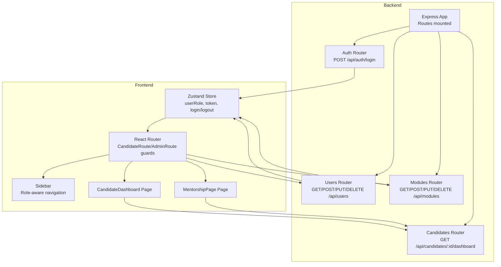
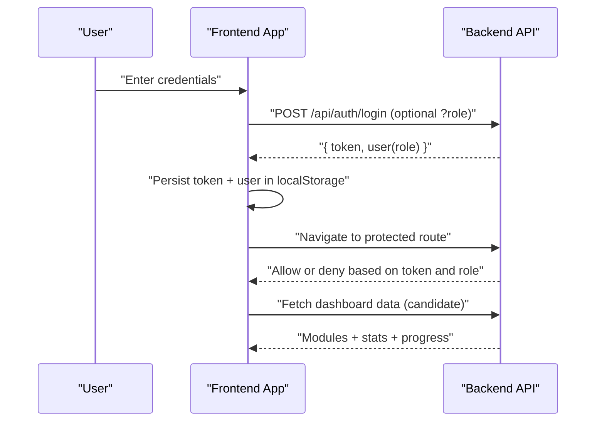
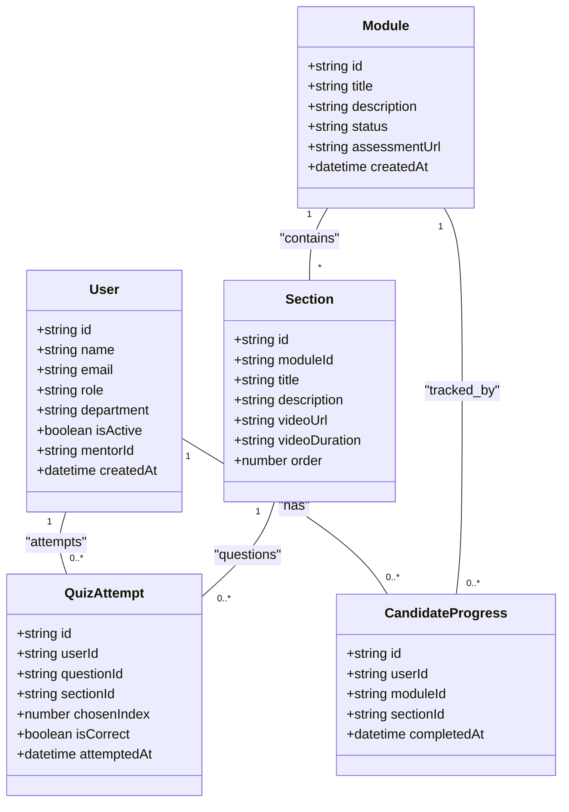
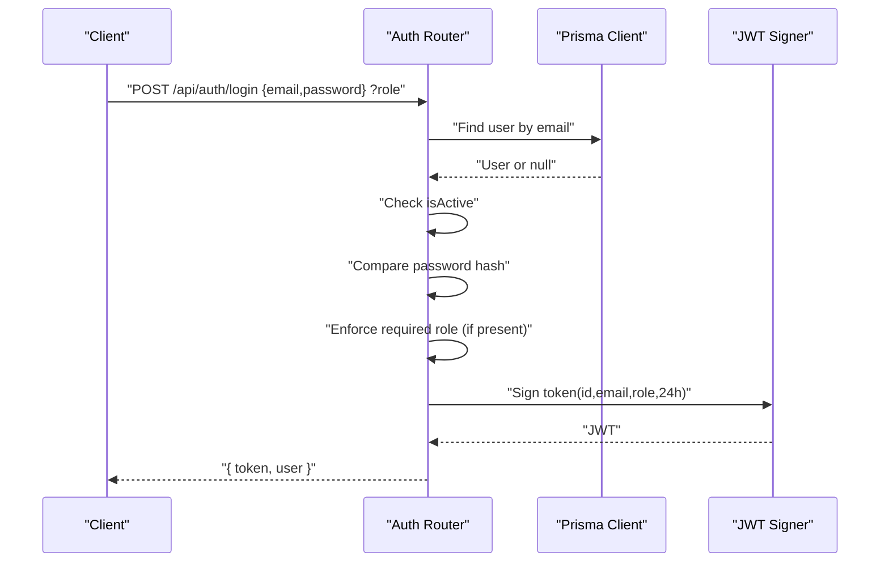
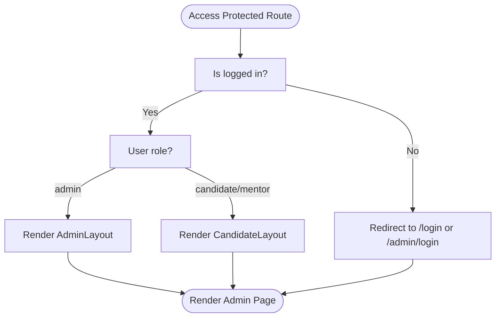
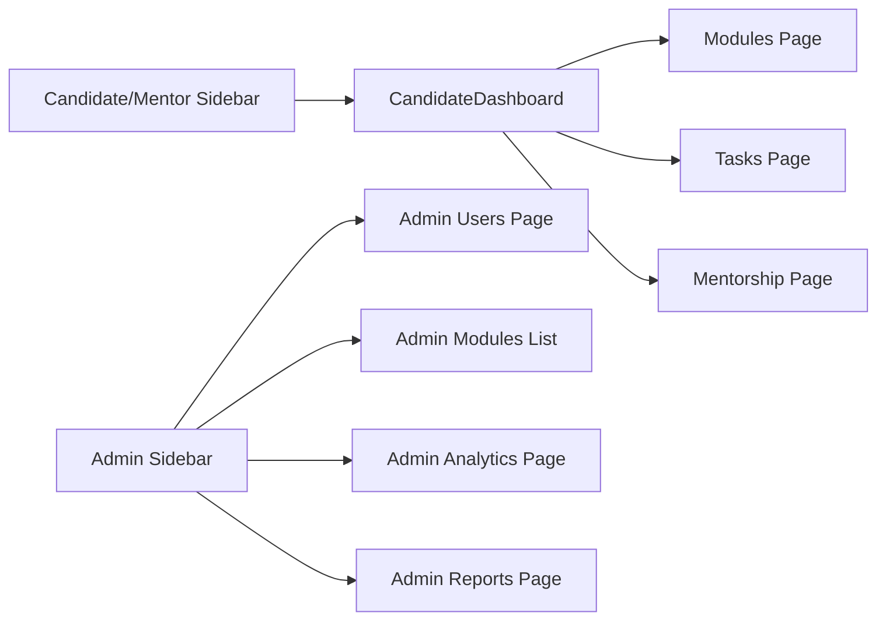
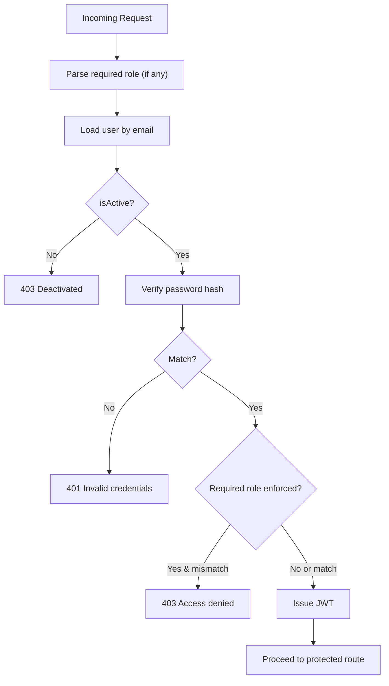
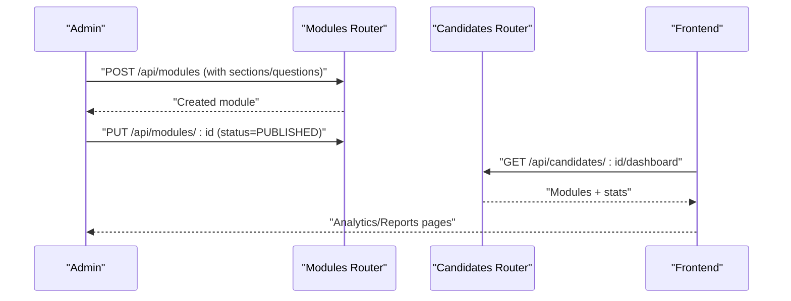
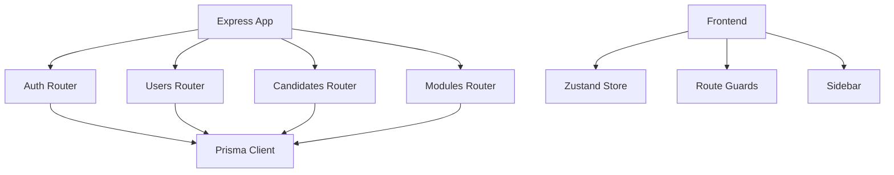

# User Roles and Permissions

<cite>
**Referenced Files in This Document**
- [backend/src/routes/auth.ts](file://backend/src/routes/auth.ts)
- [backend/src/routes/users.ts](file://backend/src/routes/users.ts)
- [backend/src/routes/candidates.ts](file://backend/src/routes/candidates.ts)
- [backend/src/routes/modules.ts](file://backend/src/routes/modules.ts)
- [backend/src/index.ts](file://backend/src/index.ts)
- [backend/prisma/schema.prisma](file://backend/prisma/schema.prisma)
- [frontend/src/store/useStore.ts](file://frontend/src/store/useStore.ts)
- [frontend/src/App.tsx](file://frontend/src/App.tsx)
- [frontend/src/components/layout/Sidebar.tsx](file://frontend/src/components/layout/Sidebar.tsx)
- [frontend/src/pages/CandidateDashboard.tsx](file://frontend/src/pages/CandidateDashboard.tsx)
- [frontend/src/pages/MentorshipPage.tsx](file://frontend/src/pages/MentorshipPage.tsx)
</cite>

## Table of Contents
1. [Introduction](#introduction)
2. [Project Structure](#project-structure)
3. [Core Components](#core-components)
4. [Architecture Overview](#architecture-overview)
5. [Detailed Component Analysis](#detailed-component-analysis)
6. [Dependency Analysis](#dependency-analysis)
7. [Performance Considerations](#performance-considerations)
8. [Troubleshooting Guide](#troubleshooting-guide)
9. [Conclusion](#conclusion)

## Introduction
This document describes the role-based access control (RBAC) system in Onboarding AntiGravity. It defines the three user roles (ADMIN, CANDIDATE, and MENTOR), their permissions and capabilities, dashboard interfaces, authentication and session handling, and route protection strategies. It also outlines permission enforcement mechanisms, typical workflows for each role, and security considerations.

## Project Structure
The RBAC system spans the backend API and the frontend application:
- Backend exposes REST endpoints for authentication, user management, modules, and candidate dashboards.
- Frontend stores session state locally, guards routes by role, and renders role-appropriate UI and navigation.

**Diagram sources**
- [backend/src/index.ts:1-45](file://backend/src/index.ts#L1-L45)
- [backend/src/routes/auth.ts:1-69](file://backend/src/routes/auth.ts#L1-L69)
- [backend/src/routes/users.ts:1-180](file://backend/src/routes/users.ts#L1-L180)
- [backend/src/routes/candidates.ts:1-117](file://backend/src/routes/candidates.ts#L1-L117)
- [backend/src/routes/modules.ts:1-209](file://backend/src/routes/modules.ts#L1-L209)
- [frontend/src/store/useStore.ts:1-77](file://frontend/src/store/useStore.ts#L1-L77)
- [frontend/src/App.tsx:1-79](file://frontend/src/App.tsx#L1-L79)
- [frontend/src/components/layout/Sidebar.tsx:1-99](file://frontend/src/components/layout/Sidebar.tsx#L1-L99)
- [frontend/src/pages/CandidateDashboard.tsx:1-138](file://frontend/src/pages/CandidateDashboard.tsx#L1-L138)
- [frontend/src/pages/MentorshipPage.tsx:1-75](file://frontend/src/pages/MentorshipPage.tsx#L1-L75)

**Section sources**
- [backend/src/index.ts:1-45](file://backend/src/index.ts#L1-L45)
- [frontend/src/App.tsx:1-79](file://frontend/src/App.tsx#L1-L79)

## Core Components
- Roles and model: The database model defines three roles: ADMIN, CANDIDATE, and MENTOR. Mentors can supervise candidates via a mentor-mentee relationship.
- Authentication: Login endpoint validates credentials, enforces optional portal-specific role, blocks inactive accounts, and issues a signed JWT with a 24-hour expiry.
- Session management: Frontend persists token and user metadata in local storage and exposes login/logout actions.
- Route protection: Two guards enforce role-based access:
  - CandidateRoute: allows CANDIDATE and MENTOR users access to candidate-facing pages.
  - AdminRoute: allows ADMIN users access to admin pages.
- Dashboards:
  - CandidateDashboard: shows modules, progress, quiz stats, and mentor info.
  - MentorshipPage: displays assigned mentor information for candidates/mentors.

**Section sources**
- [backend/prisma/schema.prisma:10-28](file://backend/prisma/schema.prisma#L10-L28)
- [backend/src/routes/auth.ts:9-66](file://backend/src/routes/auth.ts#L9-L66)
- [frontend/src/store/useStore.ts:39-77](file://frontend/src/store/useStore.ts#L39-L77)
- [frontend/src/App.tsx:30-44](file://frontend/src/App.tsx#L30-L44)
- [frontend/src/pages/CandidateDashboard.tsx:1-138](file://frontend/src/pages/CandidateDashboard.tsx#L1-L138)
- [frontend/src/pages/MentorshipPage.tsx:1-75](file://frontend/src/pages/MentorshipPage.tsx#L1-L75)

## Architecture Overview
The RBAC architecture combines backend authentication and frontend route guards:
- Authentication flow issues a JWT containing user identity and role.
- Frontend guards protect routes based on role and redirect unauthorized users.
- Candidate dashboard aggregates published modules, progress, and quiz statistics.

**Diagram sources**
- [backend/src/routes/auth.ts:9-66](file://backend/src/routes/auth.ts#L9-L66)
- [frontend/src/store/useStore.ts:58-74](file://frontend/src/store/useStore.ts#L58-L74)
- [frontend/src/App.tsx:30-44](file://frontend/src/App.tsx#L30-L44)
- [frontend/src/pages/CandidateDashboard.tsx:19-57](file://frontend/src/pages/CandidateDashboard.tsx#L19-L57)
- [backend/src/routes/candidates.ts:6-114](file://backend/src/routes/candidates.ts#L6-L114)

## Detailed Component Analysis

### Roles and Permissions
- ADMIN
  - Capabilities: Manage users (create, bulk import, assign mentor, activate/deactivate), manage modules (create, publish/unpublish, delete), view analytics and reports.
  - UI: Admin dashboard, users page, modules list, analytics, reports.
- CANDIDATE
  - Capabilities: View published modules, track progress, take quizzes, see overall stats, view assigned mentor.
  - UI: Dashboard, modules list, module view, tasks, mentorship, settings.
- MENTOR
  - Capabilities: Supervise candidates (via assigned mentor-mentee relationship), similar to candidates but with mentor-focused UI and navigation.
  - UI: Same as candidates plus mentorship page.

**Diagram sources**
- [backend/prisma/schema.prisma:10-111](file://backend/prisma/schema.prisma#L10-L111)

**Section sources**
- [backend/prisma/schema.prisma:10-28](file://backend/prisma/schema.prisma#L10-L28)
- [frontend/src/components/layout/Sidebar.tsx:9-24](file://frontend/src/components/layout/Sidebar.tsx#L9-L24)

### Authentication Flow and Token Management
- Endpoint: POST /api/auth/login supports an optional query parameter to enforce portal-specific role:
  - ?role=ADMIN restricts access to ADMIN users.
  - ?role=CANDIDATE restricts access to CANDIDATE and MENTOR users.
- Validation:
  - Finds user by exact email.
  - Blocks inactive users.
  - Compares password hash.
  - Optionally enforces required role.
- Token:
  - Issues JWT with id, email, role, expires in 24 hours.
  - Returns sanitized user object (without password hash).
- Frontend:
  - Stores token and user in localStorage.
  - Provides login and logout actions.
  - Guards routes based on role.

**Diagram sources**
- [backend/src/routes/auth.ts:11-66](file://backend/src/routes/auth.ts#L11-L66)
- [frontend/src/store/useStore.ts:58-74](file://frontend/src/store/useStore.ts#L58-L74)

**Section sources**
- [backend/src/routes/auth.ts:9-66](file://backend/src/routes/auth.ts#L9-L66)
- [frontend/src/store/useStore.ts:39-77](file://frontend/src/store/useStore.ts#L39-L77)

### Route Protection Strategies
- CandidateRoute:
  - Allows logged-in users whose role is candidate or mentor.
  - Redirects unauthenticated users to /login.
  - Redirects admin users to /admin.
- AdminRoute:
  - Allows only logged-in users whose role is admin.
  - Redirects unauthenticated users to /admin/login.
  - Redirects non-admin users to /dashboard.

**Diagram sources**
- [frontend/src/App.tsx:30-44](file://frontend/src/App.tsx#L30-L44)

**Section sources**
- [frontend/src/App.tsx:30-44](file://frontend/src/App.tsx#L30-L44)

### Dashboard Interfaces and Navigation Patterns
- CandidateDashboard
  - Fetches dashboard data for the current user ID.
  - Displays overall progress ring, stats cards, and module cards.
  - Navigates to module view and tasks.
- MentorshipPage
  - Shows assigned mentor information if available; otherwise informs no assignment yet.
- Sidebar
  - Renders role-specific navigation items.
  - Admin sees Users, Modules, Analytics, Reports.
  - Candidate/Mentor sees Dashboard, My Modules, Tasks, Mentorship, Settings.

**Diagram sources**
- [frontend/src/pages/CandidateDashboard.tsx:1-138](file://frontend/src/pages/CandidateDashboard.tsx#L1-L138)
- [frontend/src/pages/MentorshipPage.tsx:1-75](file://frontend/src/pages/MentorshipPage.tsx#L1-L75)
- [frontend/src/components/layout/Sidebar.tsx:9-24](file://frontend/src/components/layout/Sidebar.tsx#L9-L24)

**Section sources**
- [frontend/src/pages/CandidateDashboard.tsx:1-138](file://frontend/src/pages/CandidateDashboard.tsx#L1-L138)
- [frontend/src/pages/MentorshipPage.tsx:1-75](file://frontend/src/pages/MentorshipPage.tsx#L1-L75)
- [frontend/src/components/layout/Sidebar.tsx:1-99](file://frontend/src/components/layout/Sidebar.tsx#L1-L99)

### Permission Enforcement Mechanisms
- Backend enforcement points:
  - Login endpoint enforces required role via query parameter.
  - Users endpoint supports bulk import and mentor assignment.
  - Modules endpoint supports CRUD and quiz question import.
  - Candidates endpoint computes progress and quiz stats for a given user.
- Frontend enforcement points:
  - Route guards prevent unauthorized access.
  - Sidebar visibility depends on role.

**Diagram sources**
- [backend/src/routes/auth.ts:11-66](file://backend/src/routes/auth.ts#L11-L66)

**Section sources**
- [backend/src/routes/auth.ts:9-66](file://backend/src/routes/auth.ts#L9-L66)
- [backend/src/routes/users.ts:62-112](file://backend/src/routes/users.ts#L62-L112)
- [backend/src/routes/modules.ts:155-205](file://backend/src/routes/modules.ts#L155-L205)
- [backend/src/routes/candidates.ts:6-114](file://backend/src/routes/candidates.ts#L6-L114)

### Role-Specific Workflows

- Admin module creation and publishing
  - Admin creates a module with nested sections and questions.
  - Publishes the module so candidates can see it.
  - Imports quiz questions via Excel template.
  - Views analytics and reports.

- Candidate progress tracking
  - Candidate logs in and lands on the dashboard.
  - Dashboard aggregates published modules, progress per module, and quiz scores.
  - Candidate navigates to module view, completes lessons, and takes quizzes.

- Mentor supervision features
  - Mentors are treated similarly to candidates in the UI.
  - They can view assigned mentorship information and access candidate-facing pages.

**Diagram sources**
- [backend/src/routes/modules.ts:28-77](file://backend/src/routes/modules.ts#L28-L77)
- [backend/src/routes/modules.ts:92-105](file://backend/src/routes/modules.ts#L92-L105)
- [backend/src/routes/candidates.ts:6-114](file://backend/src/routes/candidates.ts#L6-L114)
- [frontend/src/pages/CandidateDashboard.tsx:19-57](file://frontend/src/pages/CandidateDashboard.tsx#L19-L57)

**Section sources**
- [backend/src/routes/modules.ts:28-105](file://backend/src/routes/modules.ts#L28-L105)
- [backend/src/routes/modules.ts:155-205](file://backend/src/routes/modules.ts#L155-L205)
- [backend/src/routes/candidates.ts:6-114](file://backend/src/routes/candidates.ts#L6-L114)
- [frontend/src/pages/CandidateDashboard.tsx:1-138](file://frontend/src/pages/CandidateDashboard.tsx#L1-L138)

## Dependency Analysis
- Backend dependencies:
  - Express app mounts routers for auth, users, candidates, modules, analytics, progress, quiz, reports.
  - Auth router depends on Prisma client and JWT library.
  - Users and modules routers depend on Prisma client.
- Frontend dependencies:
  - Zustand store persists token and user role.
  - App routes are guarded by role-aware wrappers.
  - Sidebar renders role-specific navigation.

**Diagram sources**
- [backend/src/index.ts:1-45](file://backend/src/index.ts#L1-L45)
- [backend/src/routes/auth.ts:1-69](file://backend/src/routes/auth.ts#L1-L69)
- [backend/src/routes/users.ts:1-180](file://backend/src/routes/users.ts#L1-L180)
- [backend/src/routes/candidates.ts:1-117](file://backend/src/routes/candidates.ts#L1-L117)
- [backend/src/routes/modules.ts:1-209](file://backend/src/routes/modules.ts#L1-L209)
- [frontend/src/store/useStore.ts:1-77](file://frontend/src/store/useStore.ts#L1-L77)
- [frontend/src/App.tsx:1-79](file://frontend/src/App.tsx#L1-L79)
- [frontend/src/components/layout/Sidebar.tsx:1-99](file://frontend/src/components/layout/Sidebar.tsx#L1-L99)

**Section sources**
- [backend/src/index.ts:1-45](file://backend/src/index.ts#L1-L45)
- [frontend/src/App.tsx:1-79](file://frontend/src/App.tsx#L1-L79)

## Performance Considerations
- Candidate dashboard aggregation:
  - Uses parallel queries to fetch modules, progress records, and quiz attempts.
  - Builds lookup structures for O(1) access during enrichment.
  - Computes stats efficiently with single-pass accumulation.
- Module retrieval:
  - Dedicated single-module endpoint avoids loading unnecessary data for module view.

**Section sources**
- [backend/src/routes/candidates.ts:21-95](file://backend/src/routes/candidates.ts#L21-L95)
- [backend/src/routes/modules.ts:127-153](file://backend/src/routes/modules.ts#L127-L153)

## Troubleshooting Guide
- Login issues
  - Invalid credentials: Returned when email not found or password mismatch.
  - Account deactivated: Returned when user.isActive is false.
  - Portal role mismatch: Returned when required role does not match user role.
- Route protection
  - Unauthenticated users are redirected to appropriate login page.
  - Admins accessing candidate routes are redirected to admin dashboard.
  - Non-admins accessing admin routes are redirected to candidate dashboard.
- Session persistence
  - Ensure token and user are present in localStorage after login.
  - On logout, remove token and user from localStorage and reset role.

**Section sources**
- [backend/src/routes/auth.ts:22-46](file://backend/src/routes/auth.ts#L22-L46)
- [frontend/src/App.tsx:30-44](file://frontend/src/App.tsx#L30-L44)
- [frontend/src/store/useStore.ts:70-74](file://frontend/src/store/useStore.ts#L70-L74)

## Conclusion
Onboarding AntiGravity implements a clear RBAC system:
- Roles are defined in the database model and enforced at login and route level.
- Authentication issues a short-lived JWT and the frontend manages session state.
- Route guards ensure that only authorized users can access specific pages.
- Dashboards and navigation adapt to the user’s role, while admin workflows focus on module and user management.